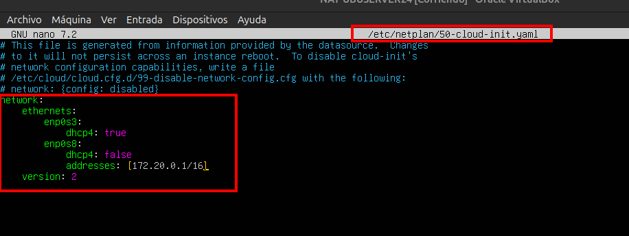
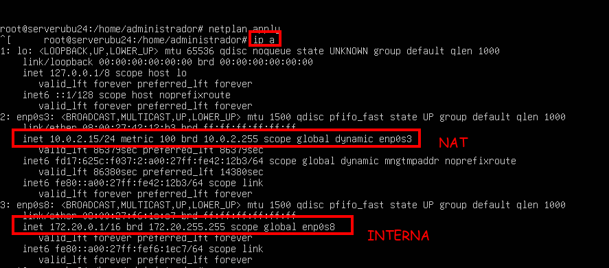
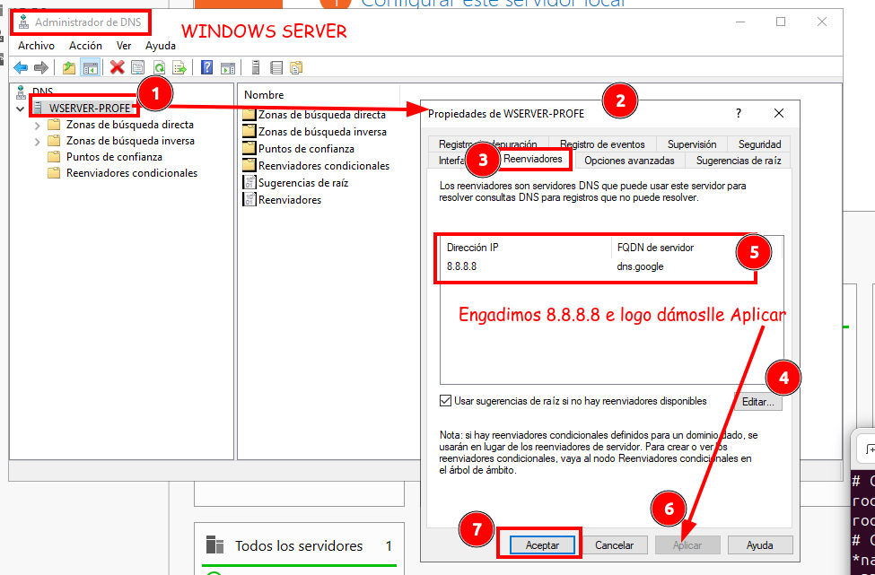

# Configurar router NAT

Tarxetas de rede:

- Modo NAT (DHCP)
- Modo Rede Interna (rede DC-PROFE)


## Configurar IPS



Facemos `#netplan apply`



## Habilitamos ipforward

`echo 1 > /proc/sys/net/ipv4/ip_forward`
Vemos que se aplicaron os cambios.
`cat /proc/sys/net/ipv4/ip_forward`

## Enrutamos desde a rede Interna a NAT.
`iptables -t nat -A POSTROUTING -s 172.20.0.0/16 -o enp0s3 -j MASQUERADE`

Gardamos a táboa de rutas:

`iptables-save`

Mediante o comando iptables-save gardamos as reglas NAT de iptables no arquivo /root/reglasNAT.txt

`iptables-save > /root/reglasNAT.txt` 

Visualizamolas có comando `cat /root/reglasNAT.txt`

## Creamos un script para que se execute cada vez que se inicie o servidor e o enrutamento quede definitivo

```bash
#Script /root/scriptNAT.sh
echo 1 > /proc/sys/net/ipv4/ip_forward
/usr/sbin/iptables-restore /root/reglasNAT.txt
```

Configuramos crontab para qeu se inicie o script ao iniciar o sistema
`crontab -e`
```bash
@reboot /root/scriptNAT.sh
```
Por último asignamos permisos ao script.
`chmod 744 /root/scriptNAT.sh`

## Configurar o reenviador no DNS do Windows Server



Comprobando:

Se facemos desde o servidor.  `ping www.google.com  debería de funcionar xa e responder.