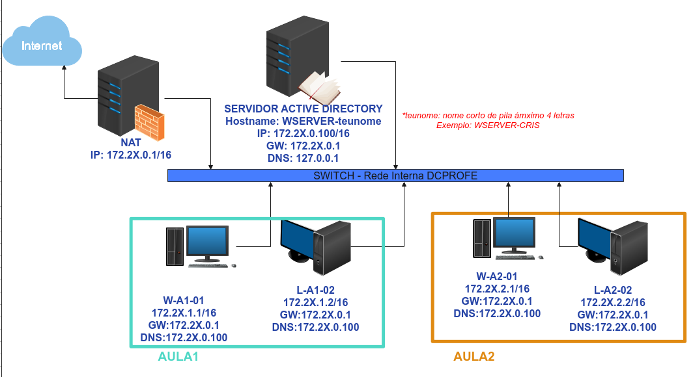
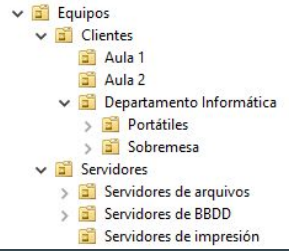
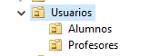
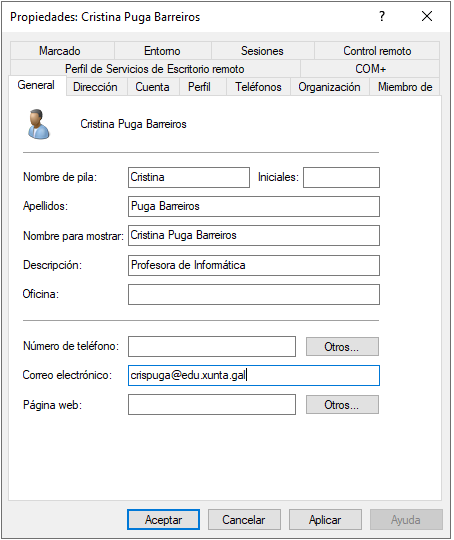
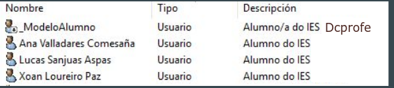
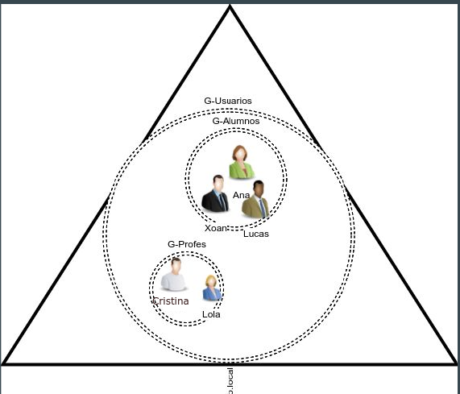

# PROXECTO CONTROLADOR DE DOMINIO WINDOWS nun ESCENARIO DE REDE con Clientes Windows e GNU/Linux

Vai facendo os apartados que se piden, e capturando evidencias básicas, onde se vexa que realizaches as configuracións.
Imos configurar a seguinte estrutura de rede:

## PREPARACIÓN DO ESCENARIO

1. Crea o ROUTER NAT:

   - Tarxeta en **modo NAT (dhcp)**
   - Tarxeta en **modo INTERNA (172.2x.0.0/16)**
2. Crear un PC con Windows 11 Pro como Base e crear unha OVA.
3. Crear un PC con Linux Ubuntu ou Debian como Base e crear unha OVA.

---

## TAREFA 1 - CONFIGURAR CONTROLADOR DE DOMINIO

1 - Instalación de Windows Server

2 - Creación de sysprep para Windows Server

3 - Creación de SERVICIO VIRTUALIZADO da máquina de Windows Server (.OVA)

4 - Crear unha máquina virtual WSERVER-teunome partindo da .OVA anterior, E METELA DENTRO DO GRUPO DE VBOX DC-TEUNOME.

5 - Promover o Wserer a DC, configurar a dominio **DCTEUNOME.local**. Onde teunome é máximo 4 caracteres do inicio do teu nome de pila. (Seguir apuntes **INSTALAR DOMAIN CONTROLER**)

6 - Crea un usuario teunome, **co teu nome de pila** (corto), por exemplo (cris) como usuario normal. Ponlle contrasinal: **abc123.**

7 - Unir PC Windows ao dominio (W-A1-01)

---

## Tarefa 2 - OU - GRUPOS - USUARIOS - EQUIPOS

### 1- Crear OU para Computers

Crea as OU para os PCs que se ven na imaxe:

### 2- Unir PC por adiantado ao dominio

1. Recupera a OVA, ou crea un Link Enlazado da túa máquina base Windows, chámalle W-A2-01
2. No PC Windows Server (WSERVER-TEUNOME): Crea dentro da OU Aula2, o PC Windows **W-A2-01**.
3. Na máquina W-A2-01 que acabas de crear:
   1. Configura o Hostname
   2. Configura as IPs/GW/DNS
   3. Une o PC ao dominio
Unha vez unido, **observa como xa non se creou a conta no contedor Computers**, e como o equipo que creaches na Aula 2 xa ten os atributos cubertos.
4. Accede aos atributos do PC que acabas de unir e busca información do **sAMAccountName** do PC, e a última vez que cambiou a contrasinal do PC no dominio **pwdLastSet**.

### 3- Unir PC por adiantado ao dominio

Unir un PC LINUX ao dominio

1. Unir un PC Linux Ubuntu ao dominio  co nome (**L-A1-02**) e seguindo o hostname e IP do esquema, seguindo os pasos de "**Unir equipos GNU/Linux ao AD**" da documentación.
2. Engádeo por defecto a Computers.
3. Logo méteo na Unidade Organizativa Aula 1

---

## Tarefa 3 - OU - Usuarios - Grupos

### Crear OU

1. Crea unha estrutura de OU:
   - Usuarios, que conteña outras dúas OU dentro:
     - Alumnos
     - Profesores

1. Proba a eliminar a OU. Que ocorre? Deixache?

### Crear Usuarios

1. Crea o usuario que te identifique. Nome de usuario, nome apelidos e OU á que pertences.
1. Unha vez creado o usuario vai a **Propiedades**, bótalle un vistazo aos atributos que aparecen, no **editor de atributos** busca por exemplo o atributo e o valor que ten **DisplayName**.
1. Crea os seguinte usuario dentro da **OU Profesores**:
   - 
   - Crea na OU Profesores o usuario **Lola Liboreiro Pereira**, inicio de sesion con nome.apelido1.apelido2 coa descrición “Profesora de informática”.

### Crear usuario modelo
  
1. Na OU Alumnos crea unha conta modelo alumno, poñendo despois a través das propiedades que a conta expira en **xullo de 2027**(**lapela Cuenta**).
1. Utiliza a opción de copiar para crear os usuarios da imaxe nesta OU.
O **nome de inicio de sesión do usuario**, debe ser o **nome.1apelido.2apelido**

1. Por último, “deshabilita” a conta modelo para que ninguén poida iniciar sesión con ese usuario.

> **Impte**: *non toda a información se copia coa opción Copiar. Por exemplo, o nome,nome de inicio de sesión, password, email, descrición, número de teléfono non se copian.*

### Procuras/Busca de usuarios

1. Desde a ferramenta de procuras, busca información do usuario que se apelida Sanjuas.
1. Desde a ferramenta de procuras,busca información dos usuario que teñen da descrición Profesor

### Borrado dun usuario e recuperación

1. Borra o usuario **Lola Liboreiro Pereira**.
1. Accede ao contedor **Deleted Objects** e comproba que podes recuperalo.

### Contrasinais

Configurar as contrasinais dos usuarios para que esixan 8 caracteres mínimo, que recorden as últimas 4 contrasinais, que se bloquee a conta 15 minutos, que NON teñen que cumprir os requisitos de complexidade. (Amosar evidencia)

### Grupos

1. Crea o grupo G-Alumnos como grupo global de seguridade na OU Alumnos. Engade os usuarios Ana, Xoan e Lucas.
1. Crea o grupo G-Profes como grupo global de seguridade na OU Profes. Engade aos usuarios Cristina e Lola.
1. Crea o grupo G-Usuarios na OU Usuarios. Fai que todos os membros de G-Profes e G-Alumnos actuais e futuros formen parte deste grupo. Ten en conta que podes establecer como membro dun grupo outro grupo.
