# Instalación de Windows Server

## Características MV
Instalamos nunha máquina virtual con:
- 4GB de RAM
- 2 CPUs 
- 150 GB de HD.
- Interface de rede en **modo INTERNA** - Rede **DC-PROFE** (No teu caso DC-TEUNOME)

Escollemos a **versión Standard** (con experiencia de Escritorio)

- Password para **administrador** contrasinal **abc123.**

## Proceso de instalación

- Versión Estándard
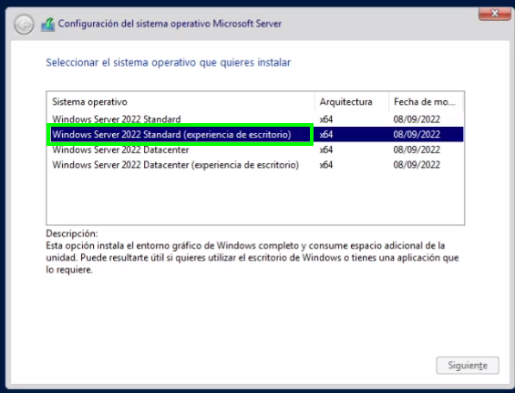
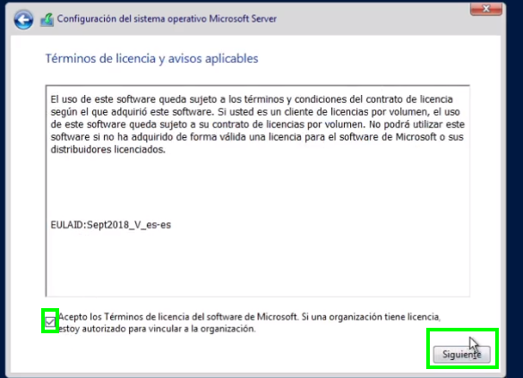
- Modo personalizado
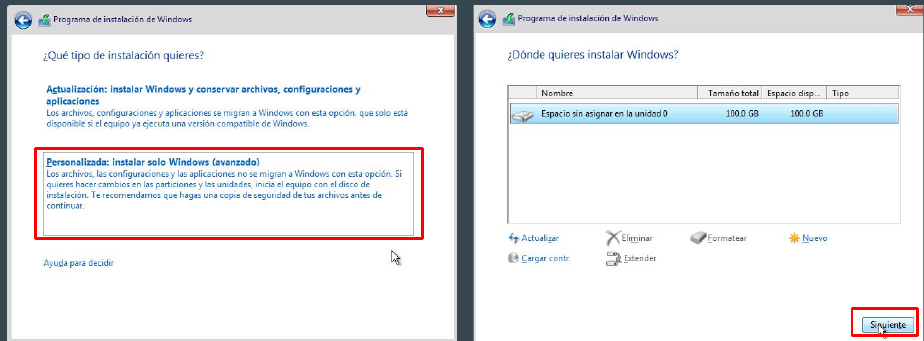
- Escollemos administrador con contrasinal **abc123.**
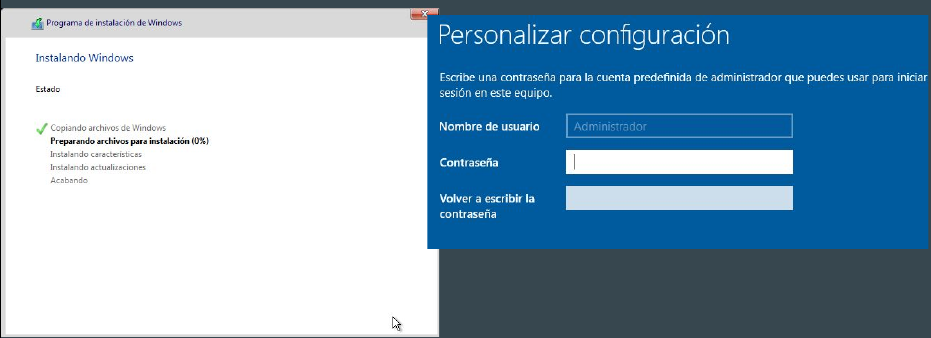
- Iniciamos sesión co usuario administrador e aparecen estes erros:
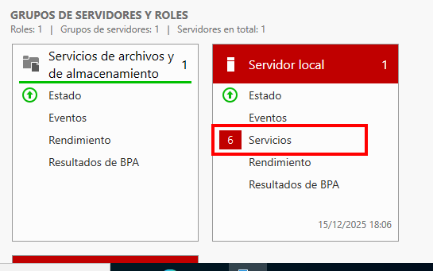

- Instalamos as Virtualbox Additions

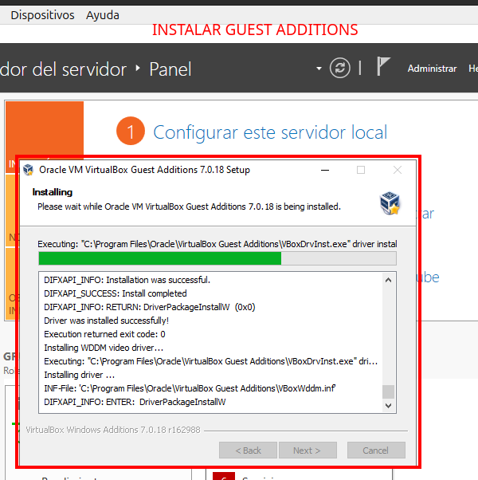
- Reiniciar o equipo e actualizar  e unha vez reiniciado o equipo, accedemos ao asistente "Administrador del Servidor", en principio teremos 6 erros pero despois de esperar un par de minutos e clickar en actualizar desaparecen os erros(verde).
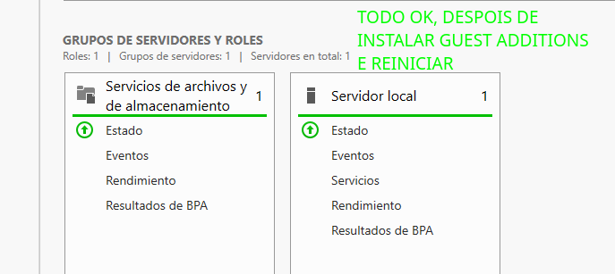
## Configuracións mellorar rendemento en máquinas de proba
### Desactivar Actualizacións automáticas 
O servidor, ao estar conectado a internet, provoca que o servidor se actualizase coas conseguintes esperas e reinicios.

Para evitalo, veremos como desactivar as actualizacións.

Se esta fose a instalación dun **servidor en produción deberíamos telo sempre
actualizado**.

Executamos desde o **cmd** o comando `sconfig` e seleccionamos a **opción 5 Configuración de la actualización**
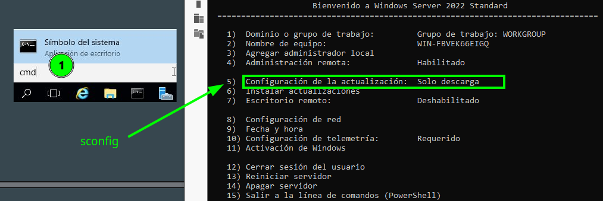
e escollemos **3) actualización manual**
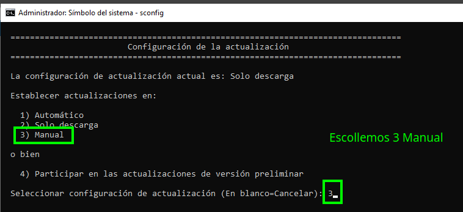

Prememos **15 salir**. E quedan desactivadas as actualizacións automáticas. (so para entornos de proba na aula)

## Sysprep - para gardar un Windows sen SID
Aos sistemas operativos de Microsoft posteriores a Windows XP, débeselles aplicar un procedemento denominado **SYSPREP** antes de crear unha imaxe a partir deles.

Nós crearemos clons a partir desta máquina polo que necesitamos facelo.
Este proceso realiza varias tarefas internas, preparando o equipo para ser clonado.
- Limpar o equipo de drivers
- Cambiar o SID (Security Identifier) da máquina.

Podemos consultar o SID da máquina co comando whoami /user dende un intérprete
de comandos cmd (Tecla de Windows+R -> cmd).
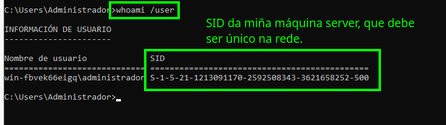

### Erro que amosa unha máquina cando ten un SID duplicado na rede.
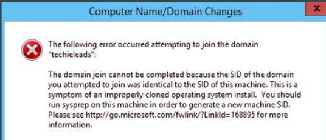

### Executar o sysprep

**Importante**: Antes de nada **facemos unha instantánea ou snapshot da máquina** e chamámoslle **Antes de Sysprep**
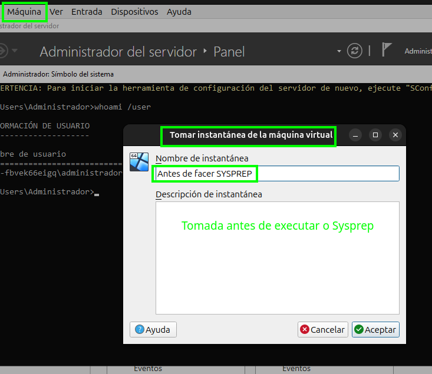

Executamos **`C:\Windows\System32\Sysprep\Sysprep.exe`**.

Escollemos as opcións da captura.

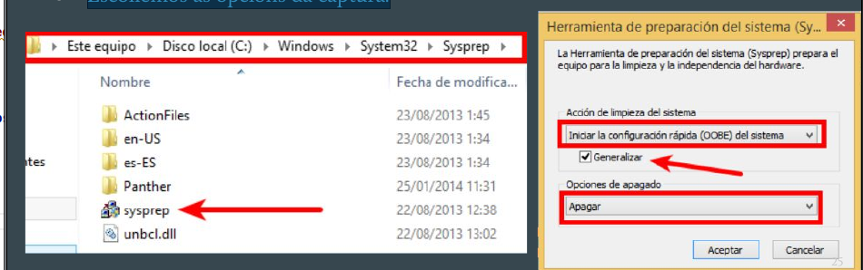

Unha vez finalizado o proceso do Sysprep, a máquina apágase.

#### Creamos unha OVA.

Agora podemos facer unha **W2022SERVER-BASE-SYSPREP.OVA**.

#### Creamos un clon COMPLETO - AD-teunome-WSERVER2022
Clon completo da máquina creada, co nome **AD-teunome-WSERVER2022**.
Vemos que ao crear un clon de Win Server con sysprep, o SID que crea é diferente ao anterior, da máquina base.
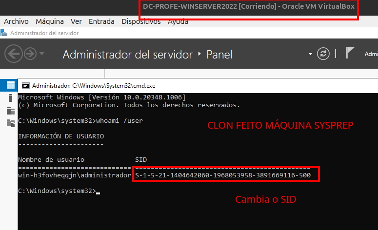

Quitamos da secuencia de arranque o disco duro da **Máquina Base**, para evitar acendela por erro.
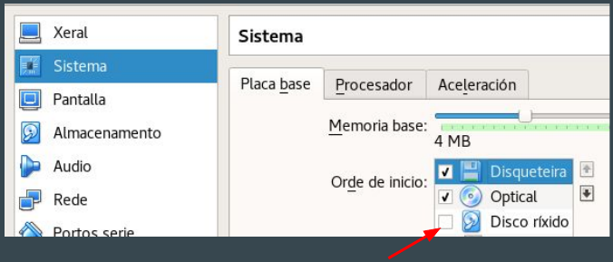