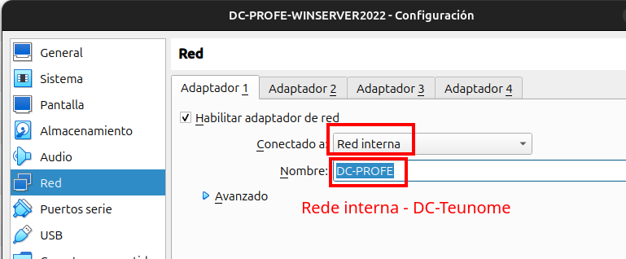
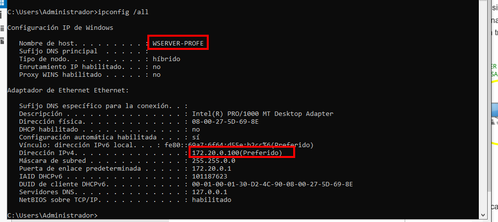

# Configuración e modo de rede

Dado os sistemas operativos de Microsoft fan un **uso intenso** de internet e están descargando moita información o que provoca nas nosas máquinas virtuais unha degradación do rendemento moi considerable. Polo tanto, para evitar que se conecten traballaremos en **REDE INTERNA**.

No meu caso implementarei a rede 172.20.0.0/16

- **WSERVER-PROFE** - 172.20.0.100/16 - GW: 172.20.0.1
- **LIN-PROFE**- 172.20.0.2/16 - GW: 172.20.0.1 -- Modo de rede Interna
- **W11-PROFE**- 172.20.0.3/16 - GW: 172.20.0.1 -- Modo de rede Interna
- **LSERVER-PROFE** - 172.20.0.1/16 - GW 192.168.6.254 -- Modo de rede Interna
                    - 192.168.6.131 - GW 192.168.6.254 - DNS: 192.168.10.101 --- Modo de rede Ponte

## Configuración da rede da máquina virtual

Rede Interna **DC-PROFE**, no teu caso porías **DC-teunome**

Configuración da IP do servidor Windows.

