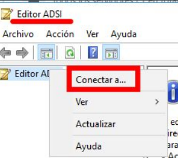
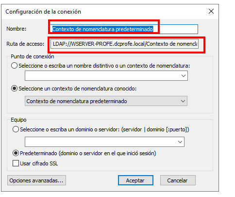
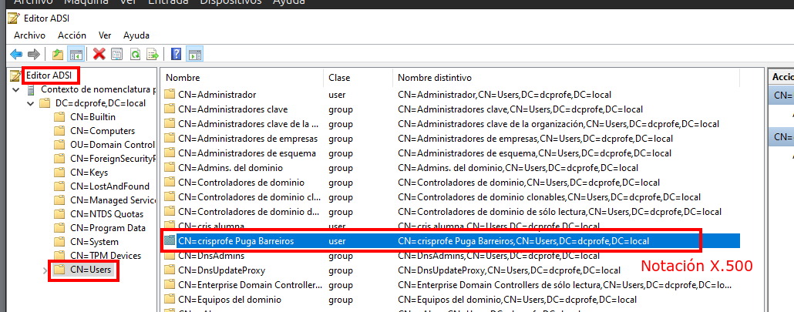
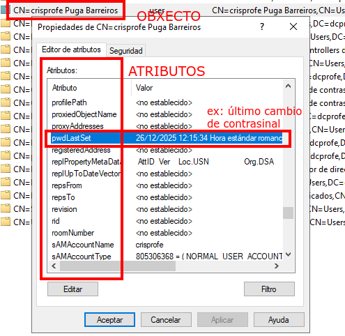

# O Controlador de dominio

Un dominio é unha agrupación lóxica de redes de equipos que comparten unha base de datos que é o directorio.

Esta **base de datos** conten obxectos como **contas de usuario, grupos... e a información de seguridade asociada a eles**.

**Active Directory** garda esta base de datos e xestiónaa.

Grazas a ela pode ofrecer o servizo de directorio á rede.

Ademais, Active Directory garda información sobre servizos e outros recursos, organizacións...

## Controlador de dominio

Esta base de datos está almacenada en equipos que reciben o nome de **Controlador de Dominio**.

O controlador de dominio é **o servidor que xestiona identidades, permisos e recursos** dun dominio Windows.

- Un controlador de dominio é un servidor que xestiona todos os aspectos relativos á seguridade nas interaccións dos usuarios dun dominio.
- Un dominio non está asociado a un tipo específico de rede.
- Os equipos dun dominio poden compartir proximidade física nunha LAN ou poden estar conectados en diferentes partes do mundo a través doutro tipo de conexión.

## Tipos de equipos que atopamos nun dominio

**1. Controladores de dominio**

Nun dominio podemos ter varios controladores de dominio. Cada un mantén unha copia da base de datos do directorio. Os cambios que se produzan na base de datos replicaranse a través dos controladores dun mesmo dominio. Por exemplo, se nun controlador se crea ou borra un usuario, este cambio replicarase entre os controladores de xeito automático. Obviamente, unha das vantaxes de ter múltiples controladores de dominio é que temos tolerancia a erros no servizo de directorio.

**2. Servidores membro**

Serán todos aqueles servidores que **ofrezan outros servizos** que non sexan os de directorio: **servidores de arquivos**, de **impresión**, **web**, **DNS** (lembremos que o asistente de instalación de Active Directory, se non atopa un servidor DNS que resolva o nome do dominio, instala un servidor DNS no mesmo equipo onde vai instalar o servizo de directorio), **DHCP**, etcétera.

**3. Equipos cliente**

Os **equipos con escritorio** para o usuario que permiten acceder aos recursos da rede: información doutros usuarios, grupos, equipos, cartafoles compartidos, etc.

## Obxectos de Active Directory

Son os **recursos** que se gardan na base de datos do directorio: usuarios, impresoras, servidores, bases de datos, grupos, equipos, directivas de seguridade...

Todo obxecto ten unha serie de **atributos**, por exemplo, un usuario terá nome, apelidos, contrsinal, etcétera.

Hai **relacións** entre obxectos, como que un usuario pertence a un ou máis grupos, qeu un grupo está incluído dentro doutro, etcétera.

O tipo/clase de obxectos e atributos que se poden crear nu ndominio vén definido polo **esquema** de Active Directory.

- Cando instalas Active Directory vai instalar o esquema por defecto e vaiche ofrecer ferramentas para cambialo.
- Na maioría dos casos non é necesario modificalo pois o esquema por defecto contén a suficiente información para representar a información de calquera institución.

## Ver os obxectos - Editor ADSI

Existen outras máis xenéricas que nos permiten ver todos os obxectos e atributos da base de datos de
Active Directory.
O **Editor ADSI** (**Administrador do servidor - Ferramentas - Editor ADSI**) é unha delas. Para
configuralo, temos que conectar a ferramenta ao noso dominio:

Na imaxe pódense apreciar os obxectos do dominio. En concreto o obxecto **crisprofe**, que é de clase user.

**Notación X.500 ou Distinguished Name**: serve para nomear cada
obxecto que hai en Active Directory.
O nome, tecnicamente coñecido como Distinguished Name, constrúese polo obxecto seguido dos contedores en que está.

No noso caso:
**cn=crisprofe Puga Barreiros,cn=Users,dc=dcprofe,dc=local** (onde ***dc** é domain component*, ***cn** é common name*, ***ou** é organization unit name)*.

Podemos ver na seguinte imaxe os atributos do obxecto, de tipo usuario, crisprofe:
