# 1. Instalación do Controlador de Dominio

Un controlador de dominio (Domain Controller, DC) serve para ser o núcleo de control e seguridade dunha
rede baseada en Active Directory. É o servidor que xestiona identidades, permisos e recursos dun dominio
Windows.

A instalación de controlador de docminio consta de dúas fases:

- 1- Instalar os servizos de dominio de Active Directory.
- 2- Promover o controlador a Controlador de Dominio Primario.

## 1.0 - Configuración previa. Cambiar o nome do pc servidor

Cambiamos o nome do servidor en **Sistema -> Acerca de -> Cambiar nombre del equipo**.
Poñémoslle **WSERVER-teunome**.
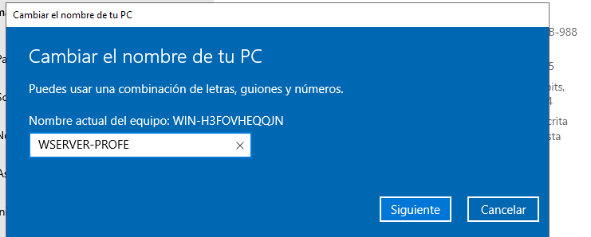
Reiniciamos para que aplique o cambio.
Comprobamos que está ben a iP, debería de quedar así:

## 1.1 - Instalar os servizos de dominio de Active Directory

Imos a:

- Herramientas Administrativas →Administración del Servidor.
- Administrar -> Agregar roles y características.

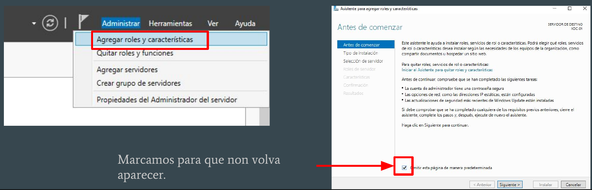

- Seleccionar tipo de instalación: **Instalación basada en características o en reoles**
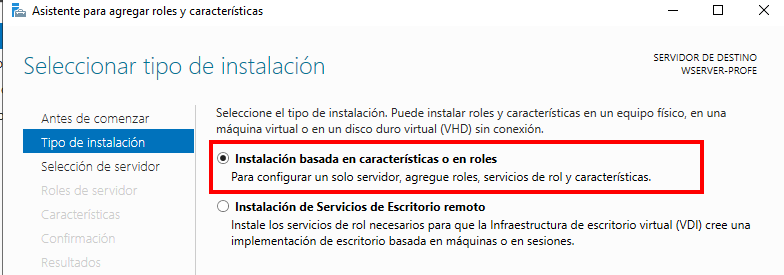
- Selección de servidor: **Seleccionar un servidor del grupo de servidores**
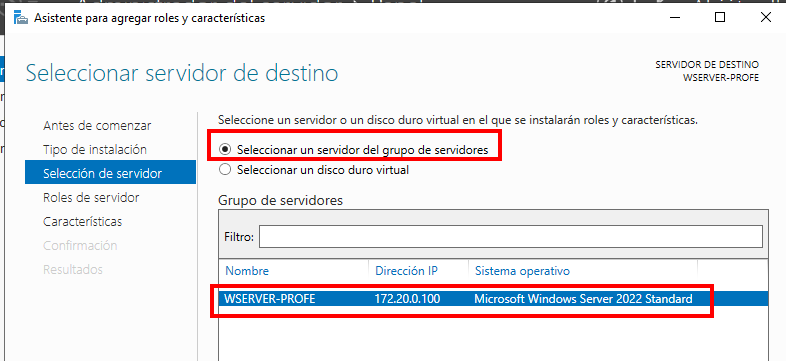
- Seleccionar roles de servidor: **SERVICIOS DE DOMINIO DE ACTIVE DIRECTORY**
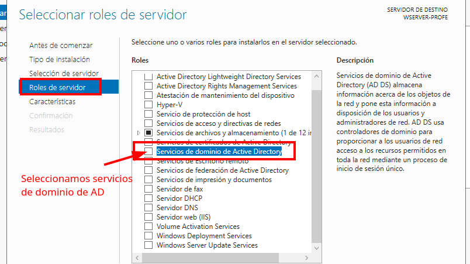
E agregamos as características:
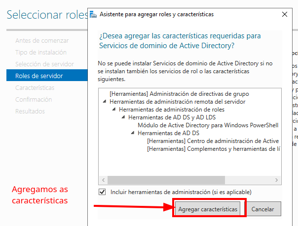
- Características: Deixamos as por defecto
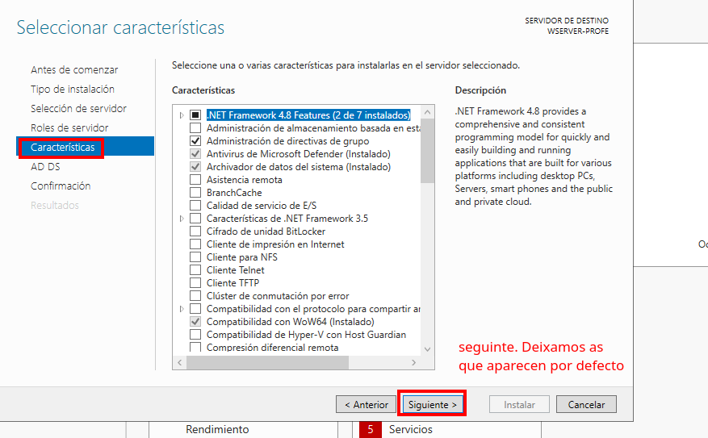
- AD DS - Deixamos as por defecto
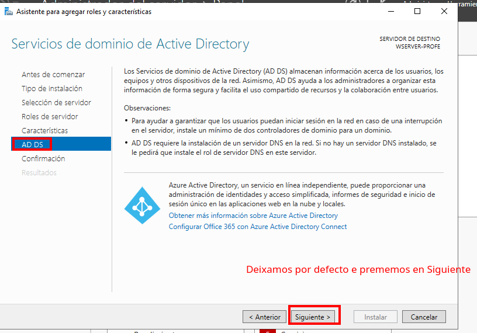
- Confirmación - Prememos en **Instalar**
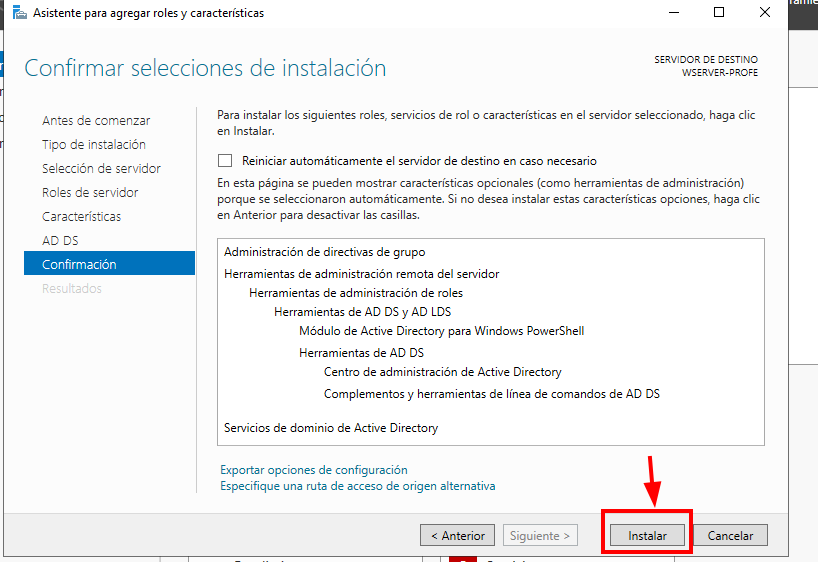
Cando finaliza a instalación, xa nos avisa de que faltan pasos adicionais para que esta máquina sexa
Controladora de Dominio, e dános a opción de facelo dende aquí.
Escollemos Cerrar.
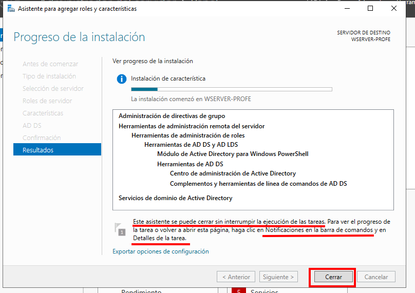

## 1.2 - Promover a Controlador de dominio

Se imos as notificacións, xa nos indica que debemos **Promover a controlador de dominio**.
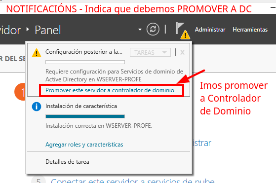
Indicamos o nome que vai ter o noso dominio **dcprofe.local** no meu caso, no voso caso sería **dcteunome.local**

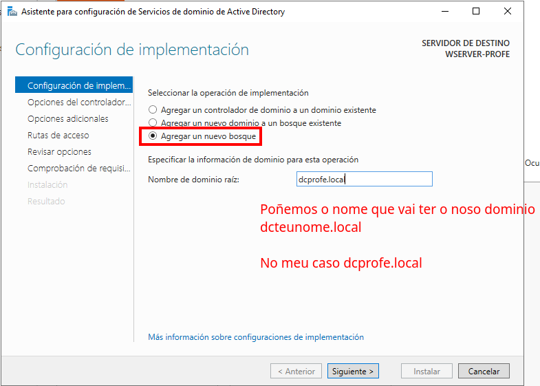

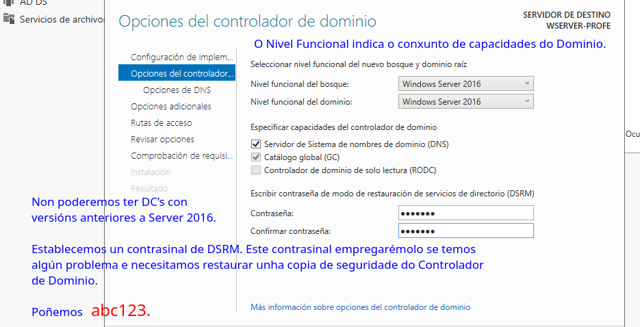

- Opciones de DNS - Prememos en seguinte
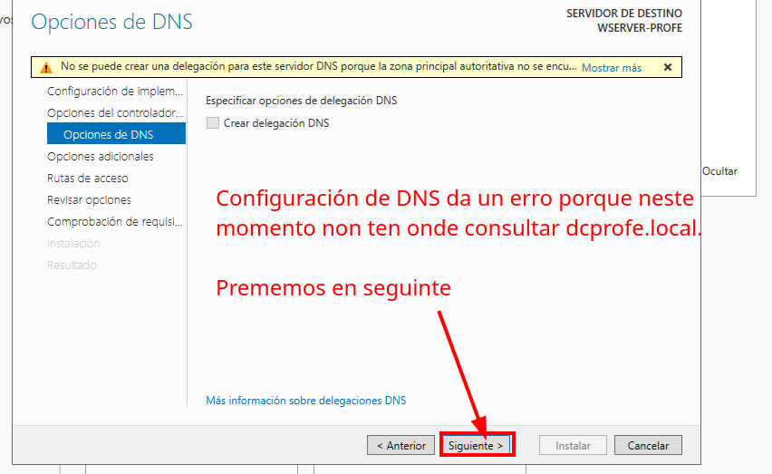
- Opciones adicionales - aceptamos o nome **NETBIOS** que propón:
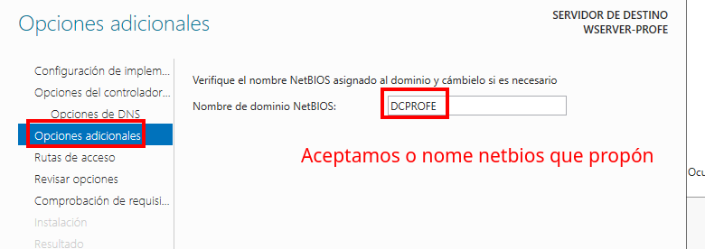
- Rutas de acceso - Aceptámolas
  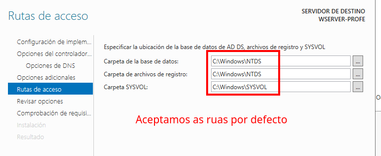
  - **Base de Datos**: contén os obxectos do dominio: Usuarios, Equipos, ....
  - **Arquivos de rexistro**: actividades realizadas no AD.
  - **SYSVOL**: almacena información común para todo o dominio que deberá ser accesible por todos os clientes:
    - scripts de inicio de sesión.
    - directivas.
- Revisamos as opcións escollidas e prememos en seguinte:
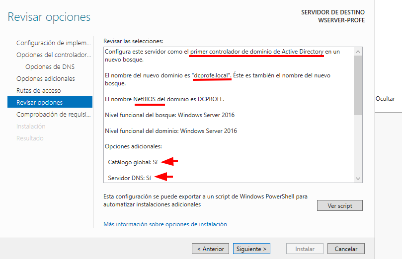
  
- Comprobación de requisitos
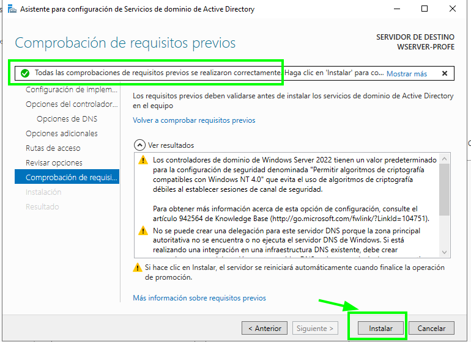
Aparecen unas advertencias, pero son normais. Escollemos Instalar e continuamos.
O equipo reiniciarase.

## 1.3 - Configuración servidor DNS

É un dos compoñentes fundamentais do directorio activo. Encárgase de **traducir os enderezos IP a nomes de dominio** e viceversa.

Cando navegamos escribimos http://www.google.com, é un servidor de DNS o que traduce esa URL
a unha dirección IP. Se non existisen os servidores DNS teriamos que lembrar e empregar os enderezos IP.
Nun servidor DNS podemos configurar:

- **zona de búsqueda directa**: procuramos un nome de equipo e devolve un enderezo IP.
- **zona de búsqueda inversa**: procuramos unha IP e devolve un nome de dominio.
- **reenviador DNS**: configúranse servidores DNS externos, aos que se lles preguntará en caso de non poder resolver un equipo no servidor DNS local.

### 1.3.1 Configuración do DNS

Iniciamos a ferramenta de administración do DNS.
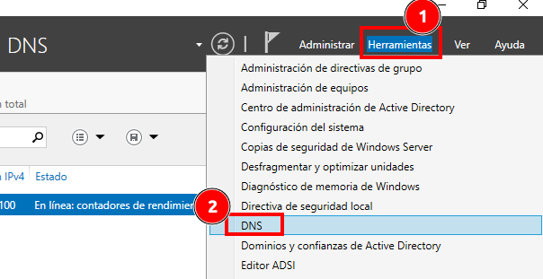
Inicialmente só se crea a zona de búsqueda directa. E de momento, nesta zona so está dado de alta o PC que é o propio servidor.
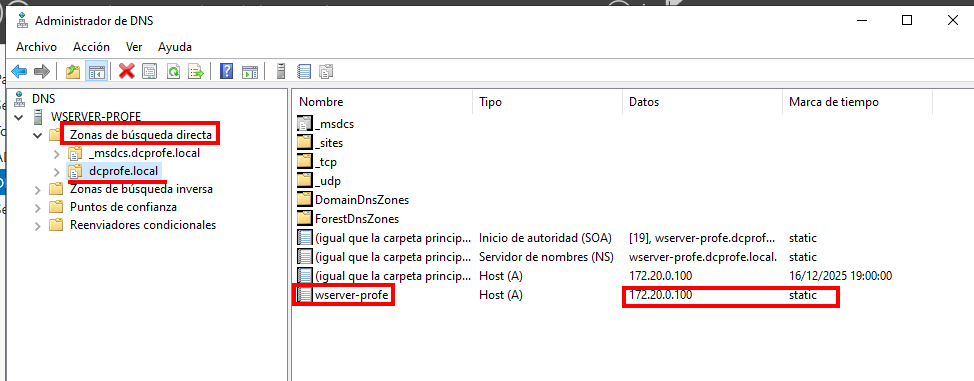

### 1.3.2 Reenviadores do DNS

No noso caso, para resolver calquera consulta que non sexa do noso DNS podemos acceder ao servidor de domino do Institudo **192.168.10.101** e logo ao de google, por exemplo, **8.8.8.8**, de forma que o que non resolva o noso DNS poda ser reenviado a estes outros.

Por suposto, neste momento estamos en rede interna e non temos saída fóra. No momento que configuremos o ROUTER NAT que nos dea saída ao exterior, este reenviador funcionará.

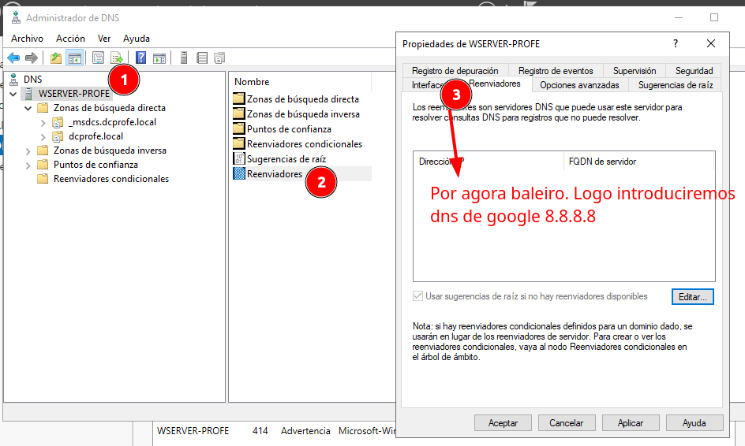

#### 1.3.3 Comprobando configuración DNS

Vemos que como a búsqueda directa está configurada, responde ao nome do PC "wsever-profe" coa súa ip, empregando nslookup.

Pero ao revés, se poñemos a IP non nos devolve o nome, xa que a **búsqueda inversa aínda non está configurada**.
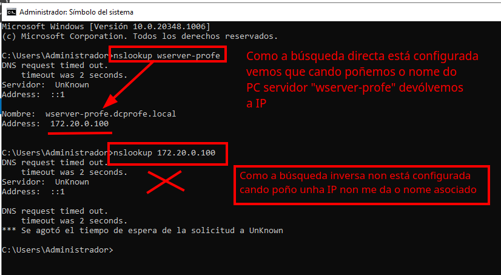

## 1.3.4 Creación de DNS zona búsqueda INVERSA

Configuramos a búsqueda inversa, para **traducir IPs en nomes de equipos**.
Imos a Ferramentas -> DNS e en Zonas de búsqueda **inverse** co botón dereito engadimos unha zona **zona nueva**
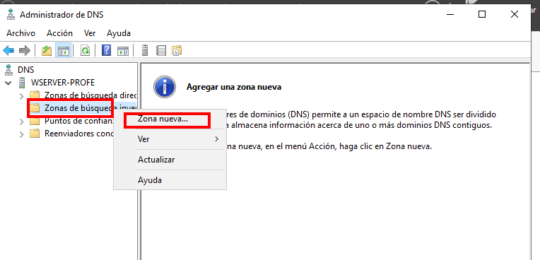
Engadimos unha **zona principal**
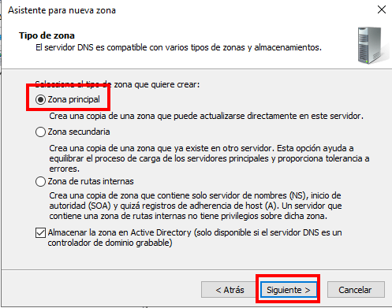
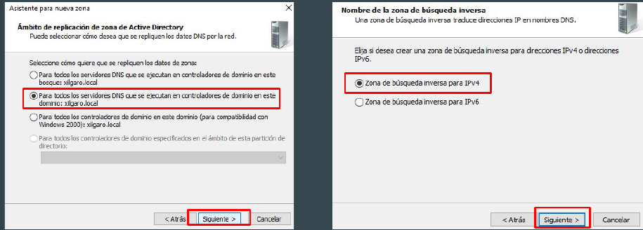
Definimos a nosa subrede:
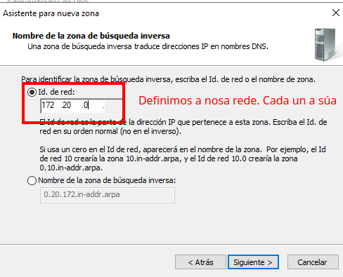
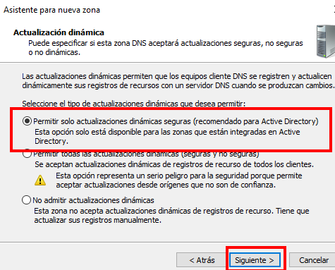
Danos un resumo, e prememos Finalizar.
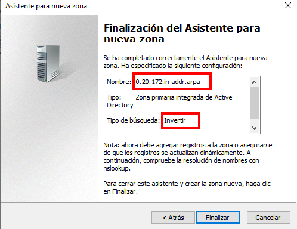

Temos a **zona de búsqueda inversa** creada, pero non temos ningún equipo dado de alta nela, como se ve na imaxe:
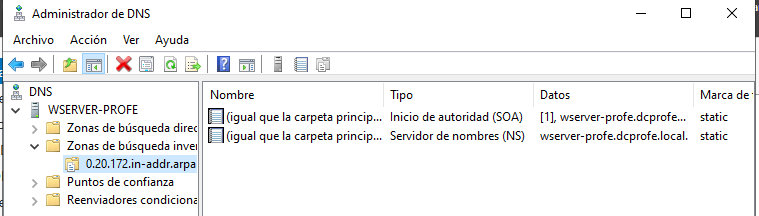

- Imos a zona **búsqueda directa** ao pc servidor e dámoslle **actualizar PTR asociado**
- 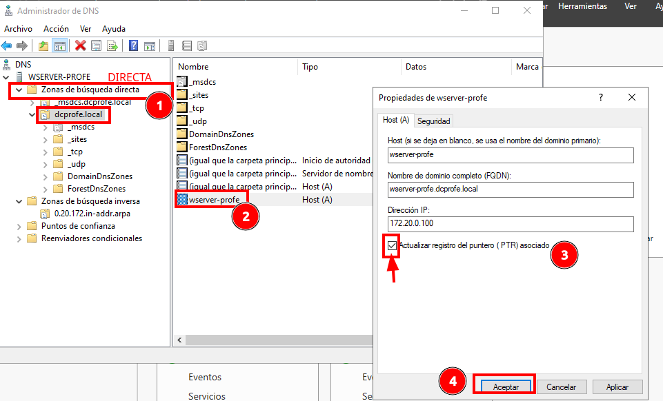
  
- Zona Inversa: Actualizamos o PTR asociado:
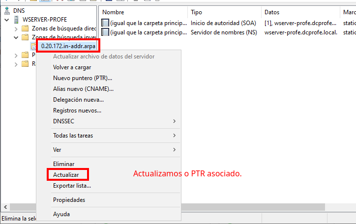
E xa aparece o PC servidor, como se ve na imaxen.
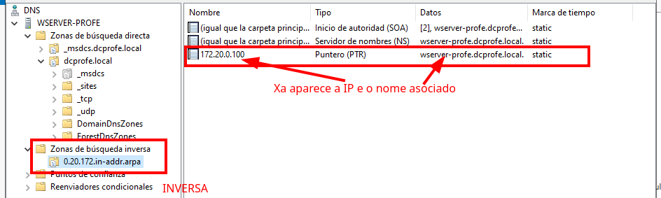

- Comprobamos se fai resolución inversa
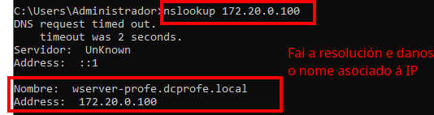

### 1.4 - Uso do servidor DNS - Rexistros SRV

 Empréganse polo servidor DNS para localizar os equipos que ofrecen servizos específicos.

Exemplo: cando un cliente quere autenticarse consulta o DNS para atopar ó servidor Kerberos.
Observamos os rexistros SVR creados.

- **_gc**: catálogo Global.
- **_kerberos**: autenticación dos usuarios no Dominio.
- **_kpasswd**: contrasinal de Kerberos.
- **_ldap**: atopar os obxectos (Usuarios, Equipos...) no Catálogo Global.
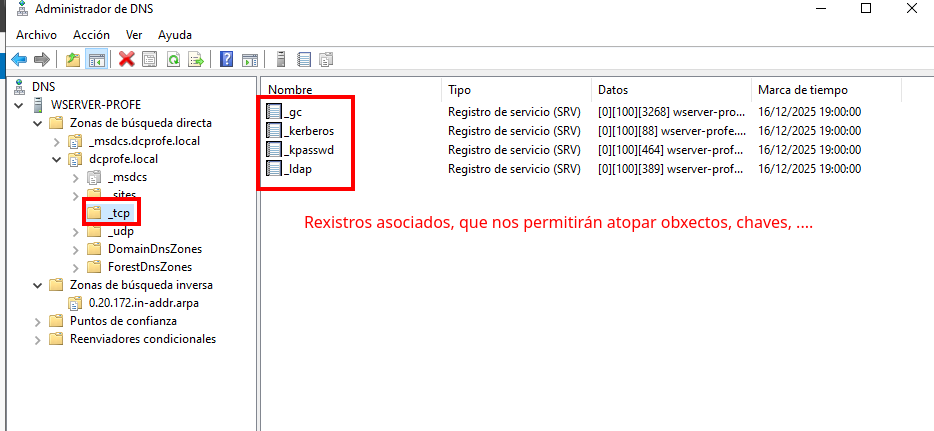

Os equipos preguntan ao DNS polos proveedores de servizos (LDAP,...)
O DNS responde aos equipos o equipo que proporciona esta información (winserver-profe)
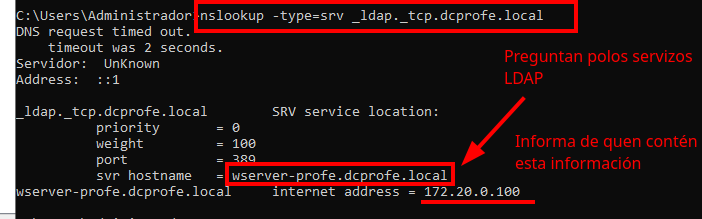

### 1.5 - Xestión de usuarios no DC

Ao ter un controlador de dominio, a **base de datos de usuarios locais xa non existe**.

- Os usuarios locais pasaron a ser **usuarios do dominio**
- Nun controlador de dominio, **non existen usuarios locais** (no pc Server)
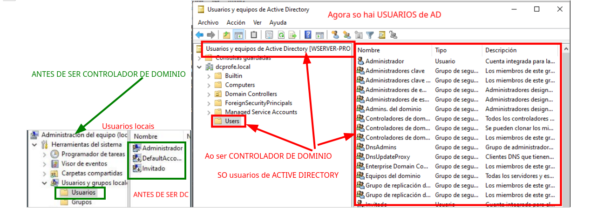

Agora poden xestionarse coa ferramenta: **Usuarios  y equipos de Active Directory**

## 1.6- Creando un usuario e un grupo global

Aproveitamos esta ferramenta para crear o grupo **gALUM** e o usuario **teunome** dentro deste grupo.

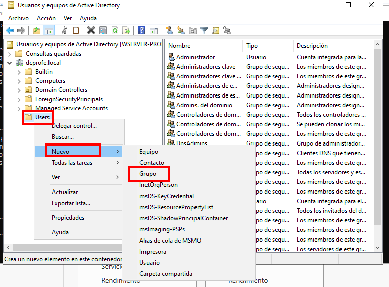
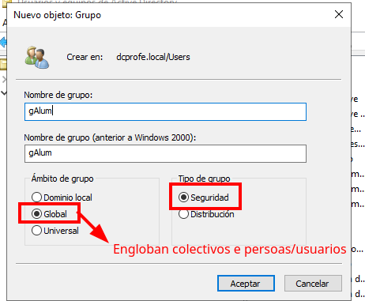
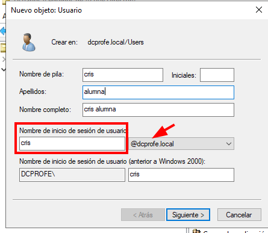
Engadimos o usuario dentro do grupo gAlum.
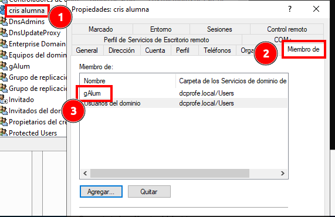