# Unir equipos Windows ao dominio AD

Unha das posibilidades de Active Directory é de actuar como servizo de autenticación. Deste xeito, un cliente pode configurarse para que solicite ao servidor a validación dun usuario e contrasinal para dar acceso aos seus recursos. Como cliente poden actuar aplicacións de escritorio, aplicacións web ou incluso sistemas operativos. Esta última opción é moi útil para unha rede de ordenadores, pois centraliza a autenticación dos usuarios nun único servizo.

Para poder probar as posibilidades que nos ofrece Active Directory necesitamos ter equipos que actúen como cliente do noso servizo.

Lembramos o esquema de rede:
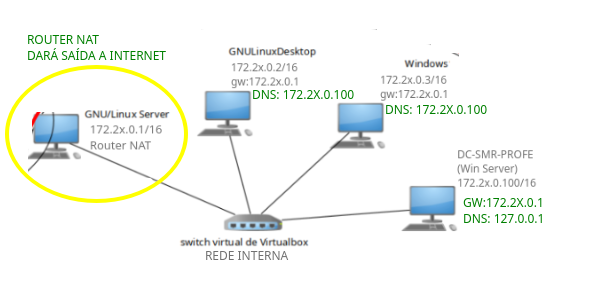

Imos configurar o **PC Windows 11 Pro** con IP **172.20.0.3/16**, tal e como se ve na imaxe, e unido ao dominio.
Desta forma o servidor DNS será **172.20.0.100** que é o noso servidor de dominio e **servidor dns**.

## 1. Configuración da rede do Windows 11 Pro cliente

**Características da MV de Windows 11 Pro**
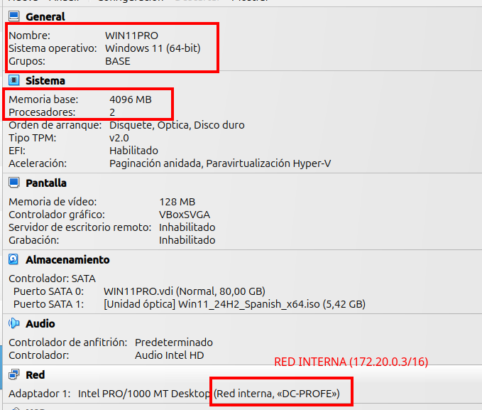

- Nome da MV: **WIN01-DCPROFE**
- Hostname: **WIN01-DCPROFE**
- Rede: 172.20.0.3/16 - DNS:172.20.0.100 - GW - 172.20.0.1 (Para cando o configuremos)
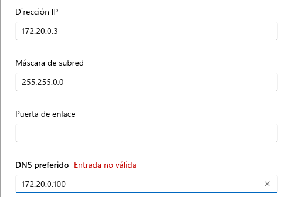
Comprobamos a conectividade co servidor:
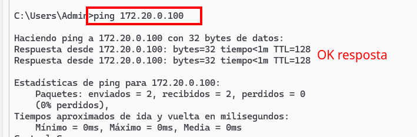

## 2. Cambiar o nome do hostname do PC
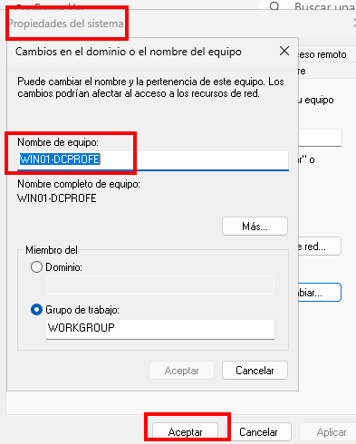

## 3. Unir o equipo ao dominio
Acceder ás propiedades do sistema, desde algunha das vías e configurar o equipo como **membro do dominio DCPROFE.LOCAL**
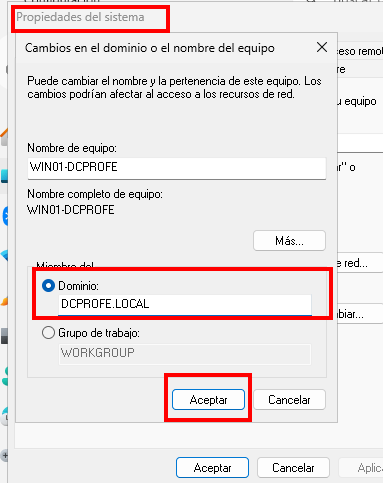
Vai solicitar a chave dun usuario con permisos de **administración**, con permisos para unir o PC ao dominio, no noso caso podemos usar as credenciais do **Administrador do domino**.
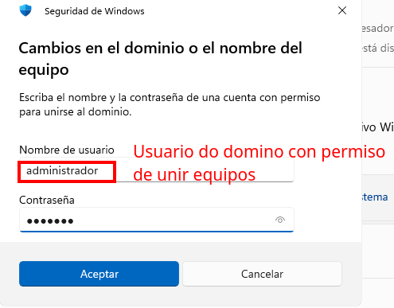

Indica que se uniu correctamente:
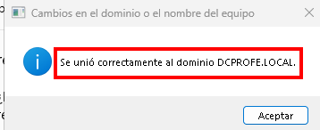

### 3.1 Posibles Erros ao unir ao dominio
Cando unimos un equipo ao dominio, un erro típico pode ser o que aparece na imaxe.

Este erro pode estar asociado a un **erro ao escribir o nome do dominio**, pero se non é o caso, o **erro está na configuración do nivel IP, indicando que o servidor DNS non apunta a IP do controlador de dominio**.
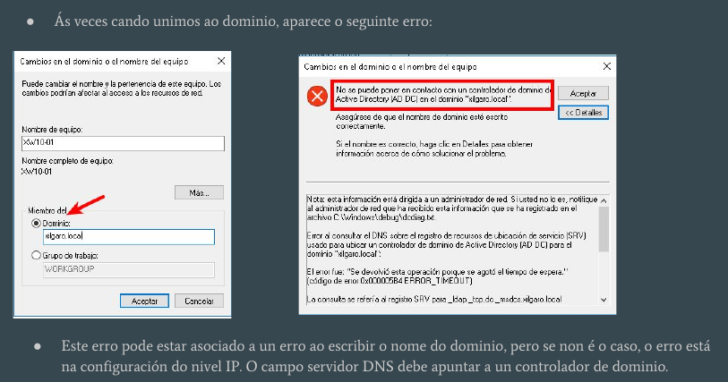

## 4. Cambios no servidor ao unir o equipo cliente
Cando se une un novo PC:
- Aparece no apartado **COMPUTERS** da ferramenta de **Usuarios y equipos de Active Directory**
- No apartado DNS aparece este equipo, tanto na búsqueda directa como na búsqueda inversa.
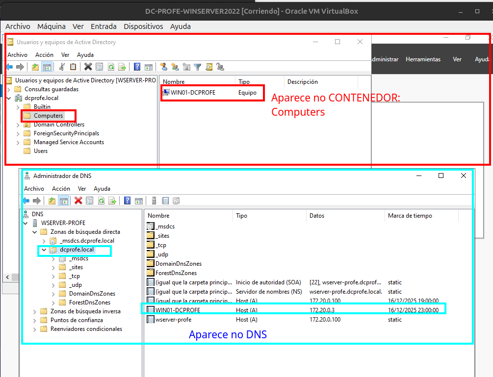

Se comprobamos o dns:
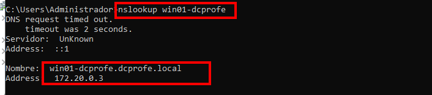
Resolución inversa:
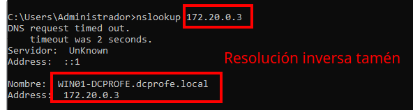

## 5. Cambios no cliente win01-dcprofe

O administrador do dominio é membro do grupo Administradores local.

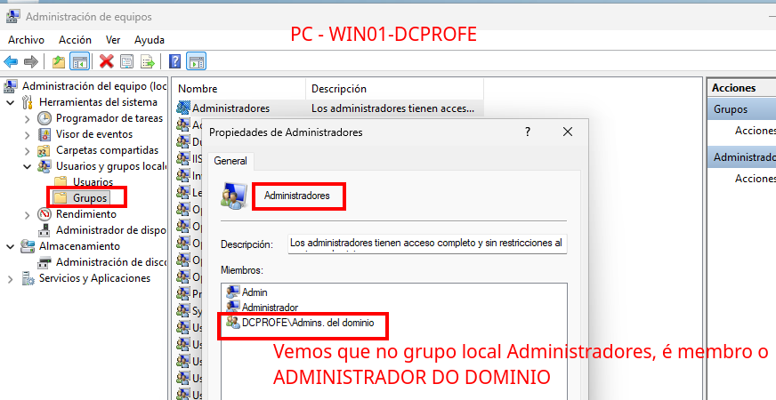

O nome do equipo leva tamén o nome do dominio win01-dcprofe.**dcprofe.local**
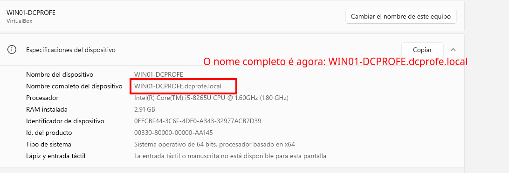

Vemos que se antes existía un usuario local co mesmo nome, a carpeta de perfil de usuario, ao usuario do dominio, lle engade a coletilla cris.**DCPROFE** para distinguila do perfil do **usuario local cris**
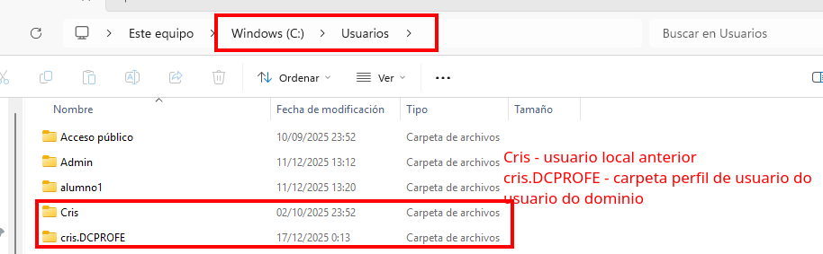

## 6. Acceder ao dominio co nome UPN ou con formato clásico
Pódese acceder ao dominio co nome de SAMAccount, ou co nome UPN (que é máis moderno e permite nomes de calquera lonxitude)
Por exemplo, co usuario:
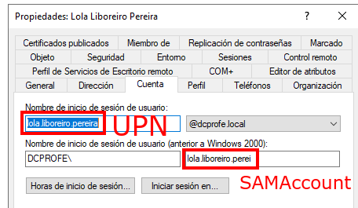
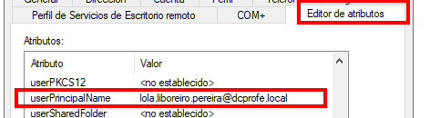
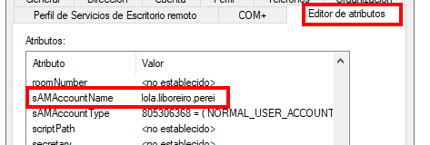
**Formato UPN (User Principal Name)**
Este é o formato moderno, semellante a un correo electrónico. É o que debes usar se o teu nome de usuario é longo (máis de 20 caracteres), xa que non ten a limitación do sAMAccountName.
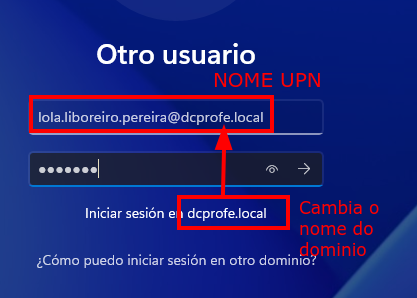
    Exemplo: lola.liboreiro.pereira@dcprofe.local
    Cando escribes o @, Windows entende automaticamente a que dominio queres conectar, polo que non importa o que poña debaixo do cadro de texto (onde adoita dicir "Iniciar sesión en: ...").

**Formato Clásico (Down-Level Logon Name)**

Este é o formato tradicional de tipo DOMINIO\usuario. Lembra que aquí o nome de usuario está limitado a 20 caracteres. Se o teu nome no AD se cortou, tes que poñelo exactamente como aparece no campo "Nombre de inicio de sesión (anterior a Windows 2000)".

Se o equipo xa está no dominio, este nome é o que debes poñer.
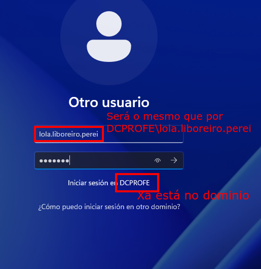

    Exemplo: DCPROFE\lola.liboreiro.perei

## 7. Acceder ao equipo unido ao dominio como usuario local

Por defecto, cando un equipo se une ao dominio, o usuario que se conecta é o de dominio.

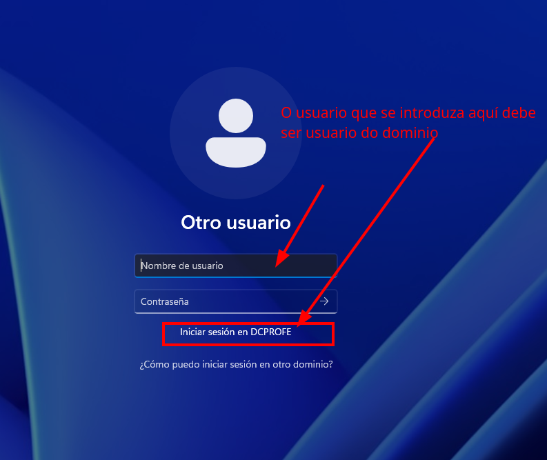

Se queremos acceder como usuario local temos dúas opcións:

- Poñer no nome de usuario **.\nomeusuariolocal**, exemplo, no noso caso **.\administrador**
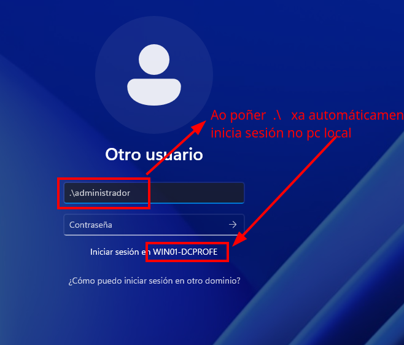
- Poñer no nome de usuario **nomePC\nomeusuariolocal**, no noso caso **win01-dcprofe\administrador**
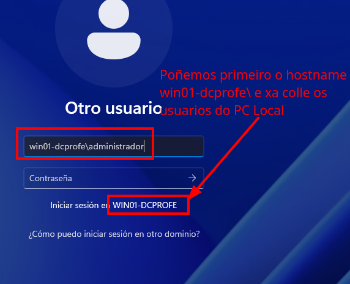
