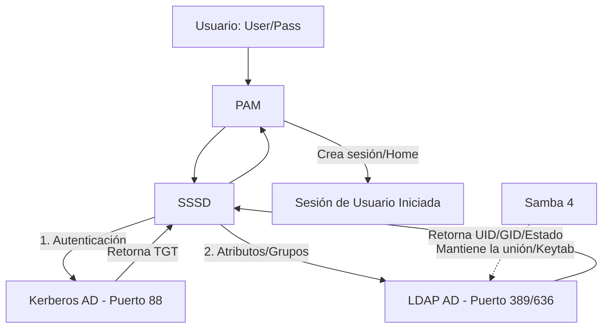

# Esquema: Proceso de Login Linux en Active Directory (AD)

Este proceso describe cómo un sistema Ubuntu utiliza **SSSD** (System Security Services Daemon) como puente principal entre los módulos de Linux y el controlador de dominio de Windows.

## 1. Arquitectura de Componentes

* **PAM (Pluggable Authentication Modules):** El "portero". Gestiona quién entra y bajo qué condiciones.
* **SSSD:** El "traductor y mediador". Conecta el sistema Linux con AD (vía Kerberos y LDAP).
* **Kerberos:** El "notario". Valida las contraseñas y emite tickets de seguridad.
* **LDAP (AD):** La "base de datos". Almacena los atributos del usuario, grupos y estado de la cuenta.
* **NSS (Name Service Switch):** El "identificador". Asigna nombres de usuario a IDs numéricos (UID/GID) que Linux entienda.
* **Samba 4:** La "herramienta de integración". Mantiene la confianza entre la máquina y el dominio (`keytab`).

---

## 2. El Flujo de Conexión (Paso a Paso)

| Fase | Componente | Acción Detallada |
| --- | --- | --- |
| **1. Entrada** | **Login Manager** | El usuario introduce `usuario@DOMINIO` y `password` en GDM, Consola o SSH. |
| **2. Delegación** | **PAM (auth)** El "portero"| PAM recibe los datos y consulta `/etc/pam.d/common-auth`. Al ver `pam_sss.so`, le pasa las credenciales a SSSD. |
| **3. Validación** | **SSSD** El "traductor y mediador" + **Kerberos**El "notario" | SSSD contacta con el **KDC** (Key Distribution Center) del AD. Kerberos valida la clave y, si es correcta, entrega un **TGT** (Ticket Granting Ticket) que se guarda en caché. |
| **4. Verificación** | **PAM (account)** | SSSD consulta al AD vía **LDAP** para verificar: ¿Está la cuenta activa? ¿Ha caducado la contraseña? ¿Tiene permiso para entrar a esta hora? |
| **5. Identidad** | **NSS** El "identificador" | El sistema pregunta: "¿Quién es este usuario para Linux?". NSS busca en `/etc/nsswitch.conf`, consulta a SSSD y este traduce el SID de Windows en un **UID/GID** de Linux. |
| **6. Entorno** | **PAM (session)** | Se ejecuta `pam_mkhomedir.so` para crear automáticamente la carpeta `/home/usuario@dominio` si no existe. |
| **7. Finalización** | **Shell / GUI** | El usuario accede a su sesión con su ticket Kerberos listo para usar en recursos de red (como carpetas compartidas). |

---

## 3. Diagrama de Interacción Simplificado

---

## 4. Resumen de Archivos Clave y su Rol

* **/etc/sssd/sssd.conf**: Configuración principal de la conexión con AD.
* **/etc/krb5.conf**: Configuración del reino (Realm) de Kerberos y localización de los DCs.
* **/etc/nsswitch.conf**: Define que el sistema debe mirar en `sss` para encontrar usuarios y grupos.
* **/etc/pam.d/common-***: Define la secuencia de módulos para autenticación, cuentas y sesiones.
* **/etc/krb5.keytab**: Archivo binario (gestionado por Samba) que permite a la máquina Linux identificarse ante el AD de forma segura.

# Simuladores

- [kerberos simulador]([https://](https://andr3sdr.github.io/infografias/25-26/Bastionado/simulador-Kerberos.html))