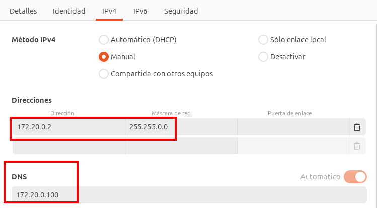
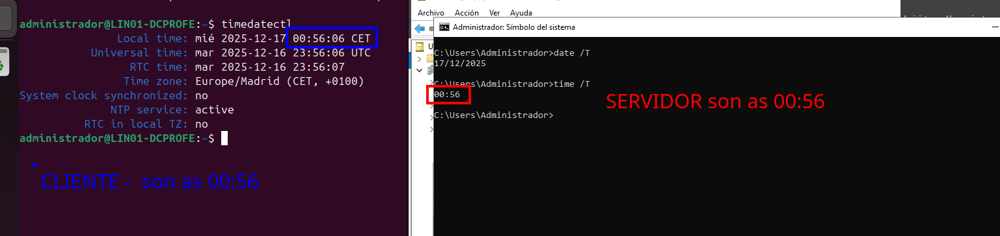
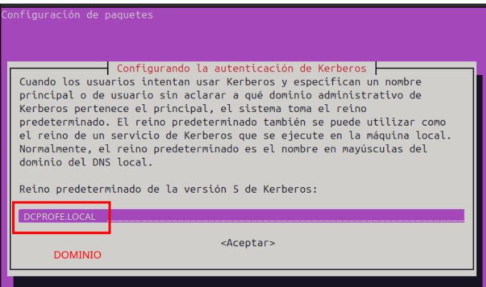
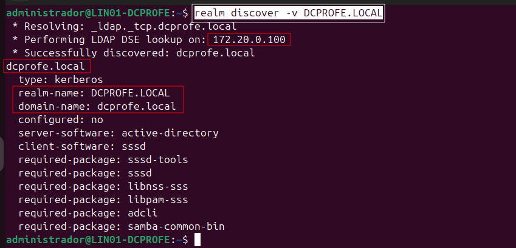
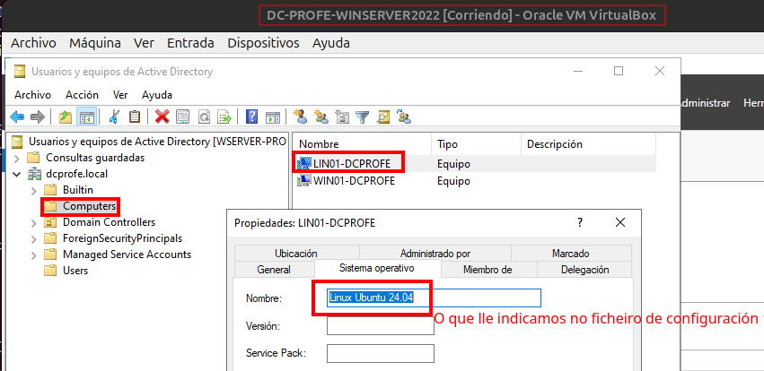
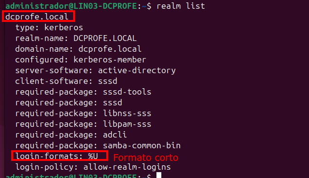
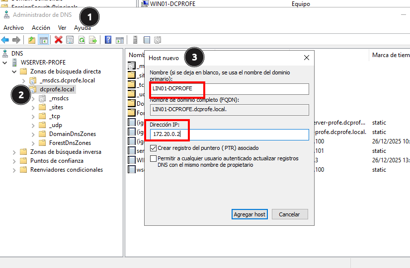
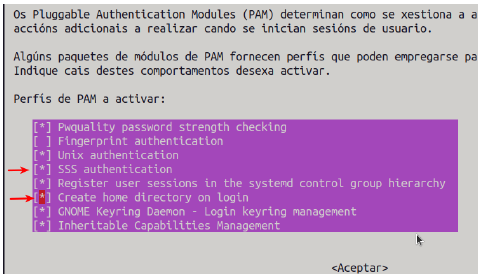
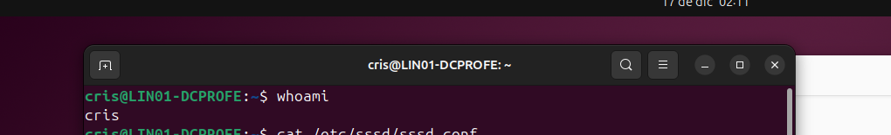

# Ubuntu como cliente de Active Directory

## Obxectivo

A unión de clientes Ubuntu ao dominio para que a autenticación sexa centralizada é necesaria cando na rede se traballa con máquinas GNU/Linux.

Imos unir a máquina **LINO1-DCPROFE** ao dominio de **DCPROFE.LOCAL**.

## ESCENARIO

1. Máquina cunha interfaz en rede interna: 172.20.0.2/16 e DNS: 172.16.0.100 e no modo interno **DCPROFE** de  creado VirtualBox
2. No `/etc/resolv.conf` ten que estar como `nameserver 172.20.0.100` sempre de primeiro e o dominio de busca `search DCPROFE.LOCAL`

## 1. Configuración do nome

Inicialmente a máquina  **LINO1-DCPROFE** está na mesma rede que o controlador de dominio **DCPROFE**.

`/etc/hostname` e poñemos o nome **LIN01-DCPROFE**
`/etc/hosts` e poñemos o nome novo.

Reiniciamos `sudo reboot`

## 2. Configuración da rede

### 2.1 Tarxeta en modo INTERNA (rede DCPROFE creada en VBox)

**Dirección IP** do LINO1-DCPROFE.


Comprobar a configuración facendo `ip a`

***Se non temos configurada o enrutador NAT, podemos engadirlle para isto provisionalmente unha interface NAT.***
Este inferface configuraríamola como DHCP e logo engadiríamos no /etc/resolv.conf ao final o nameserver 8.8.8.8 como se mostra no seguinte apartado.

### 2.2 Configuración de /etc/resolv.conf

Configuramos /etc/resolv.conf de forma que quede do seguinte modo:

1. Eliminamos o link simbólico a /etc/resolv.conf, para que non cargue a configuración do NetworkManager.
`sudo unlink /etc/resolv.conf`
2. Borramos o ficheiro `sudo rm /etc/resolv.conf`
3. Creamos de novo /etc/resolv.conf coa configuración da nosa máquina, no noso caso

`sudo nano /etc/resolv.conf`

```bash
  nameserver 172.20.0.100
  search DCPROFE.LOCAL
```

Se tiverades outra interface de rede nunha rede distinta, por exemplo unha NAT, podería quedar así, de forma que resolve primeiro na rede local e logo na externa.

```bash
  nameserver 172.20.0.100
  search DCPROFE.LOCAL
  nameserver 8.8.8.8
```

4. Facemos o /etc/resolv.conf inmutable. Para eso debería de borrar o ficheiro e volver crealo e logo teclear:
`chattr +i /etc/resolv.conf`
5. Comprobamos que resolve os nomes, por exemplo, poñemos o nome do servidor de AD.

```bash
administrador@LIN03-DCPROFE:~$nslookup wserver-profe
Server: 172.20.0.100
Address: 172.20.0.100#53

Name:	wserver-profe.DCPROFE.LOCAL
Address: 172.20.0.100

```

Vemos que como xa resolve o DNS local, xa non o busca en 8.8.8.8.

7. Comprobamos a **Tabla de rutas** do LINO1-DCPROFE con algún destes comandos `ip r` `resolvectl` `nmcli`:

```bash
administrador@LIN01-DCPROFE:~$ ip r
172.20.0.0/16 dev enp0s3 proto kernel scope link src 172.20.0.2 metric 100  
```

```bash
~$ resolvectl
Global
         Protocols: -LLMNR -mDNS -DNSOverTLS DNSSEC=no/unsupported
  resolv.conf mode: stub

Link 2 (enp0s3)
    Current Scopes: DNS
         Protocols: +DefaultRoute -LLMNR -mDNS -DNSOverTLS DNSSEC=no/unsupported
Current DNS Server: 172.20.0.100
       DNS Servers: 172.20.0.100
```


```bash
$ nmcli
enp0s3: conectado to netplan-enp0s3
        "Intel 82540EM"
        ethernet (e1000), 08:00:27:E5:10:CF, hw, mtu 1500
        inet4 172.20.0.4/16
        route4 172.20.0.0/16 metric 100

lo: connected (externally) to lo
        "lo"
        loopback (unknown), 00:00:00:00:00:00, sw, mtu 65536
        inet4 127.0.0.1/8
        inet6 ::1/128

enp0s8: no disponible
        "Intel 82540EM"
        ethernet (e1000), 08:00:27:9C:2C:08, hw, mtu 1500

DNS configuration:
        servers: 172.20.0.100
        interface: enp0s3

```

## 3. Sincronización da hora

A opción máis sinxela, forzamos a zona a **Europe/Madrid** que é a mesma que no servidor.
`sudo timedatectl set-timezone Europe/Madrid`

Comprobamos con `timedatectl` e no servidor Windows podemos facer `date /T`, `time /T`
É importante que o equipo teña a mesma hora que o servidor.


Senón estivera sincronizada, poderíamos facer que sincronice co servidor cos servizos **chrony** ou **ntp** ou **ntpsec** nalgunhas distribucións.

## 4. Instalación do software

Temos que instalar os servizos realmd e sssd que nos van permitir unir o equipo ao dominio. Instalaremos paquetes:

1.**Autenticarse** (traballo de `sssd` e `krb5-user`).
2.**Unirse ao Dominio** (traballo de `realmd` e `adcli`).
3.**Acceder a recursos** (traballo das librarías de `samba`).
4.**Crear carpeta home** (`oddjob`)

```bash
apt install -y realmd sssd sssd-tools samba-common krb5-user packagekit samba-common-bin samba-libs adcli oddjob oddjob-mkhomedir sssd-ad
```

Durante a instalación vainos preguntar polo realm por defecto, que será o noso nome de dominio en **MAIÚSCULAS**.


## 5. Configuración do ficheiro /etc/realmd.conf 

Coa orde `realm discover -v DCPROFE.LOCAL` obtemos información do noso dominio.


A continuación temos que crear o arquivo /etc/realmd.conf co seguinte contido:
`sudo nano /etc/realmd.conf`

```ini
administrador@PCLIN-01-AD:~$ cat /etc/realmd.conf 
[users]
# define Samba AD users behavior
# define default home directory and shell for Samba AD users
default-home = /home/%U
default-shell = /bin/bash

[active-directory]
# define realmd connection to the Samba AD
# you can use `sssd` or `winbind` for realmd to join Samba AD
# os-name can used as an identifier for client
default-client = sssd
os-name = Linux Ubuntu

[service]
# disable automati install for additional realmd service
automatic-install = no

[dcprofe.local]
# define behavior of Samba AD `example.lan`
# disable fully-qualified-names so you can use a username to identify Samba users
# automatic-id-mapping to yes will automatically generate UID and GID numbers
# user-principal to yes will automatically create UserPrincipalName for the client machine
# manage-system to yes to enabled realmd to manage client machine
fully-qualified-names = no
automatic-id-mapping = yes
user-principal = yes
manage-system = yes
```

Este arquivo con formato INI, coa información do cliente e referente aos usuarios. Debemos prestar atención a que ten unha sección para o noso dominio **dcprofe.local**.

Tedes cumprida información sobre o contido do arquivo en [realmd.conf](https://www.freedesktop.org/software/realmd/docs/realmd-conf.html)

## 6. A unión ao dominio con realm join

Co comando **realm join** podemos unirnos ao dominio, se queremos estudar as opcións que ten empregamos **`realm join --help`**

### Unión a AD en Versións de Windows Anteriores a 2025 Server

Agora xa podemos facer a unión ao dominio, empregamos a orden **`sudo realm -v join -U administrador dcprofe.local`** e vemos que a saída é exitosa.

Empregamos `adcli` para unir o equipo ao dominio, que utiliza o protocolo `ldap`.

```bash
$ sudo realm -v join -U administrador dcprofe.local
 * Resolving: _ldap._tcp.dcprofe.local
 * Performing LDAP DSE lookup on: 172.20.0.100
 * Successfully discovered: dcprofe.local
Contraseña para administrador: 
 * Unconditionally checking packages
 * Resolving required packages
 * LANG=C /usr/sbin/adcli join --verbose --domain dcprofe.local --domain-realm DCPROFE.LOCAL --domain-controller 172.20.0.100 --os-name Linux Ubuntu 24.04 --login-type user --login-user administrador --stdin-password --user-principal
 * Using domain name: dcprofe.local
 * Calculated computer account name from fqdn: LIN01-DCPROFE
 * Using domain realm: dcprofe.local
 * Sending NetLogon ping to domain controller: 172.20.0.100
 * Received NetLogon info from: WSERVER-PROFE.dcprofe.local
 * Wrote out krb5.conf snippet to /var/cache/realmd/adcli-krb5-qttefK/krb5.d/adcli-krb5-conf-3RHmI6
 * Authenticated as user: administrador@DCPROFE.LOCAL
 * Using GSS-SPNEGO for SASL bind
 * Looked up short domain name: DCPROFE
 * Looked up domain SID: S-1-5-21-1404642060-1968053958-3891669116
 * Received NetLogon info from: WSERVER-PROFE.dcprofe.local
 * Using fully qualified name: LIN01-DCPROFE
 * Using domain name: dcprofe.local
 * Using computer account name: LIN01-DCPROFE
 * Using domain realm: dcprofe.local
 * Calculated computer account name from fqdn: LIN01-DCPROFE
 * With user principal: host/lin01-dcprofe@DCPROFE.LOCAL
 * Generated 120 character computer password
 * Using keytab: FILE:/etc/krb5.keytab
 * A computer account for LIN01-DCPROFE$ does not exist
 * Found well known computer container at: CN=Computers,DC=dcprofe,DC=local
 * Calculated computer account: CN=LIN01-DCPROFE,CN=Computers,DC=dcprofe,DC=local
 * Encryption type [3] not permitted.
 * Encryption type [1] not permitted.
 * Created computer account: CN=LIN01-DCPROFE,CN=Computers,DC=dcprofe,DC=local
 * Trying to set computer password with Kerberos
 * Set computer password
 * Retrieved kvno '2' for comp## Evidencias no dominio ADuter account in directory: CN=LIN01-DCPROFE,CN=Computers,DC=dcprofe,DC=local
 * Checking RestrictedKrbHost/LIN01-DCPROFE
 *    Added RestrictedKrbHost/LIN01-DCPROFE
 * Checking host/LIN01-DCPROFE
 *    Added host/LIN01-DCPROFE
 * Discovered which keytab salt to use
 * Added the entries to the keytab: LIN01-DCPROFE$@DCPROFE.LOCAL: FILE:/etc/krb5.keytab
 * Added the entries to the keytab: host/lin01-dcprofe@DCPROFE.LOCAL: FILE:/etc/krb5.keytab
 * Added the entries to the keytab: host/LIN01-DCPROFE@DCPROFE.LOCAL: FILE:/etc/krb5.keytab
 * Added the entries to the keytab: RestrictedKrbHost/LIN01-DCPROFE@DCPROFE.LOCAL: FILE:/etc/krb5.keytab
 * /usr/sbin/update-rc.d sssd enable
 * /usr/sbin/service sssd restart
 * Successfully enrolled machine in realm
```

Vemos que o equipo xa aparece no directorio activo como equipo do dominio.

### Unión a AD en Versión Server 2025

En Server 2025 aumentáronse as políticas de seguridade para unir equipos ao dominio, así que imos empregar samba `--membership-software=samba` para unir o equipo ao dominio, que emprega o protocolo `RPC/SAMR (similar a Windows nativo)`.

Empregaremos:

`sudo realm join --verbose --user=administrador --membership-software=samba dcprofe.local`

Vemos que a salida é:

```bash
administrador@LIN01-DCPROFE:~$ sudo realm join --verbose --user=administrador --membership-software=samba dcprofe.local
 * Resolving: _ldap._tcp.dcprofe.local
 * Performing LDAP DSE lookup on: 172.20.0.100
 * Successfully discovered: dcprofe.local
Contraseña para administrador: 
 * Unconditionally checking packages
 * Resolving required packages
 * LANG=C LOGNAME=root /usr/bin/net --configfile /var/cache/realmd/realmd-smb-conf.DKS3I3 -U administrador --use-kerberos=required ads join dcprofe.local osName=Linux Ubuntu24.04 createupn
Password for [DCPROFE\administrador]:DNS update failed: NT_STATUS_INVALID_PARAMETER

Using short domain name -- DCPROFE
Joined 'LIN01-DCPROFE' to dns domain 'dcprofe.local'
No DNS domain configured for lin01-dcprofe. Unable to perform DNS Update.
 * LANG=C LOGNAME=root /usr/bin/net --configfile /var/cache/realmd/realmd-smb-conf.DKS3I3 -U administrador ads keytab create
Password for [DCPROFE\administrador]:
 * /usr/sbin/update-rc.d sssd enable
 * /usr/sbin/service sssd restart
 * Successfully enrolled machine in realm

```

## 7. Comprobación de que se creou a conta de equipo en Active Directory

Se imos á consola de Usuarios e Equipos de Active directory veremos que temos unha conta de equipo creada no Container Computers.


Por suposto se tiveramos creado previamente o equipo nunha OU o vincularía a este obxecto directamente.

**Permito o acceso a todos os usuarios do dominio** `sudo realm permit --all`

Podemos comprobar se está ben unido:

- `realm list` e debe dar unha lista de dominios:

- `id usuariodominio`: podemos facer `id crisprofe` por exemplo, xa que no noso caso hai un usuario chamado crisprofe no dominio.

```bash
$ id crisprofe
uid=118201110(crisprofe) gid=118200513(usuarios del dominio) grupos=118200513(usuarios del dominio),118201111(profes)
```

E vemos que xa aparece que é un usuario do dominio, e aos grupos que pertence.

- `getent passwd usuariodominio`

```bash
$ getent passwd crisprofe
crisprofe:*:118201110:118200513:crisprofe Puga Barreiros:/home/crisprofe:/bin/bash
```

## 8. Engadir unha entrada no servidor DNS do DC

Abrimos a xestión de **DNS** e configuramos unha nova entrada para o PC que se acaba de asociar.


## 9. Configurar /etc/sssd/sssd.conf para acceso usuarios e recursos

**Comproba que tes en /etc/resolv.conf soamente o nameserver do DC**
Automaticamente creouse un arquivo para o demo de servizos de seguridade do sistema (SSSD). Este arquivo está en **/etc/sssd/sssd.conf**

```ini
administrador@LIN01-DCPROFE:~$ sudo cat /etc/sssd/sssd.conf

[sssd]
domains = dcprofe.local
config_file_version = 2
services = nss, pam, pac

[domain/dcprofe.local]
default_shell = /bin/bash
krb5_store_password_if_offline = True
cache_credentials = True
krb5_realm = DCPROFE.LOCAL
realmd_tags = manages-system joined-with-adcli 
id_provider = ad
fallback_homedir = /home/%u
ad_domain = dcprofe.local
use_fully_qualified_names = False
ldap_id_mapping = True
access_provider = ad
```

Explicación dalgunha liña:

- **services = nss, pam, pac**: **nss**, indica quen eres; **pam**: verifica quen dis ser; **pac**: detalla que privilexios tes.
- **use_fully_qualified_names = False** indica que non fai falla usar sempre a coletilla @dcprofe.local, por exemplo, para rexistrarse pode facerse con **crisprofe** sen ter que por **crisprofe.dcprofe.local**

Tedes información sobre este servizo en [Capítulo 2. Entender el SSSD y sus beneficios Red Hat Enterprise Linux 8 | Red Hat Customer Portal](https://access.redhat.com/documentation/es-es/red_hat_enterprise_linux/8/html/configuring_authentication_and_authorization_in_rhel/understanding-sssd-and-its-benefits_configuring-authentication-and-authorization-in-rhel)

## 10. Configuración pam-auth-update para iniciar en gráfico

Para poder iniciar sesión en modo gráfico o usuario ten que ter directorio home.

Para iso, podemos crear o directorio se éste non existe cando o usuario inicia sesión no equipo.

Temos que configurar Linux Pluggable Authentication Modules [PAM (Español) - ArchWiki](https://wiki.archlinux.org/title/PAM_\(Espa%C3%B1ol\)). Executando o comando **sudo pam-auth-update** permite seleccionar os modos de inicio de sesión e que cree o home.



Vemos que se pode iniciar sesión correctamente:


---

## Explicación dos protocolos e paquetes

### PAM (Pluggable Authentication Modules)

PAM  é un framework que proporciona un **nivel de abstracción** entre as aplicacións que requiren autenticación (como login, su, SSH) e os mecanismos de autenticación reais (Kerberos, contrasinais locais, contrasinais de AD, etc.).

#### Como funciona no Escenario de AD

1. A Aplicación Pregunta: O usuario escribe su - cris. A aplicación su pregunta a PAM: "**Pode o usuario cris iniciar sesión e ten permiso para iniciar a sesión?**"
2. PAM Consulta SSSD: PAM consulta a súa propia configuración (en /etc/pam.d/) e di: "**Debo preguntar primeiro á base de datos local e logo ao módulo sssd**".
3. **SSSD Autentica**: O módulo **pam_sss.so** toma o nome de usuario e contrasinal, envía a solicitude a SSSD, e SSSD usa Kerberos para comprobar as credenciais contra o Active Directory.
4. PAM Xestiona a Sesión: Se a autenticación é exitosa, PAM segue coa xestión da sesión, por exemplo, executando o módulo pam_mkhomedir.so para crear o cartafol /home/alumno1.

**PAM** non autentica por si mesmo; **decide a orde e as regras de autenticación e xestión da sesión**. É o "axente de tráfico" de toda a seguridade.

### Kerberos

Kerberos é o protocolo de seguridade principal usado polo Active Directory. O seu papel é **probar a identidade do usuario sen enviar** o contrasinal en texto plano pola rede.
É o encargado de **recibir a contrasinal dun usuario, hasheala, enviarlla a AD para comprobar se é a mesma que está almacenada**, e responder un OK ou non, esta resposta envíaa a través dun ticket (TGT).
O **SSSD** é o encargado de recibir este ticket e gardalo na súa caché, indicando que o usuario está autenticado, así como na súa klist.

## Paquetes instalados

### Paquetes para a Integración con Active Directory (AD)

| Paquete | Función Principal | Rol na Integración con AD |
| :--- | :--- | :--- |
| **`realmd`** | **Servizo de Xestión de Dominios** | É a ferramenta de alto nivel que simplifica a unión a un dominio. Encárgase de configurar automaticamente os outros servizos (SSSD, Samba, Kerberos) para que traballen xuntos, minimizando o traballo manual. |
| **`sssd`** | **Servizo de Demonio de Seguridade do Sistema (System Security Services Daemon)** | O compoñente **máxico e crítico**. Actúa como un intermediario central. Xestiona a autenticación, a caché de usuarios e a procura de información de grupos no AD. Isto permite que o seu Linux recoñeza usuarios de AD como `alumno1`. |
| **`sssd-tools`** | **Ferramentas de SSSD** | Utilidades de liña de comandos para administrar e diagnosticar o servizo `sssd` (por exemplo, para ver a caché de usuarios que xa foron buscados no AD). |
| **`krb5-user`** | **Cliente Kerberos** | Kerberos é o protocolo de seguridade principal usado polo Active Directory. Este paquete proporciona as ferramentas necesarias para que o seu Linux poida obter os tickets de autenticación de Kerberos do servidor AD. |
| **`samba-common`** | **Arquivos Comúns de Samba** | Arquivos de configuración e librerías compartidas esenciais. Mesmo se non está a usar o servidor Samba, as súas librerías son necesarias para entender a forma na que Windows xestiona os usuarios e a rede. |
| **`samba-common-bin`** | **Executables Comúns de Samba** | Contén programas de baixo nivel necesarios para a comunicación SMB/CIFS co dominio. |
| **`samba-libs`** | **Librarías de Samba** | Librarías compartidas que permiten a outras aplicacións (como `realmd` e `sssd`) interactuar cos protocolos de rede de Windows. |
| **`adcli`** | **Ferramenta de Cliente de Active Directory** | Utilidade de liña de comandos de baixo nivel, moi precisa, para descubrir o dominio, realizar a autenticación inicial e realizar a unión formal ao dominio. |
| **`packagekit`** | **Sistema de Xestión de Paquetes** | (Este é máis xeral). É o *backend* (motor) que moitas aplicacións gráficas usan para instalar, buscar e actualizar paquetes de software no sistema. |

## Referencias

> Arvid Larson. (9 febrero, 2022). How to Connect with Samba to Linux Active Directory. In *ATALearning*. Retrieved 11:16, Feb 10, 2024, from [How to Connect with Samba to Linux Active Directory](https://adamtheautomator.com/linux-active-directory/)
