# Xestión básica de Usuarios e grupos de Active Directory

## Obxectivo

- Empregar as ferramentas básicas da xestión de usuarios e grupos de AD.
- Coñecer e xestionar os diferentes tipos de grupos.
- Aplicar outras configuracións de interese
  
## Ferramenta: Usuarios e grupos de AD

A ferramenta básica para a configuración de usuarios, grupos, unidades organizativas, equipos, .. é "Usuarios y equipos de Active Directory". Pódese acceder a ela desde diferentes sitios,un deles desde **Administrador do servidor->Ferramentas->Usuario y equipos de AD**
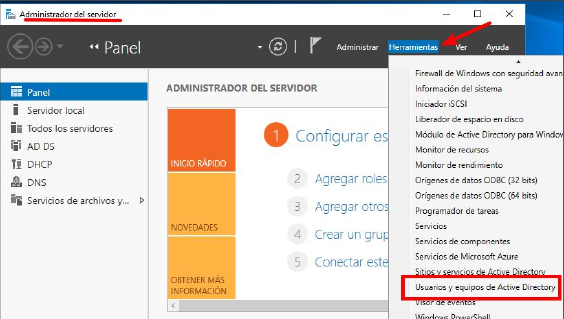

Os obxectos están nunha serie de carpetas que nos permiten organizar os obxectos, por exemplo no debuxo:

- **Builtin**: grupos de seguridade locais do dominio que veñen predefinidos (como Administradores, Operadores de copia de seguranza ou Usuarios).
- **Computers**: É a ubicación por defecto onde se crean as contas de equipos (estacións de traballo e servidores) cando se unen ao dominio, a menos que se especifique outra UO.
- **Domain Controllers**: Esta é unha UO por defecto (a única da lista inicial). Contén as contas de equipo de todos os Controladores de Dominio.
- *ForeignSecurityPrincipals*: úsase engades un usuario dun dominio alleo a un grupo do teu dominio, aparecerá aquí un identificador (SID) que representa a ese usuario externo.
- *Managed Service Accounts*: Deseñado para almacenar as Contas de Servizo Xestionadas (MSA). Estas son contas especiais para servizos (como SQL Server ou IIS)
- **Users**: É o almacén por defecto para as contas de usuario e grupos creados no dominio.
  
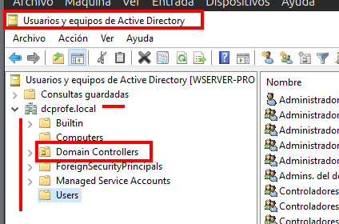

Estas carpetas denomínanse **Unidades Organizativas** (Organizational Unit - OU) e **Contedores** (Containers).
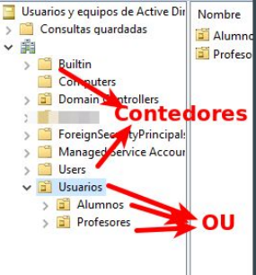

**Contedores ocultos** de inicio hai contedores que aparecen ocultos, podemos activalos desde o menú **Ver->Características Avanzadas** e vemos que aparecen novos que antes non estaban visibles.
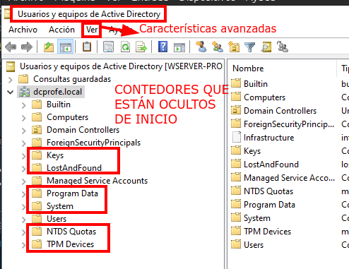

- **LostAndFoud**: Funciona como unha "caixa de obxectos perdidos". Se dous administradores crean ou moven un obxecto ao mesmo tempo en diferentes controladores de dominio e hai un conflito de replicación (por exemplo, bórrase a UO pai mentres se crea un usuario dentro), o Active Directory move ese obxecto aquí para evitar que se perda a información.
- **Program Data**: almacena datos específicos de aplicacións que se gardan no directorio. Por exemplo, úsase para gardar os axustes dalgúns servizos de Microsoft ou de terceiros que precisan que os seus datos se repliquen por todo o dominio.
- **System**: É un dos máis importantes para o funcionamento interno. Contén configuracións críticas do sistema, como:
  - Políticas de seguridade: Configuracións de contrasinais.
  - Trust Relationships: Información sobre as confianzas con outros dominios.
  - DNS: Configuracións relacionadas coa resolución de nomes se o DNS está integrado no AD.
- **NTDS Quotas**:  úsase para xestionar cotas de obxectos.
- **TPM Devices**: úsase cando configuras BitLocker (cifrado de discos) para que as claves de recuperación e a información dos chips TPM dos portátiles e servidores se garden de forma centralizada no Active Directory. Así, se un usuario esquece o seu PIN, o administrador pode recuperar a clave aquí.

## Contedores

Un contedor é usado para gardar obxectos do sistema preestablecidos e
tamén como localización por defecto para novos obxectos.

Os contedores **non poden albergar** outras **OU ou contedores** e **NON se lles pode asociar directivas de grupo**.

Na interface as OU diferéncianse dos contedores en que a icona dunha OU é unha carpeta cun libro dentro fronte á **icona dun contedor que é unha carpeta**.

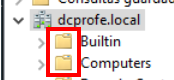

## Unidades organizativas (OU)

Vense coa icona de cartafol cunha libreta
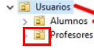
Son creadas polo administrador para organizar usuarios, grupos e equipos. A súa gran vantaxe é que permiten vincular GPOs e delegar o control administrativo.

- Sobre unha **OU**...
  - poderemos **enlazar directivas (Group Policy Objects)** como por exemplo que os equipos dunha OU non poidan cambiar o fondo de escritorio, ou que os membros dunha OU teñan que ter contrasinais máis complexos que outros doutras OU. 
  - poderemos d**esignar usuarios ou grupos para que fagan tarefas administrativas sobre os obxectos que contén esa OU**. Por exemplo, pódese designar un usuario para que poida engadir equipos novos sobre a OU, ou cambiar o contrasinal dos usuarios que hai nunha determina101da OU.

Créanse desde o menú de Usuarios e grupos de active directory:
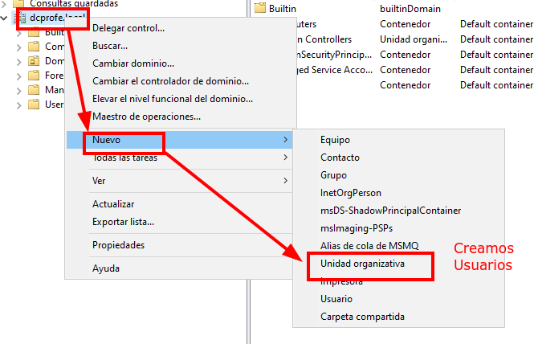

> Podemos crear a estrutura mediante PowerShell co cmdlet `New-ADOrganizationalUnit`. Exemplo:
  `New-ADOrganizationalUnit -Name "Aula 2" -Path
"OU=Equipos,DC=dcprofe,DC=local"`

### Como borrar unha OU protexida contra borrado accidental

Por defecto, cando creamos unha OU, está activado a propiedade *Proteger contenedor contra eliminación accidental*

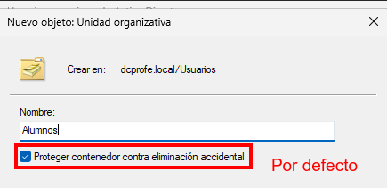

Para deshabilitar esta opción e poder borrar unha OU hai que:
Hai que ir a **Usuarios e equipos de AD**, e activar as **características avanzadas**.

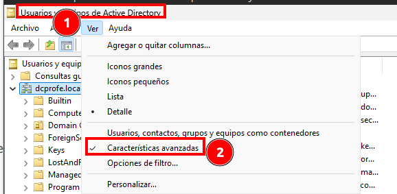

E despois xa aparece a caixiña para deshabilitar o borrado accidental:

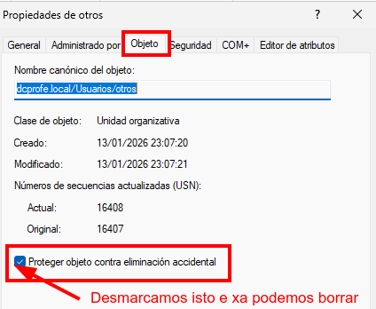

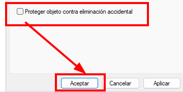

E agora xa se pode borrar.

### Que OU crear?

Por suposto que se pode traballar nunha única OU pero non é o axeitado. Deberemos crear OU en función de dous obxectivos:

1. **Aplicación de políticas de grupo (GPO)**: podemos crear OU diferentes se imos ter conxuntos de obxectos sobre os que nos interesa aplicar certas regras de configuración, *por exemplo*:
       - Crear unha OU Profesorado co obxectivo de que manteña o escritorio e carpeta meus documentos en calquera PC que inicie sesión.
       - Crea unha OU alumnado da ESO para aplicar unha directiva que impida que accedan a dispositivos USB, para evitar virus externos.
       - Crear unha OU para un conxunto de PCs qeu queremos que se execute un sript ao iniciar a máquina. Isto implicaría dividir os PCs en diferentes OUs.
2. **Delegación de control**: cando nos interesa que certos usuarios poidan facer tarefas administrativas sobre certos obxectos, deberemos metelos en OU. Por exemplo:
     - Crear unha OU para que os titores da ESO poidan xestionar os contrasinais dos alumnos da súa titoría.

#### Estratexias para a creación de OU

Existen varias estratexias para deseñar a xerarquía de OU da nosa organización. Podemos crear unha estrutura plana e ancha con poucas OU ou unha estrutura con varios niveis de profundidade de OU. O factor clave é que nos axude a manexar a nosa organización. Podemos seguir os seguintes criterios:

- **Localización xeográfica**. Se o noso dominio alberga diferentes oficinas en diferentes localizacións xeográficas pode ser de interese agrupar os obxectos de cada localización baixo OU diferentes, onde a administración pode ser delegada sobre usuarios diferentes.
- **Organización departamental**. Representar a organización departamental da nosa organización pode ser de axuda pois cada departamento require de políticas e tarefas administrativas específicas.
- **Tipo de recurso**. Pode ser de interese crear OU en función do recurso que van a conter, por exemplo, equipos e usuarios, ou equipos cliente e servidores membro, ou servidores de arquivos e servidores de impresión...

Cada organización debe adaptar a estrutura de OU ás súas necesidades, combinando as estratexias anteriores en función da súa contorna de traballo.

## OU de EQUIPOS (Computers)

Como xa se dixo anteriormente, cando engadimos un equipo ao dominio crease unha conta no **contedor Computers**.

Un contedor é diferente a unha unidade organizativa. 

1. Sobre un contedor non se poden crear outros contedores, son indivisibles.
2. Non se poden asignar políticas de seguridade sobre un
contedor.

Por estes dous motivos a mellor práctica é **crear unhas unidades
organizativas para albergar as contas de equipo**.

Recomendación: **Crear unha unidade organizativa para servidores   membro e outra para estacións de traballo de usuario**.

Sempre poderás dividir noutras unidades organizativas a de
servidores e clientes.

Exemplo, a de servidores pódela dividir por tipo de servidores. A de clientes (estacións de traballo) por aulas e dentro delas por tipo (portátiles e sobremesa).

**Utiliza unha estratexia de nomes para equipos**. Por exemplo, abreviaturas para o rol (**SRV**-servers, **CL**-clientes, **PS**-print servers...), abreviaturas para a localización (**A1**-aula1, **DInf**-departamento de informática...).

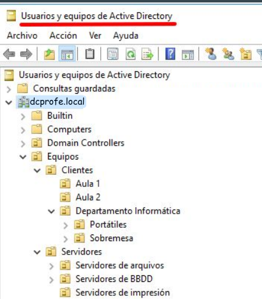

## Usuarios

Creación de usuario, por exemplo, imos crear dentro da OU Profesores a conta de **Cristina Puga Barreiros** con nome de inicio de sesión **cristina.puga.barreiros**:

- Creamos un usuario dentro da OU
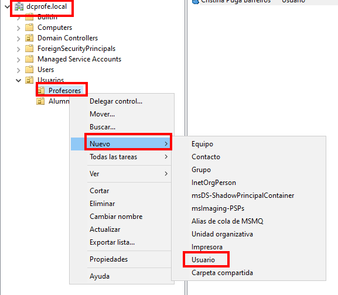
- Dámoslle os datos ao usuario: 
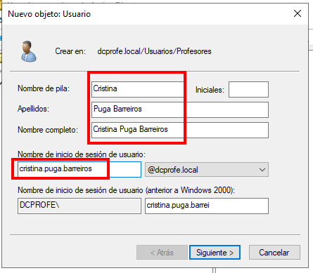
Asignámoslle unha contrasinal válida. 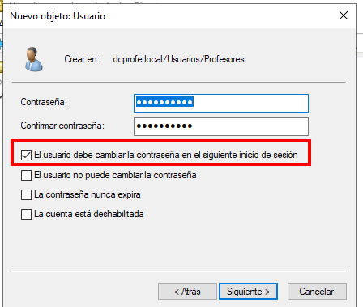 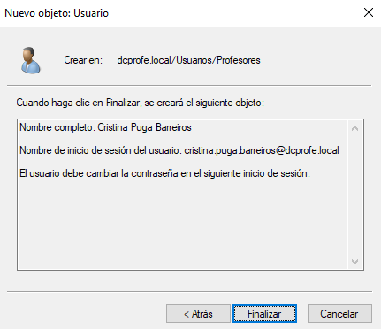
- Editamos as propiedades


### Creación usuarios e equipos con Powershell

Para facelo desde Powershell o cmdlet que podedes utilizar é `New-ADComputer` para as contas de equipo e `New-ADUser` para as de usuario:

```Powershell
New-ADComputer -Name "WIN01-DCPROFE" -Path "OU=Aula 1,OU=Equipos,DC=dcprofe,DC=local"

New-ADUser -Name "crispuga" -GivenName "crispuga" -Surname "Puga Barreiros" -Path
"OU=Profesores,OU=Usuarios,DC=dcprofe,DC=local" -AccountPassword (ConvertTo-SecureString "abc123." -AsPlainText -Force) -Enabled $True
```

### Usuarios - Editor de atributos

Para ver dentro das **propiedades** o **editor de atributos**, hai que ter habilitadas as **características avanzadas**.
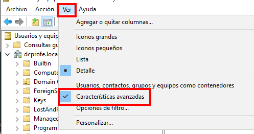

Imos ver por exemplo o **DiplayName**
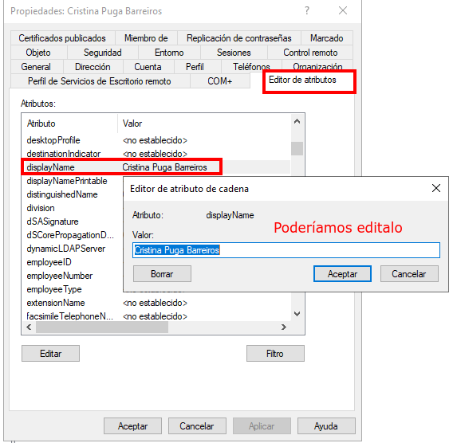

### Busca ou procura dun usuario

Para buscar un usuario pódese empregar a ferramenta gráfica de busca:
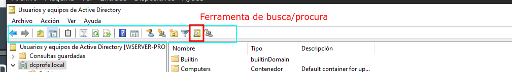
E podemos escribir o criterio de busca para que atope usuarios con esas características:
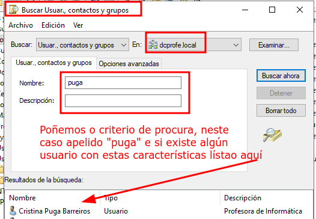

## Centro de administración de Active Directory

Desde o centro de administración de Active Directory podemos xestionar tamén o Active directory, imos ver diferentes posibilidades:
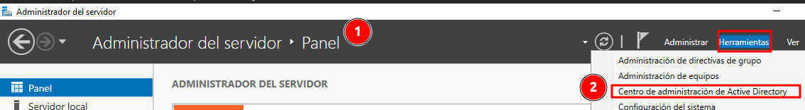

### Procurar información de usuarios

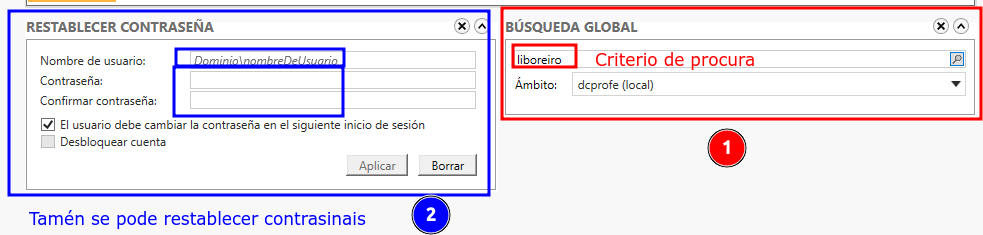
Resultado da procura:
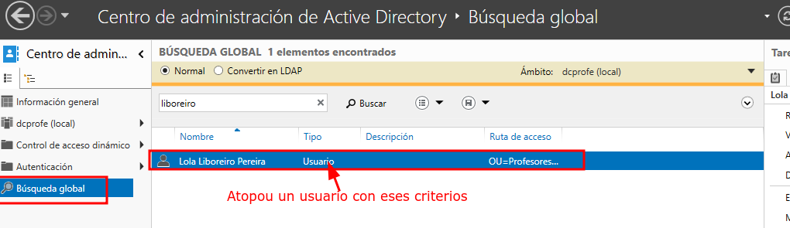

### Acceso ao Historial Powershell

Dentro do centro de administración de Active Directory, podemos acceder aos comandos powershell de accións feitas sobre o AD, como se pode ver na imaxe.
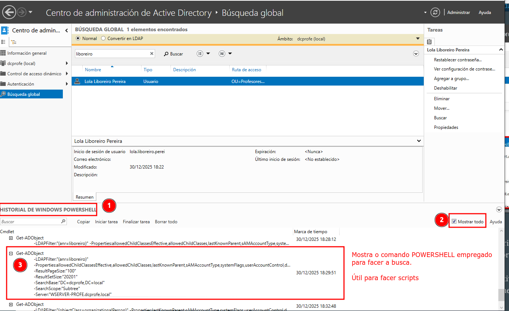

### Habilitar Papeleira de Reciclaxe de AD

Unha característica que temos nun dominio con nivel funcional Windows 2008 Server R2 ou superiores é a posibilidade de **habilitar unha papeleira de reciclaxe para os obxectos eliminados de Active Directory** coa vantaxe que isto supón.

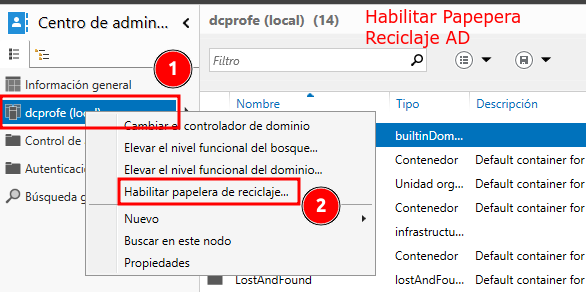

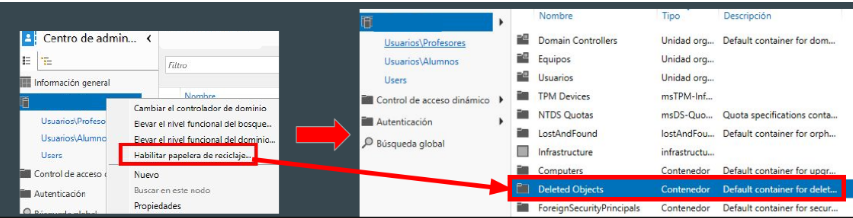

Por exemplo, se borro un usuario por erro, podería volver recuperalo:
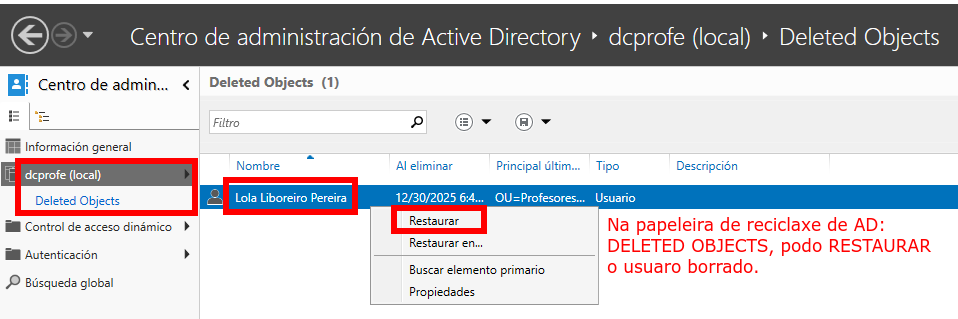

## Xestionando CONTRASINAIS

Un dos puntos principais na seguridade das contas de usuario é a xestión dos
contrasinais. Temos tres xeitos de protexer as contas de usuario relacionados cos
contrasinais.

1. **Políticas de contrasinais**: a través destas, configuramos certos requirimentos como a duración do contrasinal, lonxitude e complexidade.
2. **Políticas de bloqueo de contas**: permiten configurar cando se bloquea unha conta de usuario cando escribe o contrasinal de xeito incorrecto varias veces.
3. **Políticas de contrasinais granulares**: permiten especificar políticas de contrasinais e de bloqueo de contas a nivel de usuario e grupo.

As dúas primeiras configúranse a través de GPO  e **as políticas de contrasinais granulares configúranse dende Usuarios e equipos de Active Directory** ou do Centro de administración de Active Directory.

**Políticas de contrasinais granulares**, a través do Centro de Administración de AD, en **System->Password setting container**, e escollemos **Nuevo->Configuración de Contraseña**.
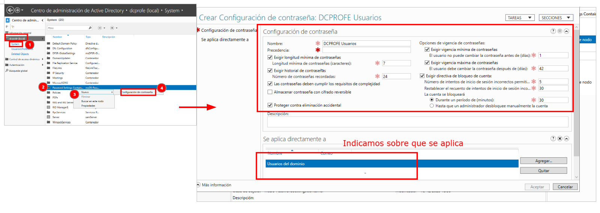
Comentarios sobre  algún dos campos:

- **Precedencia** refírese á prioridade.
- O **historial** de contrasinais implica que memoriza os contrasinais usados. Para volver repetir un contrasinal tería que haber utilizado antes 24 diferentes.
- Que os contrasinais deben cumprir os requisitos de complexidade refírese a que teñen que ter maiúsculas, minúsculas, números e signos de puntuación.
- A **vixencia mínima e máxima** refírese ao tempo de vida mínimo e máximo dun contrasinal.
- O **bloqueo de conta** refírese a que se o usuario mete mal o contrasinal 5 veces a conta queda bloqueada durante 30 minutos. Así evitamos ataques de forza bruta.

Podemos ver que se aplicou sobre un usuario, como se ve nas imaxes:
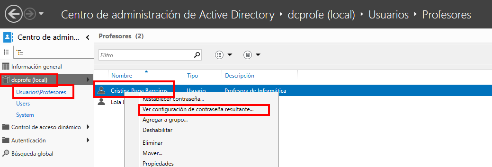
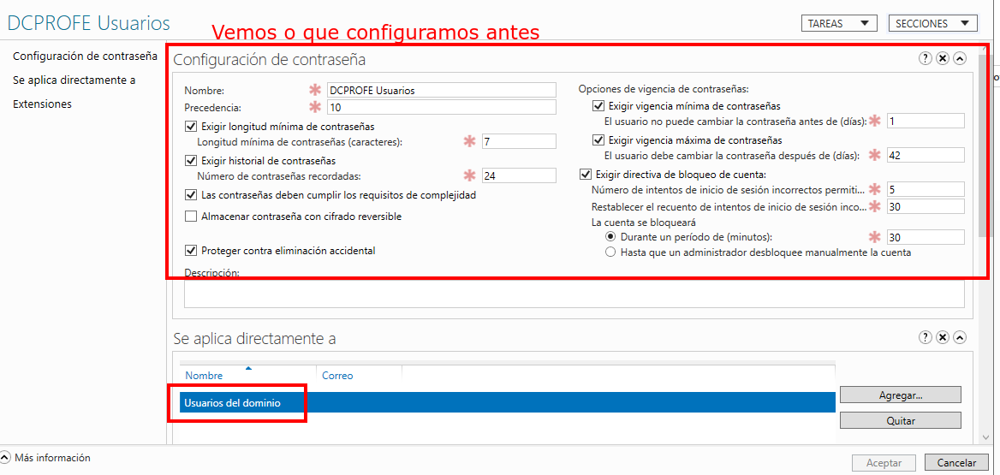

## Grupos

Os grupos facilitan a xestión de permisos sobre usuarios e equipos (por exemplo, podemos ter un grupo de equipos que executan unha aplicación concreta no noso dominio). Temos dous tipos de grupos:

1. **Grupos de seguridade**: están pensados para **asignar permisos e controlar o acceso a recursos** como arquivos e carpetas, impresoras, OU...
2. *Grupos de distribución* (opción por defecto): están pensados soamente para o correo electrónico e son utilizados por aplicacións de correo electrónico. Non teñen un identificador de seguridade (SID), polo que **non serven para dar permisos a ficheiros**.

Os grupos teñen un ámbito, que se refire ao alcance que ten o grupo e repercuten na procedencia dos obxectos que poden incluír:

- **Domino local**: Úsanse para asignar** permisos sobre un recurso específico que está no seu propio dominio**. Poden conter membros de calquera dominio. Por exemplo, *L_Carpeta_Contabilidade que ten permisos de "Lectura" nun cartafol do servidor.*
- **Global** (opción por defecto): Úsanse para **organizar usuarios que teñen funcións ou departamentos similares** dentro do mesmo dominio. Por exemplo, un grupo chamado G_Usuarios_Vendas que contén a todos os empregados do departamento comercial.
- **Universais**: Úsanse para dar acceso a recursos que están repartidos **por diferentes dominios dentro dun mesmo bosque**. Por exemplo, *un grupo chamado U_Directivos_Todo_Bosque que inclúe aos xefes de todas as sedes internacionais.*

### Grupos - Estratexia AGLPD - Recomendación

Para que a túa administración sexa eficiente, Microsoft recomenda seguir a regra AGDLP:

- Metes as contas de **Usuarios en grupos Globais**.

- Metes eses **grupos Globais en grupos Locais do dominio**.

- Asignas os **Permisos sobre o recurso ao grupo Local**.

### Grupos - Exemplo práctico

Imaxina que tes unha usuaria chamada Lola Liboreiro que traballa en RRHH e necesita ler os ficheiros do cartafol compartido **\\\Servidor\Nominas**.

#### Paso 1: A (Accounts)

Identificamos a conta: lola.liboreiro.

#### Paso 2: G (Global Groups)

Creamos un grupo Global de seguridade no Active Directory que agrupe a xente polo seu cargo ou departamento.

Nome do grupo: **G_RRHH**

Metemos a lola.liboreiro dentro deste grupo.

#### Paso 3: DL (Domain Local Groups)

Creamos un grupo Local do Dominio especificando que se vai facer con el.

Nome do grupo local: **DL_Nominas_Lectura**

Metemos o grupo Global G_RRHH dentro deste grupo Local.

- Cando a carpeta \\\Servidor\Nominas se comparta, en **permisos compartidos** porase **Control Total** para **todos os usuarios autenticados**

#### Paso 4: P (Permissions)

Imos ao cartafol físico no servidor (Nominas), prememos *botón dereito > Propiedades > Seguridade*.

Engadimos ao grupo DL_Nominas_Lectura e dámoslle permisos de "Lectura".

##### Explicación

Esta estrutura permítenos que, se mañá entra outra persoa en RRHH, só tes que metela no grupo G_RRHH e *automaticamente terá acceso a todo o que necesite RRHH*.

- **Escalabilidade**: Se mañá RRHH tamén necesita acceder a unha impresora nova, só tes que meter o grupo G_RRHH no grupo local da impresora.
- **Auditoría**: Cando miras os permisos do cartafol Nominas, ves DL_Nominas_Lectura. É moito máis claro que ver unha lista de 50 usuarios soltos ou 10 grupos globais soltos.

En forma de debuxo, sería algo así:
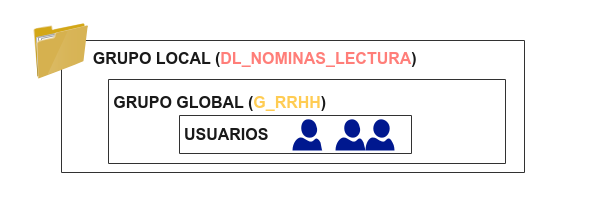
