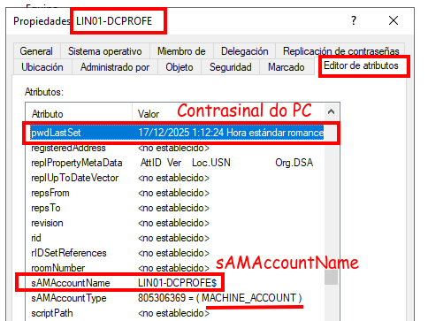
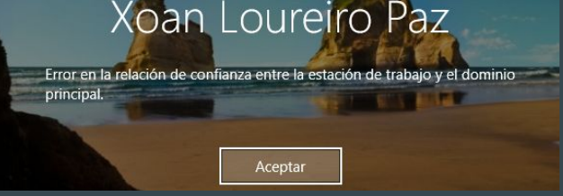
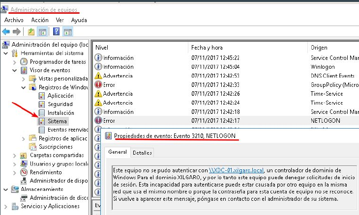
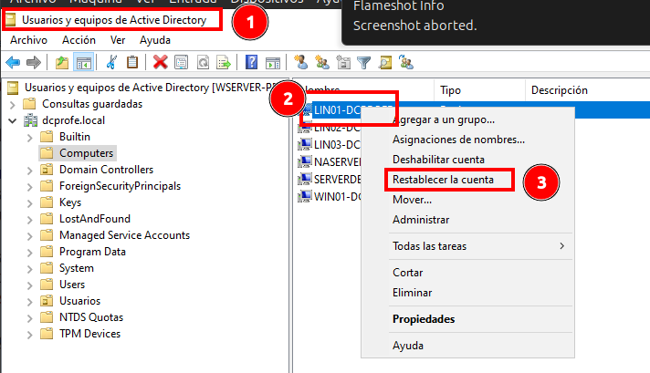
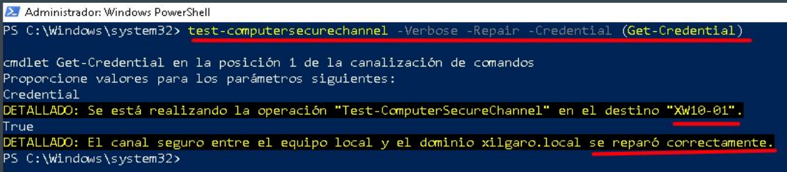

# Boas prácticas na unión de equipos ao dominio

Co o comentamos xa na unidade anterior, por defecto os novos PCs do dominio engádense no **contedor Computers**, pero podemos organizar os equipos en Unidades Organizativas, para o que se recomenda poñer nomes significativos aos PCS que se unan, no seu **hostname**.

## Organizar os computers en Unidades Organizativas OU

Como xa se dixo anteriormente, cando engadimos un equipo ao dominio crease unha conta no **contedor Computers**.

Un contedor é diferente a unha unidade organizativa. 

1. Sobre un contedor non se poden crear outros contedores, son indivisibles.
2. Non se poden asignar políticas de seguridade sobre un
contedor.

Por estes dous motivos a mellor práctica é **crear unhas unidades
organizativas para albergar as contas de equipo**.

Recomendación: **Crear unha unidade organizativa para servidores   membro e outra para estacións de traballo de usuario**.

Sempre poderás dividir noutras unidades organizativas a de
servidores e clientes.

Exemplo, a de servidores pódela dividir por tipo de servidores. A de clientes (estacións de traballo) por aulas e dentro delas por tipo (portátiles e sobremesa).

**Utiliza unha estratexia de nomes para equipos**. Por exemplo, abreviaturas para o rol (**SRV**-servers, **CL**-clientes, **PS**-print servers...), abreviaturas para a localización (**A1**-aula1, **DInf**-departamento de informática...).

## Crear un equipo por adiantado

Unha boa práctica é crear a conta de equipo no directorio antes de unir o equipo ao dominio. Para iso, teremos que ir á unidade organizativa e engadir un novo equipo. É interesante facelo así por tres motivos:

1. **Reforza a delegación**. pódese facer que un grupo de usuarios poida facer tarefas administrativas sobre unha unidade organizativa concreta. Polo tanto pode facerse que un usuario, por exemplo un profesor, cree e engada equipos ao dominio nunha aula concreta e non noutras.
2. **Reforza a estrutura de OU**. Lembremos que cando engades un equipo ao domino, por defecto engádea no contedor Computers. Aínda que estas contas de equipo se poden mover a OU correspondente é fácil esquecerse e que aparezan equipos neste contedor e despois levaranos tempo buscar en que OU hai que metelo. (Por ese motivo é importante poñer nomes significativos aos PCs)
3. **Reforza as políticas de grupo**. Lembremos que estas políticas se aplican sobre OU. Se temos creada a conta de equipo previamente, no momento de unir o equipo o dominio xa se aplicarán inmediatamente as políticas asignadas a OU na que está o equipo. Se non o creamos previamente, crearase a súa conta no contador Computers, polo que as políticas non se aplicarán ata que o administrador o mova a OU que lle corresponde.

## Canais de seguridade

As contas de equipo teñen un nome, similar ao nome de usuario, baixo o atributo **sAMAccountName**, e un contrasinal como os usuarios normais. O equipo garda o seu contrasinal localmente e cámbiaa cada 30 días. Son as credenciais do equipo.

O servizo **NetLogon** usa as credenciais do equipo para iniciar sesión no dominio (log on) establecendo unha canle de seguridade cun controlador de domino.

Esta canle de seguridade entre o equipo e o controlador é usada para todas as comunicacións co dominio. Se un equipo non é capaz de iniciar sesión con éxito, a canle de seguridade non se pode establecer.

Esta canle de seguridade pódese romper en certas situacións:

- **Reinstalación do sistema operativo**. Despois da reinstalación do sistema o equipo non se pode autenticar no dominio incluso tendo o mesmo nome que liña antes. Isto débese a que **cando se instala o operativo xérase un novo SID** e ademais o novo sistema operativo non sabe nada do contrasinal que tiña o anterior.
- **Inactividade prolongada**. Se un equipo **non inicia sesión durante 30 días** a canle de seguridade non se pode establecer.
  - Por exemplo: se temos un dominio na aula, pode ocorrer que o remate das vacacións os equipos teñan rota a canle de seguridade e non permitan iniciar  sesión no dominio.
- **Erros na sincronización do contrasinal**. Son erros que se producen cando o equipo non se pon dacordo co controlador de dominio sobre o contrasinal.Poden producirse porque outro equipo se uniu co mesmo nome ao dominio.

Os síntomas de que a canle de seguridade está rota vense cando un usuario intenta iniciar sesión e aparece unha mensaxe similar á que se ve na imaxe.

Se analizamos os logs do cliente Windows 11 (Equipo - Botón dereito - Administrar - Visor de sucesos -  Sistema - Erro NetLogon) vemos como informa do erro.

## Solución á ruptura da canle de seguridade - Restablecer conta

Cando a canal de seguridade está rota sempre é mellor, **desde o servidor**, **restablecer a conta do equipo **que eliminala e crear unha nova a través da ferramenta Usuarios e equipos de Active Directory. Cando restablecemos unha conta de equipo, o SID mantense así como as pertenzas aos grupos.

Despois, **no equipo cliente**, podemos restablecer a canle de seguridade iniciando como administrador local. Temos que executar (pediranos unha conta con permisos no dominio):

`Test-ComputerSecureChannel –verbose –Repair –Credential (Get-Credential)`

