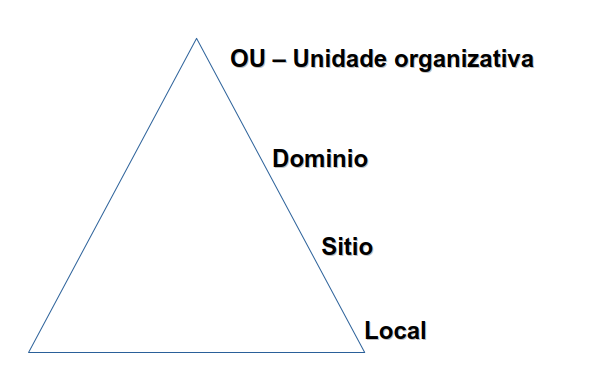
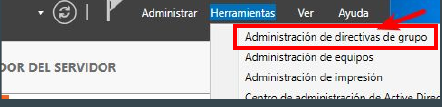
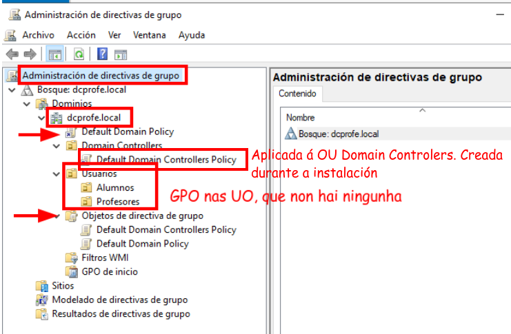
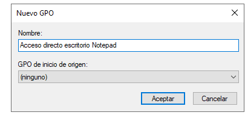
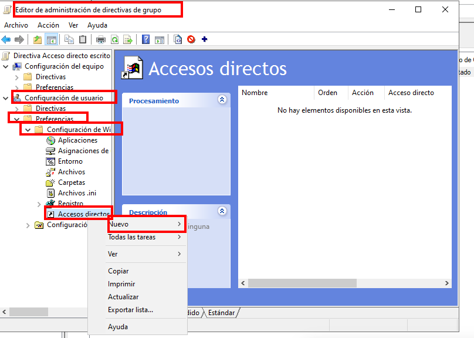
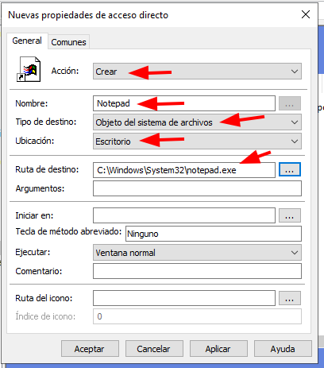
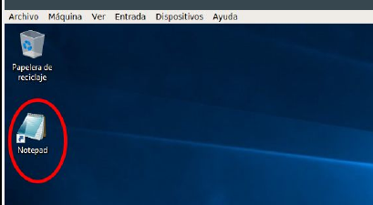
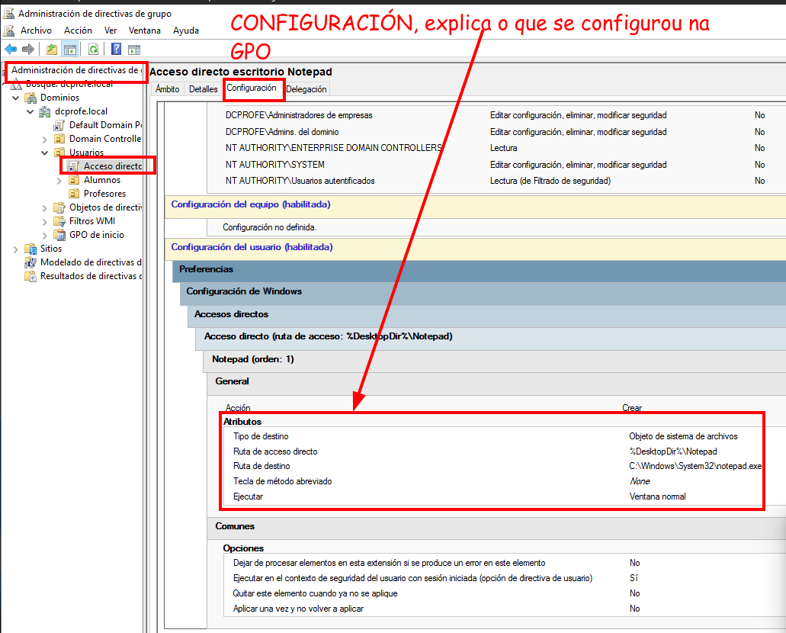
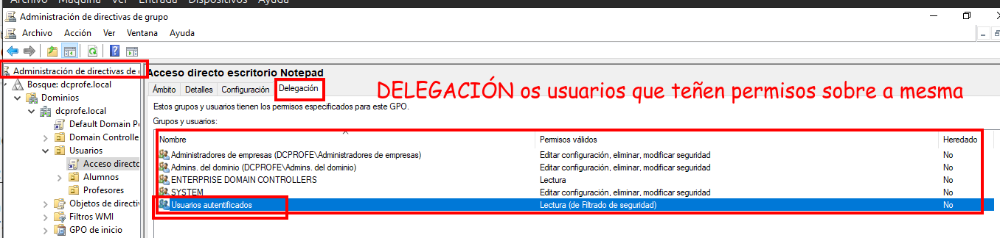

# Políticas de grupo (GPO)

Unha Política de Grupo ou Group Policy Object (GPO) é é un conxunto de **configuracións e regras** que os administradores de sistemas **para controlar e automatizar o comportamento de usuarios e computadores** nunha rede Windows.

Esta característica permite o **manexo centralizado de configuracións do
sistema operativo**, aplicacións e configuracións de usuario nun contorno con Active Directory.

A súa **función principal** é a **xestión centralizada**. En lugar de configurar cada ordenador un por un, fas o cambio na GPO e este aplícase automaticamente a todos os dispositivos vinculados.

## Exemplos de aplicación de GPOS:

- Nivel de **seguridade**:
  - Forzar cambios de contrasinal cada certo tempo.
  - Bloquear o acceso ao Panel de Control ou ao Símbolo do Sistema (CMD)
  - Deshabilitar o uso de memorias USB para evitar fugas de datos.
- Nivel **configuración do Escritorio**:
  - Establecer un fondo de pantalla corporativo común.
  - Redirixir cartafoles do usuario (como "Documentos") a un servidor central.
  - Configurar a páxina de inicio do navegador.
- Nivel de **rede**:
  - Instalar aplicacións de forma automática ao acender o equipo.
  - Mapear unidades de rede (como o disco Z: que intentabas conectar) para que aparezan sempre ao iniciar sesión.
  - Configurar scripts de inicio e peche de sesión.

## Tipos de aplicación

Pódense aplicar a distintos niveis:

- a un **PC de forma local**: En cada equipo pódense establecer GPOs que só afectan ao equipo e usuarios locais desa máquina. Non é necesario ter Active Diretory instalado. Aplícanse so nese PC local, configúranse co comando `gpedit.msc`
- a **todo o dominio**: Active Directory permite crear GPO que afectarán a **todos os usuarios e equipos** dun dominio.
- a **sitios específicos**: A través de Active Directory pódense aplicar GPO a un sitio ou “site”. Un “site” é un obxecto de AD que representa unha localización xeográfica que contén redes. 
- **Unidades Organizativas (OU)**: Active Directory permite crear GPO que só afectan aos usuarios e equipos que se atopan dentro dunha OU.

### Orde de aplicación das GPO

Para entender a orde de aplicación diremos que segue a regra “**LSD OU (Local-Site-Domain-OU)** ”.

Que indica que podemos definir unha GPO a nivel de Domino, pero esta pode ser sobrescrita por outras GPO definidas a nivel de OU. Do mesmo modo, por exemplo, unha GPO local pode ser sobrescrita por unha GPO de sitio, dominio ou OU.

#### Excepcións importantes á orde de aplicación das GPO

Aínda que a regra xeral é que a máis específica (OU) gaña á máis xenérica (Dominio), existen dous mecanismos para alterar este comportamento:

- Bloqueo de Herdanza (Block Inheritance): Unha Unidade Organizativa pode decidir ignorar as ordes que lle veñen de "arriba" (Sitio ou Dominio).

- Forzar / Esixir (Enforced): Un administrador pode marcar unha GPO de nivel superior (por exemplo, a de Dominio) como "Enforced". Isto fai que se aplique por riba de calquera outra, incluso se hai bloqueos de herdanza ou GPOs de OU que digan o contrario.

Por exemplo:

Se o Dominio prohibe o fondo de pantalla vermello, pero a túa OU de Marketing permite o fondo vermello:

- O fondo será vermello (porque a OU é a última en aplicarse).

- Pero... se o administrador do dominio marca a súa directiva como **Enforced**, o fondo será o do dominio e Marketing non poderá cambialo.

### Como se aplican as GPO?

Por defecto, as estacións de traballo procuran novas políticas de grupo cada 30 minutos e aplícanas.

O comando `gpupdate` executado nunha estación de traballo permite forzar a procura de novas GPOs e forza a que se apliquen.

A través de **filtrado WMI (Windows Management Instrumentation)**, pódese implantar GPO que so afecten a certos computadores que posúan certas características (RAM, modelos específicos de computadores, software instalado...).

### Configuración de GPO en AD - Administración de directivas de grupo

Configúranse coa ferramenta **Administración de directivas de grupo** que hai no windows server.

 Dende esta ferramenta controlamos as GPO aplicadas na nosa infraestrutura. Temos as:

- GPO dos sitios (ningunha por agora)
- as GPOs de dominio (Default Domain Policy) 
- as GPOs asociadas a OU (neste caso Default Domain Controllers vinculada á OU Domain Controllers).

Estas GPOs son creadas por defecto durante a instalación de Active Directory.

 

## Crear unha GPO

Imos crear unha GPO que poña un acceso directo ao Notepad no escritorio de todos 
os usuarios.

Para iso crearías unha GPO a nivel OU Usuarios e editaríala. Despois iriamos a preferencias (de usuario) - Configuración de Windows - Acceso Directos - Nuevo.

E poñemos o seguinte:

Ao iniciar sesión cun usuario da UO Usuarios, debería de aparecer este novo acceso directo no escritorio:

### Información da GPO creada

Na lapela de **Configuración** podemos ver o que se configurou na GPO:

Na lapela de **Delegación** vemos quen ten permisos sobre a mesma.

Na lapela **estado** está asociada á replicación da GPO entre controladores de dominio.
