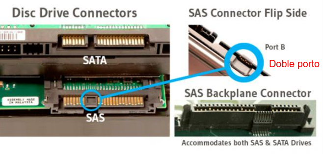
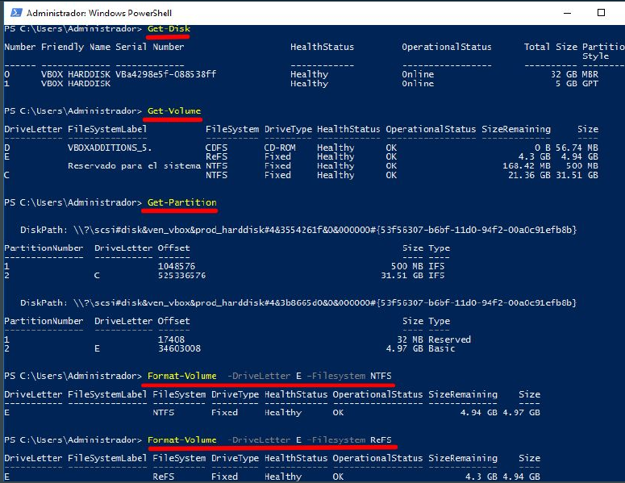

# Técnicas de xestión do almacenamento

Neste apartado imos ver diferentes técnicas de xestión do almacenamento para servidores.

De forma xeral, na actualidade hai dúas técnicas principais, que se explican no apartado A, e que requiren ambas coñecer todos os apartados ata o G.

<strong>A. Almacenamento local vs almacenamento na nube</strong>

## A. Almacenamento local vs almacenamento na nube

### 1. Almacenamento xestionado pola propia organización

 Este é o modo que se leva utilizando dende sempre. As empresas mercaban grandes máquinas con moitos discos que xestionaba o departamento IT.

- **Vantaxe**: é que tiñas os datos na túa organización e a velocidade de acceso era a máxima proporcionda poloa túa rede.
- **desvantaxe**: é que o mantemento das máquinas ten que facelo o departamento IT con tarefas como:
  - substitución de discos con erros.
  - planificación da expansión para cando o espazo de almacenamento non sexa suficiente.
  - xestión da tolerancia a erros nos discos.
  - xestión da tolerancia a erros nas máquinas tendo que mercar servidores por duplicado.
  - renovación de equipamento cando quede obsoleto.

### 2. Almacenamento xestionado na nube

Contratación de infraestrutura a un provedor externo (Azure, AWS, Google Cloud, ...).

Contratas un provedor unha maquina cos terabytes que necesites de almacenamento ou incluso podes contratar toda unha cabina de discos. O provedor vaiche ofrecer unha
máquina (Windows ou GNU/Linux) que vai ter un ou varios discos co espazo contratado e unha conexión (VPN,lenta e barata, ou MPLS, rápida e cara) para que os equipos da túa rede vexan esa máquina como se fose local.

- Vantaxes:
  - O provedor ocúpase do mantemento e a renovación de hardware. (Delegación de tarefas)
  - Podes ampliar terabytes cun so clic. (Escalabilidade inmediata)
  - Pagas por uso.
- Desvantaxes:
  - A velocidade depende da conexión.
  - Os datos non están físicamente na empresa (obriga a facer backups e cifrado)

> [Máis infor: Podcast 6 - Almacenamiento](https://www.eduardocollado.com/2017/01/01/podcast-6-almacenamiento/)

<strong> B. Conexión do almacenamento ao servidor: DAS, NAS, SAN</strong>

## B. Conexión do almacenamento ao servidor: DAS, NAS, SAN

Independentemente da tendencia escollida (pensa que traballas para unha empresa que xestiona localmente o espazo ou ben que traballas para unha empresa que proporciona eses servizos de almacenamento na nube) hai tres formas principais de conectar o almacenamento aos servidores, dependendo de se priorizamos a simplicidade, a facilidade para compartir ficheiros ou o rendemento profesional.

### 1.DAS (Direct Attached Storage)

É o almacenamento tradicional. O **disco está conectado directamente á placa base do servidor** (discos internos ou externos vía USB/SAS).

- **Acceso**: O SO accede ao almacenamento **mediante bloques** (nivel de bloque) e xestiona o sistema de arquivos directamente. Sistema operativo é o encargado de crear particións/volúmenes e sistemas de arquivos para almacenar información nel.
- **Vantaxe**: Máxima simplicidade e baixo custo; non depende da rede.
- **Desvantaxe**: Difícil de compartir con outros servidores.

### 2. NAS (Network Attached Storage)

É un **dispositivo** especializado **conectado á rede local** (LAN) que funciona como un servidor de ficheiros. Sería como conectar un disco duro a rede local, e compártense carpetas.

- **Acceso**: o dispositivo comparte carpetas (nivel de ficheiro).
- **Protocolos**: Usa protocolos de rede como **CIFS/SMB** (Windows) ou **NFS** (Linux).
- **Vantaxe**: Moi fácil de configurar para que múltiples usuarios compartan documentos.
- **Desvantaxe**: O rendemento vese afectado polo tráfico da rede local.

### 3. SAN (Storage Area Network)

Unha rede dedicada de alta velocidade (separada da rede de datos) que conecta servidores con cabinas de discos.

- **Acceso**: Nivel de bloque (o servidor "cre" que o disco da rede é un disco local).

Estas redes necesitan de hardware específico, dispoñen de cabinas que manexan discos con **potentes controladoras**. Estas controladoras xestionan pools de datos repartidos polos discos físicos e que se conectan co switch: **por fibra** (no caso e *Fibre Channel*) e usando **Ethernet** (no caso dos *iSCSI*).

- **Vantaxe**: Rendemento profesional, alta dispoñibilidade e escalabilidade masiva.

- **Desvantaxe**: Alta complexidade técnica e custo elevado (especialmente en FC).

#### Tecnoloxías:

- **Fibre Channel (FC)**: Moi rápida e fiable, pero **cara** (require switches e fibra especial, alto custo en equipamentos).
- **iSCSI**: Aparace como unha alternativa fibre channel,  máis barata, pódese implantar sobre TCP/IP, e empregar switches e tarxetas de rede estándar.

<strong> C. Tecnoloxías de Discos Físicos: SATA, SAS, PCIe</strong>

## C. Tecnoloxías de Discos Físicos: SATA, SAS, PCIe

A xerarquía de rendemento evolucionou. Hoxe en día, a distinción non é só o disco, senón o **protocolo** (como falan os dispositivos) e o **bus** (por onde viaxan os datos).
Temos en conta:

- **SATA**: é **half-duplex, ou envía ou recibe non pode facer as dúas cousas a vez**. Velocidade 6Gbps. Na actualidade máis adicado a uso pc de escritorio.
- **SAS (Serial Attached SCSI)**: Interface SAS **ten dous conectores, se un conector falla, o tráfico segue funcionando polo segundo**. SAS é **full-duplex, pode enviar e recibir datos á vez**. Velocidades 12Gbps a 24 Gbps-. Empregado de modo empresarial, HDD para moitos datos e SSD para rendemento seguro.
- **PCIe -NVME**: que acadan rendemento **PCIe 4.0** sobre 7000 MB/s, **PCIe 5.0** sobre **14.000MB/s**, e **xa aparecendo PCIe 6.0**. A alta velocidade actual. Conector M.2 para usuarios e U.2/u.3 para empresa.

- Conectores SAS, onde se ve o **segmento de unión**, que permite que o disco teña dúas canles de comunicación independentes. Se falla a normal, pódese utilizar esta para seguir accedendo aos datos.

| Tecnoloxía | Tipo | Uso Recomendado | Estado Actual |
| --- | --- | --- | --- |
| SATA HDD | Mecánico | Almacenamento masivo (backups, vídeos). | Económico, pero moi lento para SO. |
| **SAS HDD** | Mecánico | Servidores empresariais e centros de datos. | Sólido, pero perdendo terreo ante o SSD. |
| SATA SSD | Sólido | Mellora de portátiles e PCs antigos. | Límite de 600 MB/s polo **bus SATA** (que para comunicarse co procesador ten que pasar por o chipset) e protocolo AHCI, que limita o envío de datos, ten 1 única cola de atención e so pode atender 32 comandos/peticións á vez|
| **SAS SSD** | Sólido | Servidores de alta dispoñibilidade e misión crítica e cabinas de almacenemento SAN | Combina a velocidade do flash coa robustez do protocolo SAS (Full-duplex e Dual-port). Ideal para sistemas que non poden permitirse nin un segundo de parada.|
| **NVMe (PCIe)** | Sólido | Sistemas que teñen **Rendemento crítico**, bases de datos, edición 4K. | O estándar actual para PCs e portátiles formato M.2. Pode superar os (**PCIe 4.0** sobre 7000 MB/s), **PCIe 5.0** sobre **14.000MB/s**, e **xa aparecendo PCIe 6.0**.En vez dunha cola emprega 65.535 colas que atenden 64.000 comandos cada unha, e ademais ao traballar con PCIe **conecta directamente co procesador** |
| **NVMe (U.2 - Formato 2.5'') / U.3** | Sólido |Centros de datos de última xeración e IA.  | É a evolución do NVMe M.2 para servidores. **Ten formato de disco de 2.5" pero usa o bus PCIe**. Permite extracción en quente (hot-swap) e capacidades masivas (ata 30TB ou máis) |

<strong> D. VirtualBox: Que controladora de discos escoller?</strong>

## D. VirtualBox: Que controladora de discos escoller?

Cando creas un NAS con Windows Server en VirtualBox, non estás usando o hardware directamente, senón unha **emulación**. Para que o teu servidor de ficheiros sexa rápido, debes escoller a "ponte" adecuada entre Windows e o teu disco real.

### 1. Escoller a Controladora Axeitada

En VirtualBox, podes engadir varios "Controladores" na sección de Almacenamento:

1. **LSI Logic SAS (Recomendada):** É a **mellor opción** "instalar e listo". Windows Server recoñécea sen drivers extra e **xestiona moito mellor as peticións múltiples de datos** que a controladora SATA virtual.
2. **NVMe (Para SSDs modernos):** Se o teu ordenador físico ten un disco NVMe, podes configurar a VM con esta controladora. É a que ofrece **menor latencia**, pero Windows pode precisar que verifiques se os drivers están activos.
3. **VirtIO-SCSI:** É a máis eficiente a nivel de consumo de CPU, pero require que descargues e **instales os drivers de "Oracle VirtIO"** manualmente en Windows.

### 2. Consellos para mellorar o rendemento do servidor de ficheiros en VirtualBox

* **Almacenamento Fixo vs. Dinámico:** Para un NAS, usa discos de **"Tamaño Fixo"** (*sempre que non sexan de moito tamaño*). Evitas que o ordenador host teña que aumentar o ficheiro `.vdi` en tempo real, o que causa paróns (lags) nas transferencias SMB.
* **O "Host I/O Cache":** Na configuración da controladora en VirtualBox, activa a casilla *"Usar a caché de E/S do anfitrión"*. Isto permite que a RAM do teu ordenador físico axude a acelerar as escrituras no disco virtual.

> **En Resumo** Debe evitarse a emulación IDE/SATA e optar por **LSI Logic SAS** ou **VirtIO** (necesita drivers), xa que permiten unha xestión máis eficiente, esencial para o protocolo SMB."

<strong>E. Tecnoloxías de Discos lóxica: MBR|GPT, exFAT|NTFS|ReFS</strong>

## E. Tecnoloxías de Discos lóxica: MBR|GPT, exFAT|NTFS|ReFS

 Para poder gardar información nun disco é necesario crear unha táboa da particións. A táboa de particións almacena as particións existentes no disco, así como o seu sistema de arquivos e tamaño. Temos que ver as particións como compartimentos estancos onde se van poder gardar datos.

- **MBR**: máximo 4 particións de 2TB tamaño máximo. Particións primaria e/ou extendida (lóxica dentro das extendidas).
- **GPT**: máximo 128 particións máximo, 18EB tamaño máximo de cada unha.

### Sistema de arquivos en Windows

 Temos tres tipos de sistemas de arquivos para Windows: FAT, NTFS e ReFS:

#### 1. exFAT

é o sistema de arquivos máis sinxelo que soportan os sistemas operativos Windows, e só se emprega en **unidades de almacenamento pequenas e portables**.

**Non ten permisos de seguridade nin resiliencia**; non se debe usar nunca para un NAS ou un disco de sistema.

#### 2. NTFS (New Technology File System)

mellora considerablemente FAT con **máis metadatos** e empregando estruturas complexas para mellorar o rendemento, consistencia e os tamaños máximos (de arquivo e de volume). Ademais incorpora as **listas de control de acceso (ACLs)** para xestionar os permisos sobre os arquivos, operacións transaccionais, auditoría e cifrado.

Orientado para o **disco do Sistema Operativo** (C:) e aplicacións xerais.

#### 3. ReFS (Resilient File System) - A recomendación para o teu NAS

Está deseñado para mellorar o rendemento con arquivos grandes e cumprir cos
requisitos necesarios para sistemas virtualizados. Deseñado especificamente para **servidores de datos e virtualización**.

En Windows Server 2025, ReFS recibiu melloras fundamentais:

- **Resiliencia**: Autocorrección de datos. Se un bit se corrompe no disco, ReFS detéctao e repárao automaticamente sen que teñas que pasar un chkdsk.
- **Block Cloning (Clonación de bloques)**: Se fas unha copia dun ficheiro dentro do mesmo volume, ReFS non copia os datos reais, só crea unha referencia. Isto fai que copiar un ficheiro de 50GB sexa instantáneo e non ocupe espazo extra.
- **Deduplicación e Compresión** (Novidade 2025): Agora ReFS soporta moito mellor a eliminación de datos duplicados, o que é ideal para un NAS onde moitos usuarios gardan o mesmo ficheiro.
- **Rendemento VHDX**: Se vas gardar máquinas virtuais dentro do teu NAS, ReFS crea os discos virtuais de tamaño fixo en segundos, mentres que NTFS tardaría minutos.

**En resumo**, o mellor sistema é **ReFS**.

<strong>F. Discos básicos (RAID, Storage Spaces) e discos dinámicos (Volumes)</strong>

## F. Discos básicos (RAID, Storage Spaces) e discos dinámicos (Volumes)

### 1. Discos Básicos vs. Dinámicos

- **Discos Básicos**: É o tipo por defecto. Usa **particións normais** (MBR ou GPT). Son os máis compatibles e estables. Para a maioría dos usos actuais (incluíndo **Storage Spaces), os discos deben ser básicos**.
- **Discos Dinámicos**: Unha tecnoloxía antiga de Microsoft que permitía crear volumes que ocupaban varios discos (RAID por software clásico). Hoxe está en desuso. *Microsoft recomenda optar por Storage Spaces*.

### 2. Xestión con Volumes RAID - Discos dinámicos

Ao converter os discos en Dinámicos, Windows permite crear volumes RAID desde o "Administrador de Discos":

- **Volume Seccionado (RAID 0)**: Suma o espazo de dous discos. Moi rápido, pero se un falla, perdes todo.
- **Volume Espello (RAID 1)**: O que escribes nun disco cópiase no outro. Se un falla, o NAS segue funcionando.
- **Volume RAID-5**: Require polo menos 3 discos. Reparte os datos e a paridade. Ofrece un equilibrio entre espazo e seguridade.

### 3. Storage Spaces (Espazos de Almacenamento) - Discos básicos

Esta é a tecnoloxía moderna que substituíu ao RAID dinámico. É moito máis flexible e potente. Funciona en capas:

1. **Storage Pool (Agrupación)**: agrúpase varios discos físicos "básicos" e xuntasnos nunha agrupación común que crea un so espazo.
2. **Storage Space (Disco Virtual)**: Dentro deste pool, creáse un ou varios discos virtuais, que poden ser:
   - **Simple**: Sen protección (como **RAID 0**).
   - **Mirror** (Espello): Protexe contra o fallo de 1 ou 2 discos.
   - **Parity** (Paridade): Semellante a RAID 5, optimiza o espazo.
3. **Volume**: Finalmente, hai que darlle formato (NTFS ou ReFS) e unha letra de unidade (Ex: D:).

<strong>G. Xestión de discos con Powershell</strong>

## G. Xestión de discos con Powershell

- Cos comandos **Get-Disk**, **Get-Volume**, **Get-Partition** obtemos información.
- Co comando **New-Partition** podemos crear particións.
- Co comando **Format-Volume** asignamos o sistemas de arquivos.

