# DAS - Creación carpetas usuarios nun DAS

Lembramos que **DAS** (Direct Attached Storage): É o almacenamento tradicional. O **disco está conectado directamente á placa base do servidor** (discos internos ou externos vía USB/SAS).

## Escenario: Compartir carpeta para gardar os DATOS dos USUARIOS

O noso escenario baséase en crear unha carpeta compartida (neste caso cun servidor DAS, pero poderíamos creala con calquera dos outros tipos de servidores NAS, SAN), para que os usuarios cando entren no dominio garden os seus datos, é dicir cando o usuario inicie sesión, que teña montada na unidade **Z**, a **carpeta Datos do servidor**.

Esta imaxe sería o obxectivo final:
**Cando un usuario inicie sesión se automonte a carpeta do servidor onde se gardan os seus datos. A súa carpeta persoal**.

- En **Windows**:
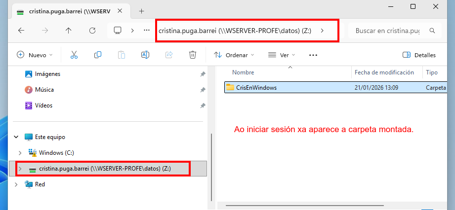
- En **GNU/Linux**:
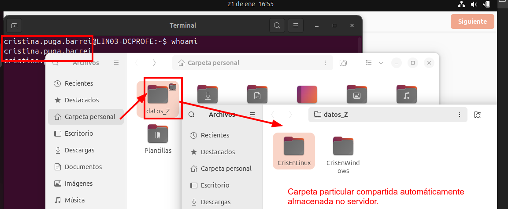

Explicamos paso a paso como facelo.

---

### Paso 1 - Engadir un disco ao servidor DC (WSERVER-PROFE)

Imos engadir un disco ao servidor DC, no noso caso, WSERVER-PROFE.

- Engadimos un disco á controladora **SATA normal**.
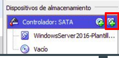
- Chamámoslle ao disco **datos** e tamaño **32GB**
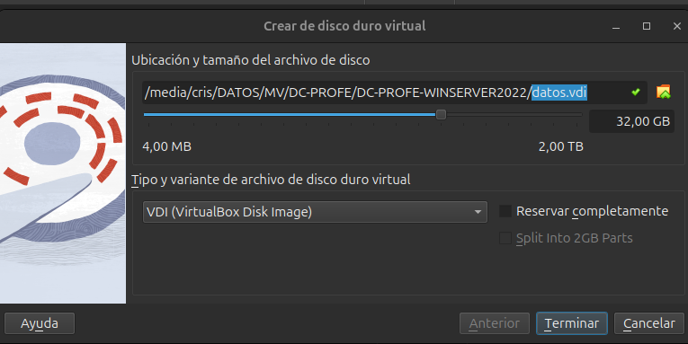

### Paso 2 - Crear un volume de datos

Creamos un **volume simple** de datos en formato **ntfs**, e a **etiqueta** de volume chamámoslle **DATOS**.

- Aplicamos táboa de particións MBR.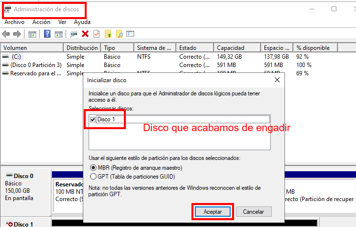
- Creamos un **volumen simple**: 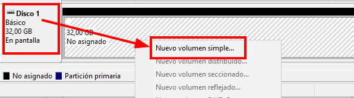
- Indicamos nome da etiqueta e sistema de arquivos e formateamos: 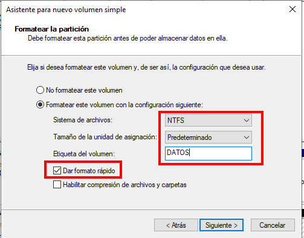
- Temos o volumen montado, no meu caso na letra **E:**: 
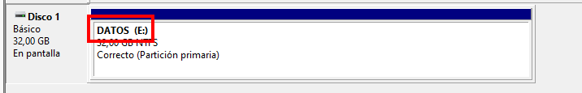

### Paso 3 - Crear a estrutura de directorios para almacenar os datos dos usuarios e aplicar ACLs

- Creamos a estrutura de carpetas. Creamos, dentro de **E:**, a carpeta **Usuarios**, e dentro desta a carpeta **Datos**.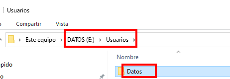
- Examinamos as ACLs da carpeta **Datos**,e deshabilitamos a herdanza. 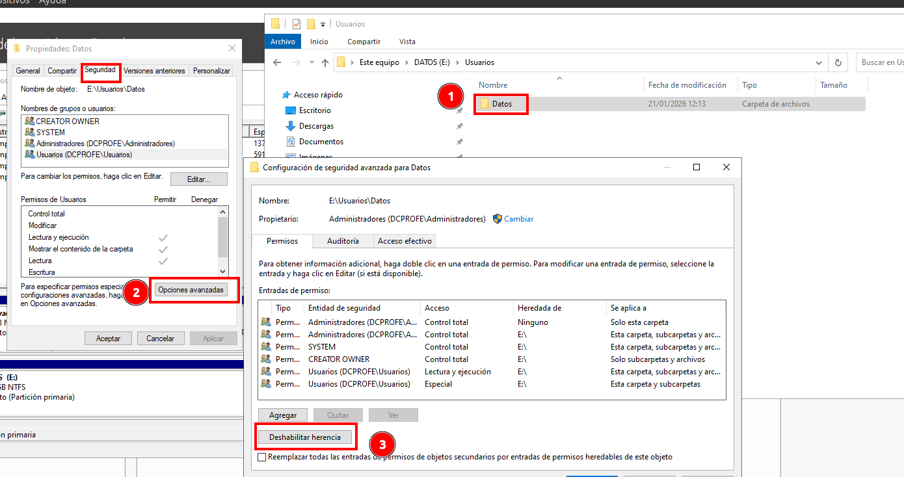 e convertimos os permisos en propios.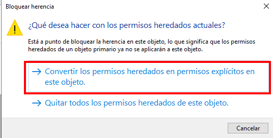
- Revisamos os permisos que hai:
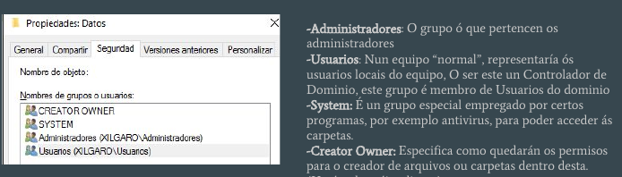

Imos axustar os permisos para cada grupo de usuarios. 

#### 3.1 Usuarios: poidan percorrer as carpetas e crear só carpetas

Neste momento o grupo Usuarios pode crear carpetas e arquivos.
Temos que aplicarlle un **permiso avanzado**, para que poidan **crear so carpetas**.

Editamos so o **permiso especial**, os permisos de **Lectura e execución** deixámolos ok.
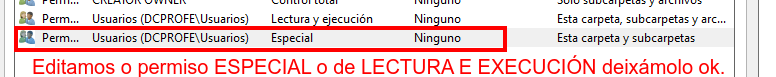
No permiso especial, **mostramos permisos avanzados** **desmarcamos** o casil de **Crear archivos/escribir datos**, quedaría así:
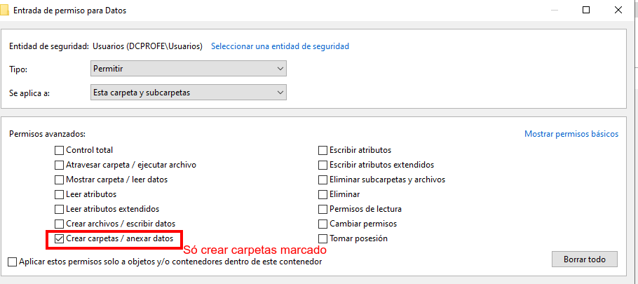

#### 3.2 Creator Owner: deixámolo así, aplicado a Subcarpetas e arquivos

Vemos que un usuario, tal e como vimos no permiso anterior, so podería crear carpetas, pero si unimos este permiso ao que lle da **Creator Owner**, nas **carpetas** que sexan **propias** dentro da carpeta Datos, ten **Control Total**.
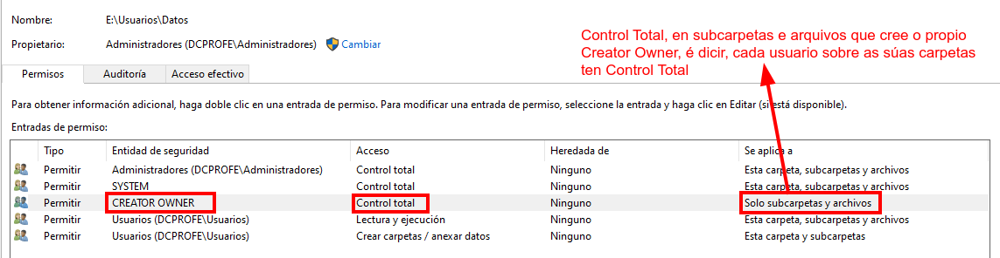
Aproveitaremos isto, para posteriormente gardar os datos de cada usuario ahí, cada un na súa carpeta.

#### 3.3 System e Administradores

Estes usuarios, deixámolos con control total.

### Paso 4 - Compartir a carpeta

Compartimos a carpeta en rede para que sexa accesible desde calquera equpo no que un usuario do dominio inicie sesión.

Compartímola, en **Permisos do recursos compartido**, con **CONTROL TOTAL**.
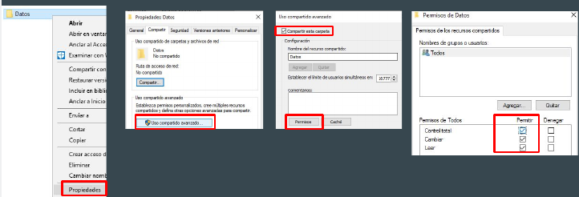

Lembramos que cando se comparte un recurso, hai dous permisos:

- ACLs, permisos locais NTFS sobre a carpeta.
- Permisos do recurso compartido.

E sempre se aplica a **combinación máis restritiva**, que no noso caso son os permisos locais (ACLs).
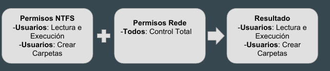

O máis doado é **axustar os permisos empregando os permisos NTFS**, e compartir asignando a Todos: CT, deste xeito os permisos a través da rede serán os mesmos que os locais.

Se accedemos ao servidor desde a rede `\\WSERVER-PROFE`, vemos os recursos compartidos:
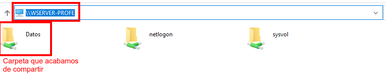

- **Datos**: Carpeta que acabamos de compartir
- **Netlogon**: Scripts de inicio para os usuarios
- **Sysvol**: Directivas para os usuarios, ...

### Paso 5 - Automatizar a montaxe da carpeta Datos

Para automatizar a montaxe, imos a **Usuarios y equipos de active directory**, e nas propiedades de cada usuario imos a: Propiedades usuario->Perfil->Carpeta Particular, e ahí indicamos a letra na que queremos que se monte e a ruta de acceso a carpeta de datos de usuario.
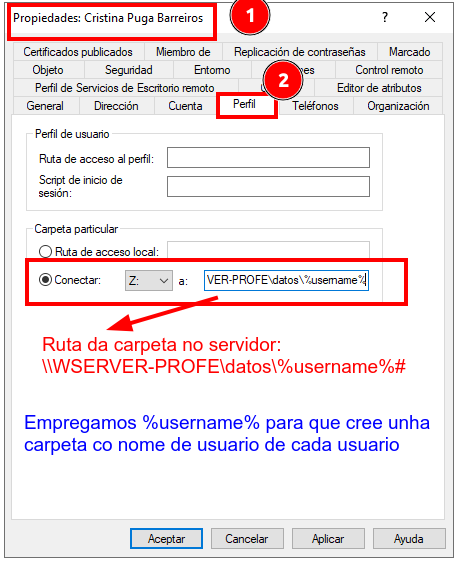

> Cando creamos usuarios plantilla, é interesante configurar xa isto na plantilla.

Finalmente, se accedemos desde un equipo cliente veríase así:


### Paso 6 - Automatizar nos clientes Linux.

Os clientes linux necesitan empregar o módulo **libpam-mount** para automatizar a montaxe de carpetas.

Este módulo permite que, no momento en que o usuario introduce os seus credenciais de AD en Ubuntu, o sistema utilice ese contrasinal para montar a carpeta de rede via SMB/CIFS.

#### 7.1. Instalar módulos libpam-mount e cifs-utils

Instalar o módulo de montaxe PAM e as utilidades de cliente Samba:

```bash
sudo apt update
sudo apt install libpam-mount cifs-utils

```

####  7.2. Configurar o ficheiro de montaxe e engadir regra de montaxe

O ficheiro que controla que volumes se montan automaticamente é `/etc/security/pam_mount.conf.xml`. Debes editalo como superusuario:

```bash
sudo nano /etc/security/pam_mount.conf.xml

```

**Engadir a regra de montaxe**.

Buscamos a liña que di `<!-- Volume definitions -->` e engadimos xusto debaixo a configuración para a nosa ruta. Ou a lo menos antes de que peche `</pam_mount>`.

```xml
<volume 
    user="*" 
    fstype="cifs" 
    server="wserver-profe" 
    path="datos/%(USER)" 
    mountpoint="/home/%(USER)/datos_Z" 
    options="nosuid,nodev,vers=3.0" 
    options="rw,sec=krb5,cruid=%(USER),iocharset=utf8,vers=3.0"
/>
 
```

**Detalles**:

- Para que sexa dinámico (como o `%username%` de Windows), usaremos a variable **`%(USER)`** de linux:
- **mountpoint**: É a carpeta onde aparecerán os ficheiros en Ubuntu. Podemos usar o nome que queiramos (ex: `Z_Drive` , `datos_Z` ou `datod`). PAM creará a carpeta automaticamente.
- **vers=3.0**: Recomendado para seguridade e compatibilidade con Windows Server 2012 en diante.
- **path**: Lembramos que en Linux as barras son `/` e non se precisa o prefixo do servidor se xa o pos no atributo `server`.
- **sec=krb5**: emprega kerberos e non garda contrasinais

#### 7.4. Revisar a configuración de PAM

Normalmente, ao instalar `libpam-mount`, Ubuntu xa configura os ficheiros en `/etc/pam.d/`. Asegúrate de que o ficheiro `/etc/pam.d/common-session` teña esta liña ao final:

`session optional pam_mount.so`

#### 7.5. Verificar o funcionamento

Pechamos a sesión en Ubuntu, entramos de novo cun usuario do dominio, e miramos no navegador de arquivos se aparece a nosa carpeta montada.

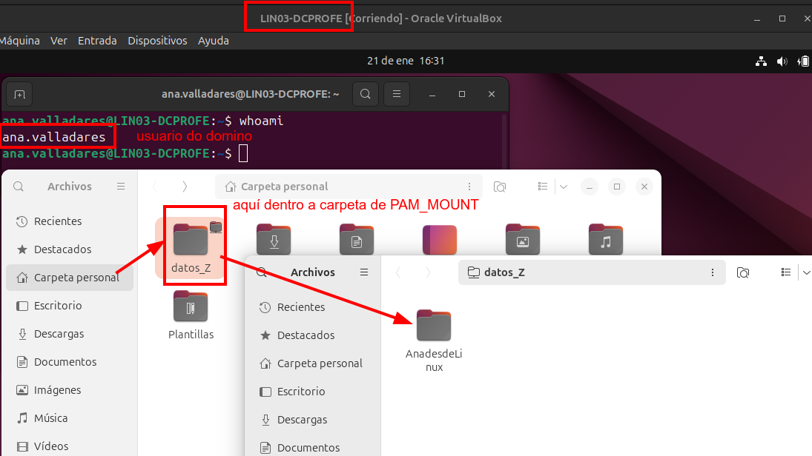

E se facemos un `mount` vemos que aparece a montaxe automática:

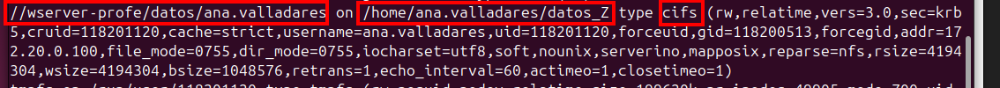

> **NOTA**: se houbera calquer problema, podemos MONITORIZAR e ANALIZAR os ficheiros de log tecleando **`journalctl -xe | grep pam_mount`** ou **`journalctl -xe | grep cifs`**.