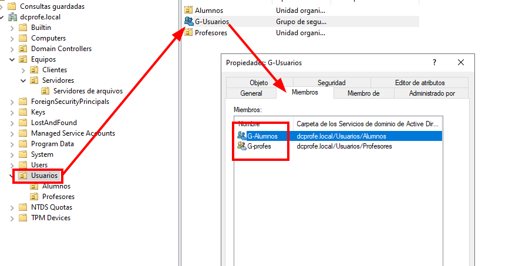

# PROXECTO CONTROLADOR DE DOMINIO WINDOWS 
## ESCENARIO ACTUAL de rede - OU - Grupos - Usuarios

Temos o seguinte configurado

- As seguintes OU:

- Os seguintes usuarios e grupos:

  - Profesores:
    - Cristina Puga Barreiros
    - Lola Liboreiro Pereira

---
Realizar:

## Tarefa 5 - Crear servidor DAS con carpetas particulares de usuarios

## 1. Organizar Grupos dentro das OU

- Dentro da **OU-> Usuarios**, introducimos o grupo **G-Usuarios**
- Dentro da **OU->Profesores**, introducimos o grupo **G-Profes**
- Dentro da **OU->Alumnos**, introducimos o grupo **G-Alumnos**
- Os membros do G-Usuarios son G-Alumnos e G-Profes.

## 2. Crear un servidor DAS engadindo un disco ao DC,WSERVER-PROFE

- Engadir un disco de 32GB ao servidor DC, de tipo SATA.
- Creamos un **volume simple** de datos en formato **ntfs**, e a **etiqueta** de volume chamámoslle **DATOS**.

## 3. Montar en Z: a carpeta de cada un dos usuarios creados no servidor

- Configurar cada usuario para que automáticamente direccione a súa carpeta Datos do servidor á unidade Z: cando inicie sesión.
- Comprobar que funciona entrando desde un equipo cliente con un dos usuarios configurados.

## 4. Configura este montaxe automático tamén en linux

- Configura nos PCs linux cliente o que necesites para que cando inicien sesión teñan montada automáticamente a súa carpeta particular que está dentro da Datos do servidor.

Esta carpeta debe estar configurada dentro do home do usuario nunha carpeta chamada **datos_Z**.
