# AD - Perfís móbiles

Os perfís móbiles, son **copias do perfil de usuario** (Escritorio, Documentos, configuración de aplicacións, fondo de pantalla...) q**ue se gardan no servidor**.

É dicir, cando o usuario inicia sesión, o perfil descárgase do servidor ao PC local. Ao pechar sesión, os cambios sóbense de novo ao servidor.

- **Vantaxes**:
  - O usuario ten o seu "escritorio" exactamente igual, sen importar desde que ordenador se conecte.
  - Facilita as copias de seguridade, xa que os datos do perfil de usuario están no servidor.
  - Se un PC se estropea, o usuario non perde a información do seu perfil.

- **Inconvintes**
  - **Lentitude no inicio e o peche de sesión**, pois ten que descargar do servidor ao inicio e volcar a información ao servidor ao pechar.
  - **Consumo de espazo no servidor**, ao gardar todo no servidor (incluíndo ficheiros temporais ...) corremos o risco de que o servidor quede en espazo fácilmente.
  - Conflictos de versión, se un usuario deixa unha sesión aberta nun PC e logo abre outra nova noutro PC, ao pechar a sesión, a última que se garde sobreescribirá á anterior. o que** pode provocar perda de datos**.
  - **Problemas con aplicacións**. Moitas aplicacións gardan información na carpeta do perfil do usuario `AppData`, se o perfil é móbil e contén esta carpeta, poderá provocar tardanza en iniciar sesión e pode provoca problemas con algunhas aplicacións.
  - **Problema ao iniciar sesión en PCs cliente Linux e Windows indistintamente**: como hai incompatibilidade de formatos, non os garda. Nun caso así, non ten sentido empregar perfiles mobiles.

> Debido a estes problemas, na actualidade téndese a empregar **Redirección de carpetas** en vez de perfís móbiles.

## Escenario

Seguimos traballando co DAS (pero poderíamos facer o exercicio con calquera outro  tipo de almacenamento NAS ou SAN).

**Estrutura discos** do noso servidor

- **WSERVER-PROFE**
  - **C:** - Disco do sistema
  - **E:** - Disco de 32 GB que engadimos na controladora SATA.
    - Contén a carpeta **Usuarios** e dentro
      - Datos: Empregada para as **carpetas particulares de usuario**
      - **Perfiles**: crearemos esta carpeta para gardar os **perfiles móbiles** dos usuarios.

Imos crear perfís móbiles para o noso usuario **Cristina Puga Barreiros**.

O procedemento será:

1. Crear a carpeta no servidor e aplicar ACLs
2. Compartir a carpeta con CT.
3. Configurar no DC o perfil móbil para o usuario.

### Paso 1 - Crear a carpeta e aplicar ACLs

Creamos a carpeta **Perfiles**, dentro de `E:\Usuarios\Perfiles`.
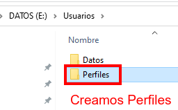

Aplicamos as ACL igual que no caso das carpetas particulares.

Pasos:

1. Rompemos a herdanza: 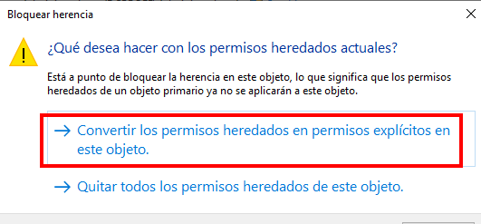
1. Eliminamos Usuarios: para impedir que outros usuarios entren na carpeta de perfiles. 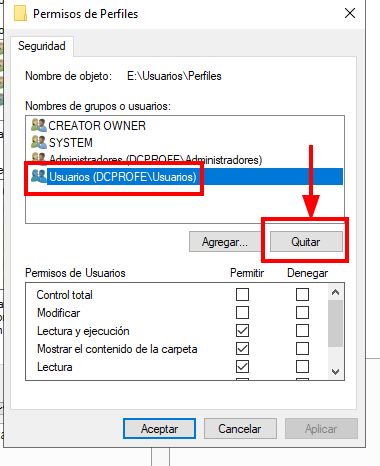
1. Eliminamos Creator Owner: 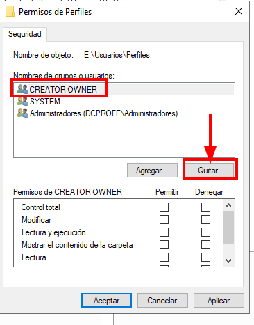
1. **Engadimos: G-Usuarios** con permiso de **Escritura**. 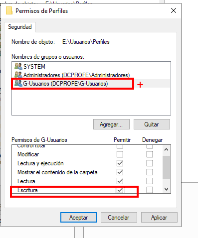

### Paso 2 - Compartimos a carpeta con Control Total

Compartimos con control total.
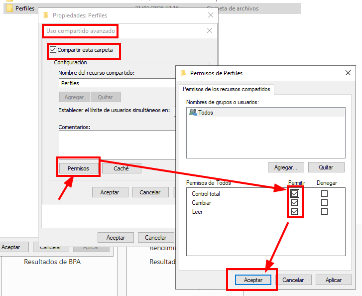

### Paso 3- Establecemos o perfil nun usuario

Imos empregar o usuario "Cristina" para establecer o perfil móbil:

Propiedades do usuario-> Perfil -> Ruta de acceso al perfil. E establecemos a ruta de rede, no noso caso `\\wserver-profe\perfiles\%username%`.

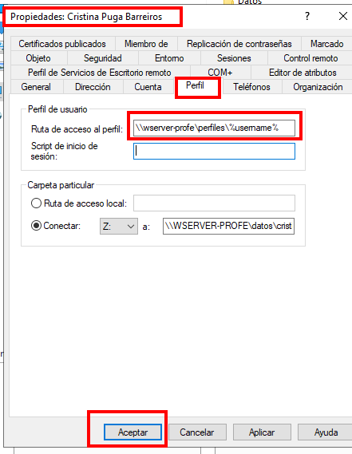

### Paso 4 - Iniciar sesión nun PC cliente e comprobar que creo a carpeta no servidor

- Iniciamos sesión co usuario desde un PC cliente:
- Comprobamos que se creou a carpeta de perfil na carpeta Perfiles so Servidor.
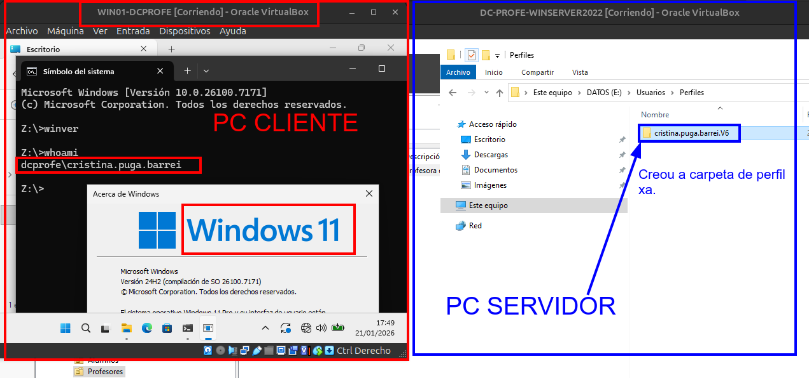

> **Problema** o administrador non pode acceder á carpeta do usuario que se creo en perfiles. Así que este método non é recomendado facelo así, senón a través dunha **Directiva de Grupo**.
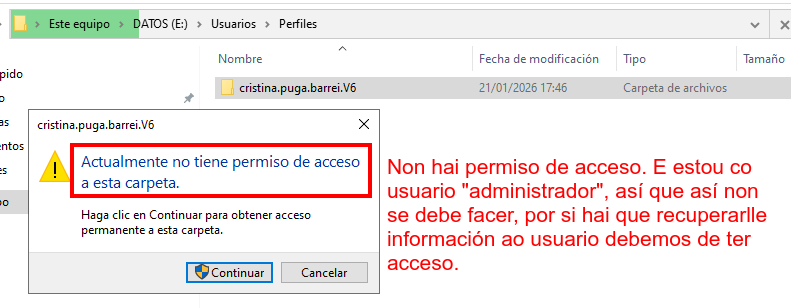

--- 

### Paso 5 - Borramos a carpeta feita e facémolo con Directivas de Grupo

- Tomamos posesión de todo o contido da carpeta
`takeown /r /f cristina.puga.barrei.v6`
- Engadims un ACE con Administradores con CT sobre o contido da carpeta.
`icacls cristina.puga.barrei.v6 /grant administradores:F /T`
- Agora xa podemos borrar toda a carpeta
`rd /s cristina.puga.barrei.V6`

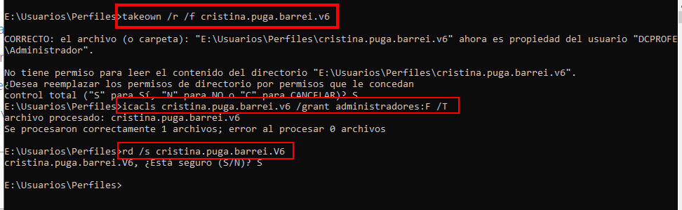

### Paso 6 - Creando unha directiva de grupo que permite aos administradores acceder aos perfís dos usuarios

Queremos que o administrador teña acceso ós perfís dos usuarios, así que **configuramos unha directiva**.

A directiva aplicarémola sobre a **OU Equipos**.

- Apagamos o cliente **WIN01-DCPROFE** pois a directiva será unha configuración de equipo e aplicarase o iniciar a máquina.

- Iniciamos a **consola de Administración de directivas de grupo** (`gpmc.msc`)

- Creamos unha nova directiva
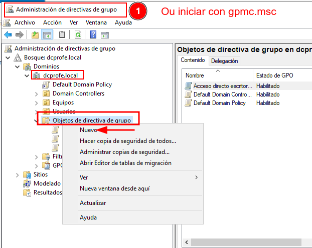
- Dámoslle un nome significativo 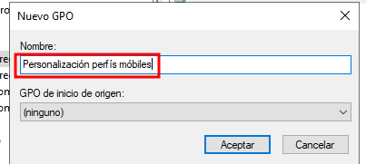
- Editamos a directiva 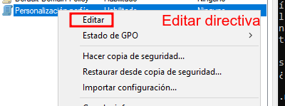
- Imos a **Configuración de Equipo->Directivas->Plantillas administrativas->Sistema->Perfiles de usuario**: 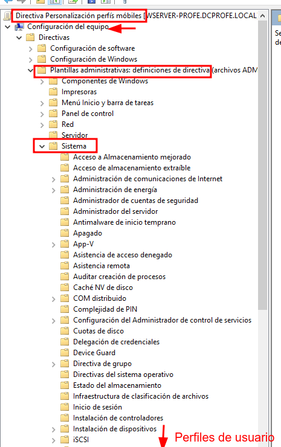
- En perfiles de usuario, configuramos:
  - **Agregar el grupo de seguridad de administradores a los perfiles de usuarios móviles**: Agregará o grupo Administradores á ACL das carpetas dos novos usuarios que inicien sesión.
  - **Eliminar copias en caché de perfiles móviles**: Non teremos dúas copias dos perfís, só estarán almacenados no servidor, evitamos problemas de inconsistencias
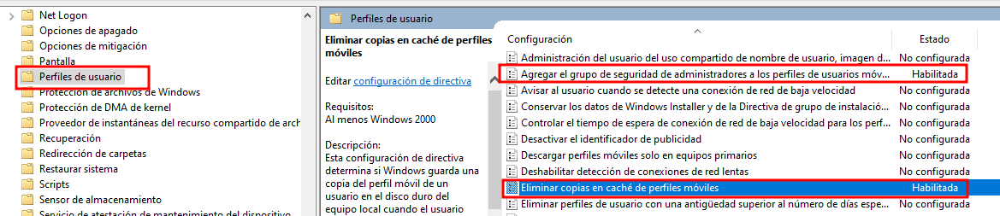

Imos vincular a directiva sobre a **OU Equipos**.

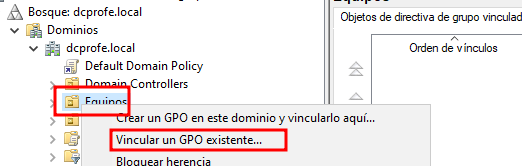
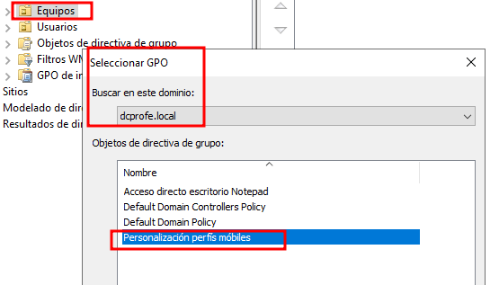

### Paso 7 - Volvemos iniciar o PC cliente (gpupdate /force)

- Iniciamos o PC cliente.
- Iniciamos sesión co usuario ao que lle configuramos perfil móbil (Cristina, no noso caso)
- Facemos un `gpupdate /force` para forzar que se apliquen as directivas.
- Podo consultar as directivas aplicadas con `gpresult /R`

Se consultamos no servidor, podemos ver que xa podemos acceder como administrador á carpeta de perfís de usuario.

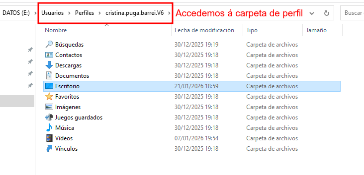

### Verificar que carga o perfil en diferentes equipos

Probar a cambiar algo no perfil nun PC e probar que se mantén iniciando sesión en outro.

Deixoo para que probedes vós.
