# AD - Redirección de carpetas equipos Windows

O implantar Perfís Móbiles todas estas carpetas do usuario están gardadas no Servidor.
Isto significa:

- Cada inicio de sesión copiamos esa información no cliente
- Cada peche de sesión copiamos toda esa información no servidor

Entre outros movemos pola rede:

- **Documentos**: A carpeta documentos
- **Escritorio**: O escritorio do usuario
- **NTUSER.DAT**: A información do rexistro do usuario: configuración do escritorio, fondo de pantalla.

Se temos un usuario “despistado” que ten moita información almacenada nesas carpetas (Por exemplo: Unha máquina virtual en Documentos), os inicios e peches de sesión serán moi lentos.

Para evitar eses retardos o iniciar sesión, en vez de aplicar perfís móbiles, aplicaremos **redirección de carpetas** sobre as carpetas de usuario que consideremos, deste xeito:

- Almacenaremos esas carpetas unicamente no servidor.
- Compartirémola na rede
- Dende o equipo cliente, traballaremos directamente coa carpeta compartida.

Pasos para a redirección de carpetas:

1. Crear a carpeta nun almacenamento do servidor e aplicar ACLs.
2. Compartir esa carpeta con CT.
3. Crear unha **GPO - Redirección de carpetas**.
4. Aplicar a GPO sobre a **OU Usuarios**.

---

## Paso 1 - Creación da carpeta no servidor

Neste caso creamos a carpeta na unidade `E:\Usuarios\Redireccions`.
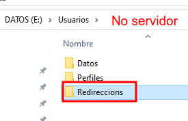

Aplicamos ACLs.

- Rompemos a herdanza
- Quitamos a usuarios
- Engadimos a G-Usuarios con:
  - Lectura e Execución
  - Escribir
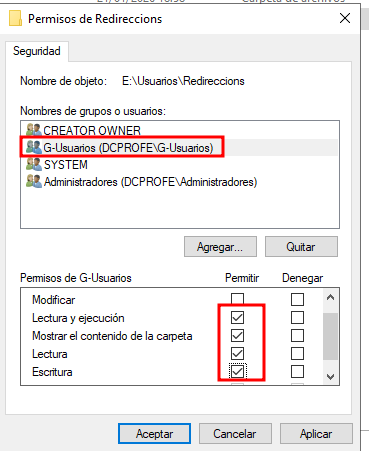

## Paso 2 - Compartimos a carpeta con CT

A diferenza é que compartimos a carpeta de xeito **oculto** `Redireccions$` é dicir engadimos un símbolo de **$** ao final.
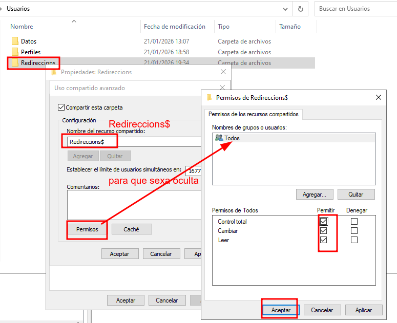

## Paso 3 - Crear a GPO - Redirección de carpetas: Escritorio e Documentos

- Imos a configurar unha **Configuración de Usuario**, así que aplicarase cada vez que un usuario inicie sesión
- Creamos unha nova Directiva chamada “Redirección de Carpetas”

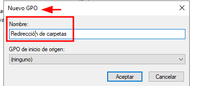

- Editámola (**Configuración Usuario - Directivas - Config Windows - Redireccion carpetas - Escritorio**)
- Para configurar a carpeta Escritorio
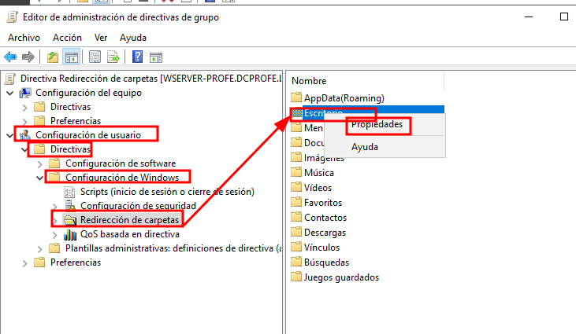
- **Botón Dereito -> Propiedades-> Destino**
  - Configuramos onde se gardará no servidor a carpeta redireccionada
  - Amósanos como nesa carpeta se creará unha carpeta por usuario, e dentro dela almacenarase o seu Escritorio.
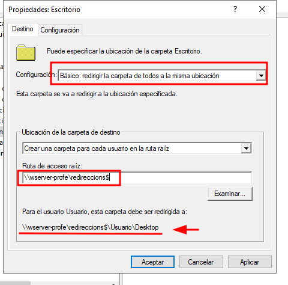
- **Botón Dereito sobre EScritorio -> Configuración** e cambiar, configurmos que ocorre coa carpeta se deixamos de aplicar a directiva.
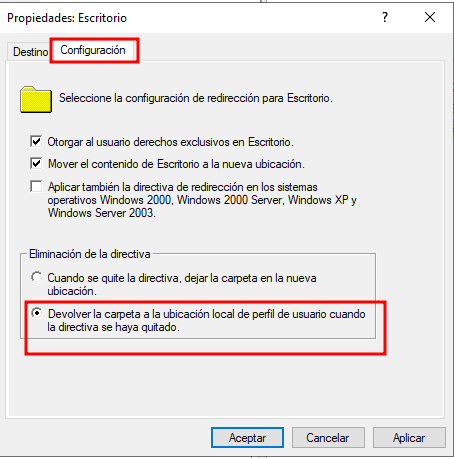

Facemos o mesmo coa carpeta Documentos

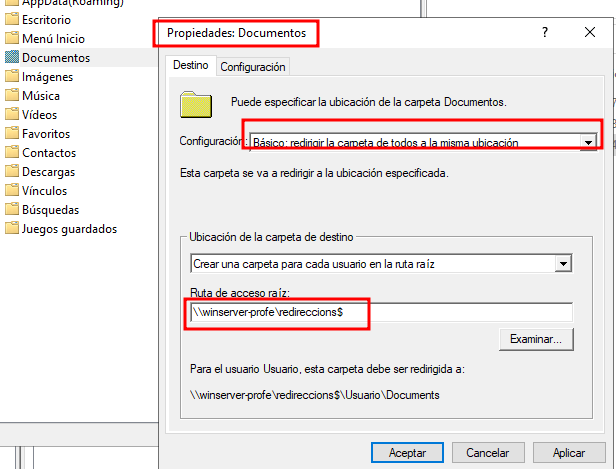
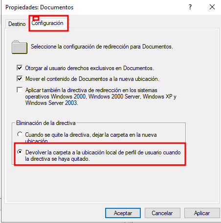

Vemos un resumo das directivas aplicadas:
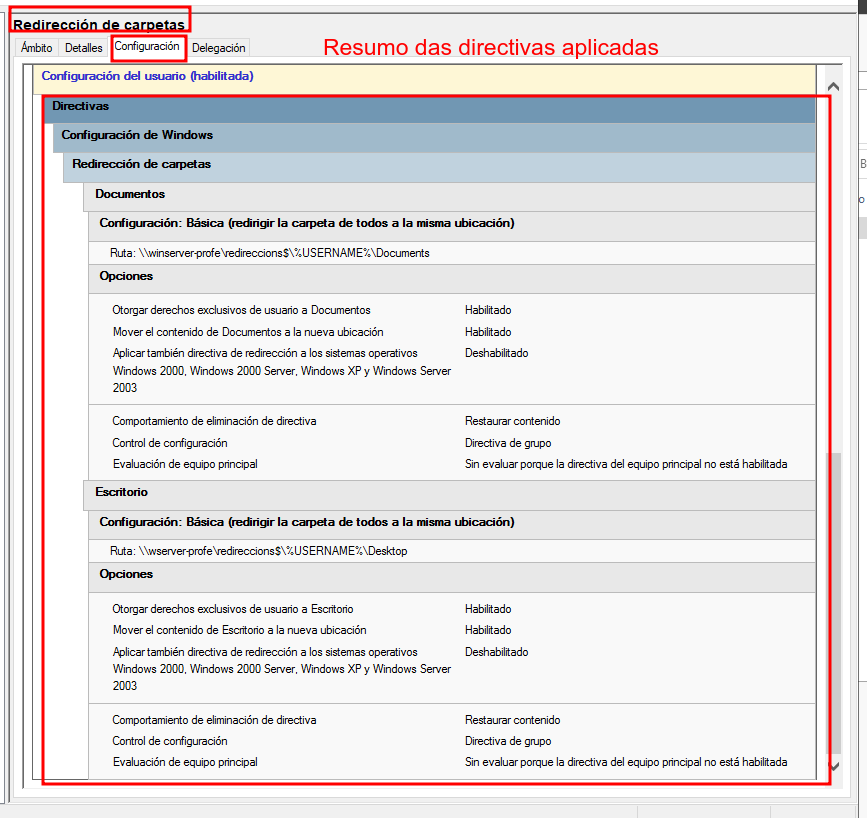

## PAso 4 - Aplicamos a GPO sobre a UO Usuarios.

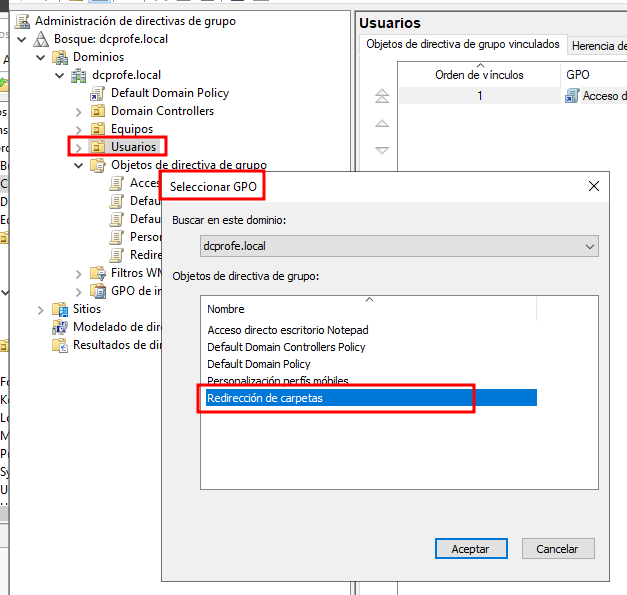

Vese que a ten aplicada: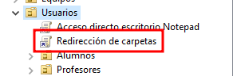

## Verificar o funcionamento

- Entro co usuario "Cristina" no cliente e comprobo no servidor que se creou a carpeta do usuario.
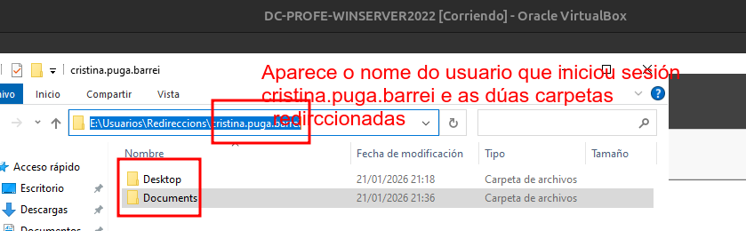

> *Outra forma de facelo*: [Redireccion Carpetas - Vídeo youtube Albert López Espinosa]([https://](https://youtu.be/JGjwuvPJN_c?si=cD6V_Z47iaUopBwy))
