# Implementando NAS con SMB

O **Escenario** que imos implementar é o seguinte:

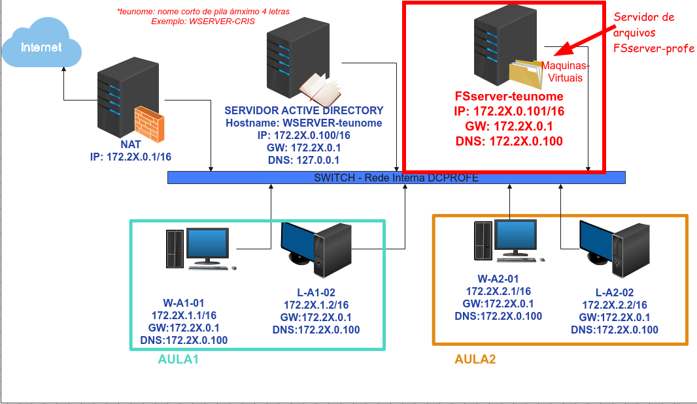

Pasos a realizar:

1. **Paso 1 - Configurar a MV Windows Server FSserver-teunome**: Configurar un NOVO SERVIDOR Windows Server chamado **FSserver-teunome** que fará de servidor de ficheiros, como se ve na imaxe do escenario.
2. **Paso 2 - Agregar o servidor FS á pantalla de administración do DC** e Configurar o **rol SERVIDOR DE ARCHIVOS** no novo servidor, configuramos desde o servidor WSERVER-teunome.
3. **Paso 3 - Configurar os discos do servidor**: Os discos no servidor NAS serán dous discos de 10GB nunha controladora LSAS.Configurados como un **Storage Space (grupos de almacenamiento), distribución Simple** (similar a **Raid 0**). Crearase un pool **Docencia-Pool** cos dous discos físicos engadidos.
4. **Paso 4 - Crear un recurso compartido con SMB - Creando un Share:** Crear recurso compartido **Maquinas virtuais** - Compartirá unha carpeta que se chame **Maquinas-Virtuais**, que estará almacenada nun disco virtual dentro do pool "Docencia-Pool", o disco virtual chamarase tamén **Maquinas-Virtuais**

> Farase toda a configuración de FSserver de **forma remota** desde o servidor **WINSERVER-teunome**, a través da ferramenta **Administrador do servidor**

Vai aplicando estes pasos sobre o teu escenario de VBox da aula, e captura as evidendias que consideres.

---

<strong>Paso 1 - Configurar a MV Windows Server FSserver-teunome
</strong>

## Paso 1 - Configurar a MV Windows Server FSserver-teunome

- Importamos a **.OVA de Windows Server**, ou facemos un **clon enlazado da máquina de Windows Server BASE** (que temos con sysprep). Chamámoslle **FSserver-teunome**
- Cambiamos o nome do hostname.
- Configuramos a rede.
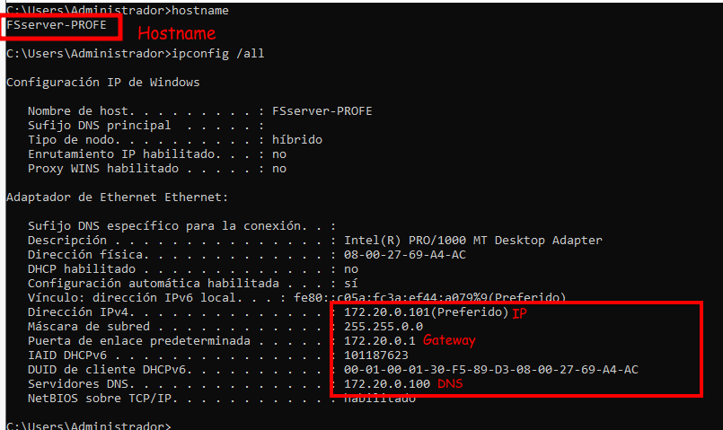
- Damos de alta o novo servidor no DOMINIO.
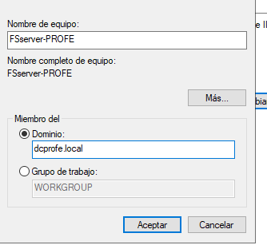
- Metemos ao servidor dentro da UO **Servidores de arquivos**
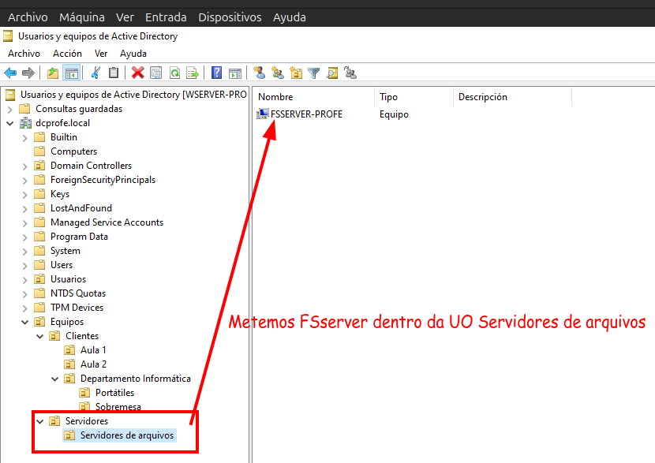

- Agregamos o servidor ao DNS.
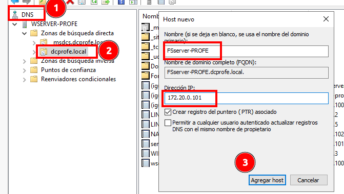

<strong> Paso 2 - Agregar o servidor FS á pantalla de administración do DC e aplicar rol Servidor Arquivos</strong>

## Paso 2 - Agregar o servidor FS á pantalla de administración do DC e aplicar rol Servidor Arquivos

Desde **DCprofe** asignamos o servidor:
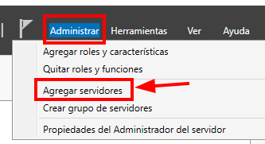
Buscamos o nome do servidor de ficheiros e engadímolo:
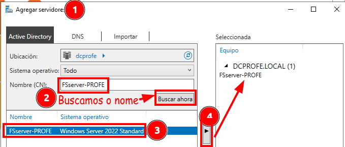

Dentro da consola de Administrar Servidor ->**Todos los servidores** vemos que xa está o novo servidor engadido:
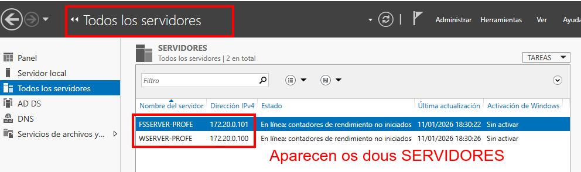

### Paso 2A - Agregar o rol Servidor de Ficheiros

Desde a **consola do DCPROFE**, imos agregar un **novo rol**, e agregarémolo sobre o servidor FSserver-PROFE.
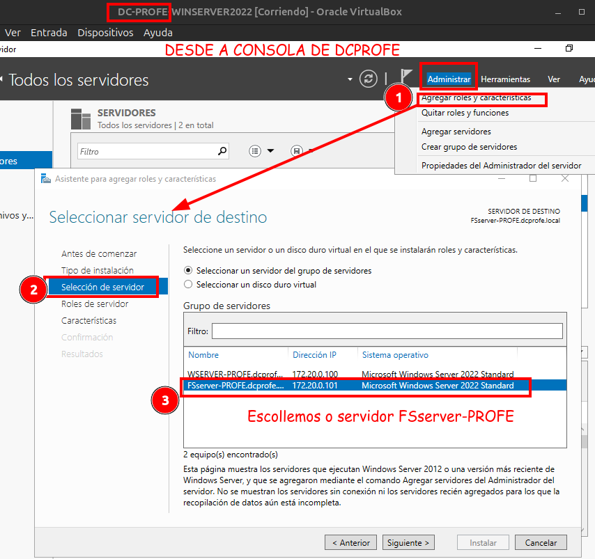

Agregar rol Servidor de archivos dentro de Servidor iSCSI.

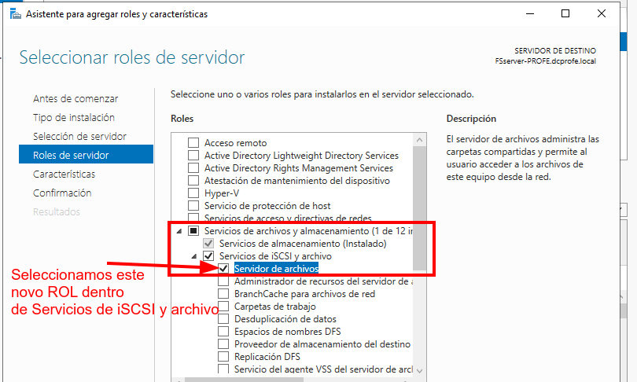

Continuamos con **Seguinte** en Característica, sen modificar nada, e en Confirmación **instalamos**.

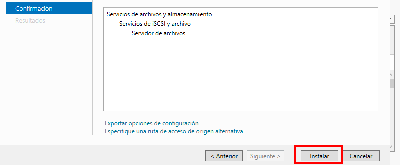
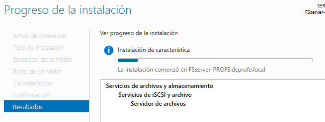

<strong> Paso 3 - Configurar os discos do servidor (Storage Space - Simple)</strong>

## Paso 3 - Configurar os discos do servidor (SAS-Storage Space - Simple)

Imos asignar dous discos de 10GB ao servidor nunha controladora LSAS.

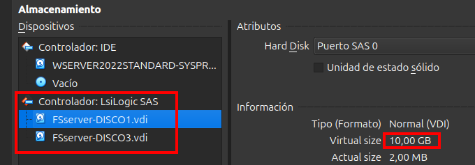

Configuramos os espazos de almacenamento no **Servizo de arquivos**
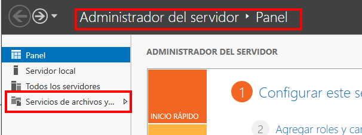

Creamos un novo grupo de almacenamento - 

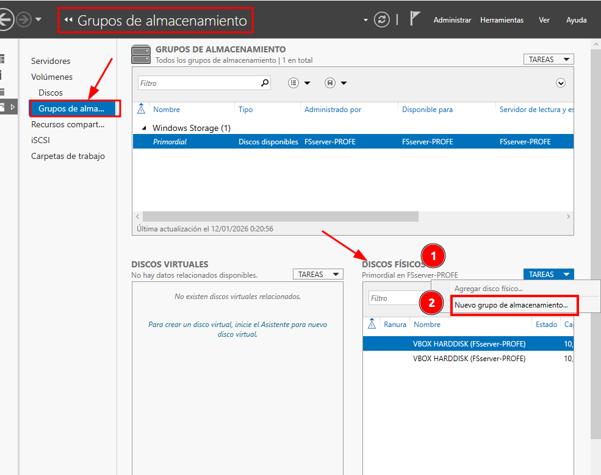

Imos chamarlle **Docencia-Pool**.
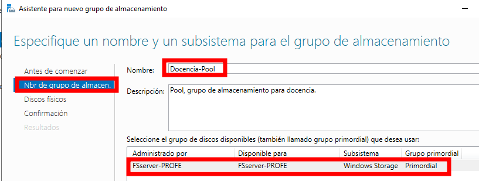

Indicámoslle que vai empregar os dous discos físicos que temos.
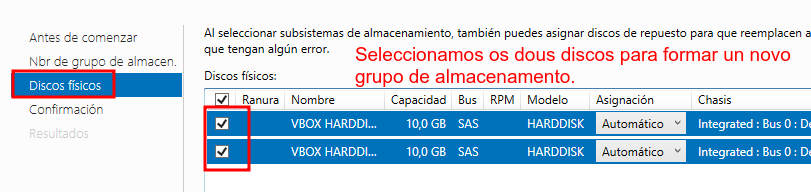
Confirmamos: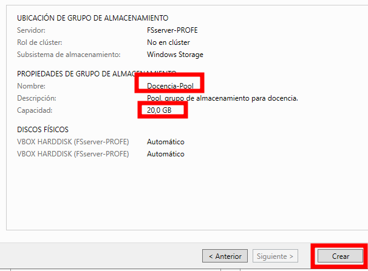

Creamos un novo **Disco Virtual**
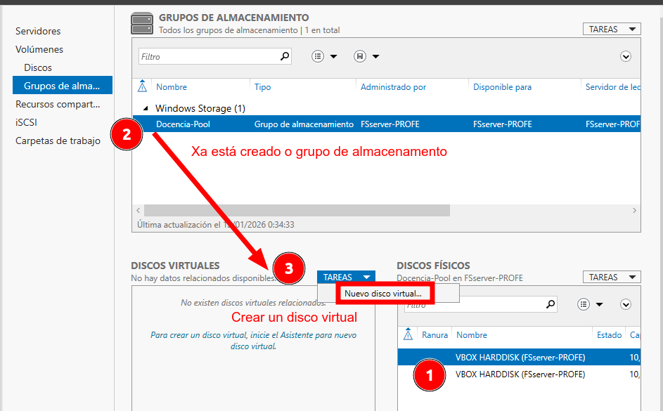

Escollemos o grupo de almacenamento:
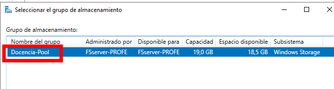

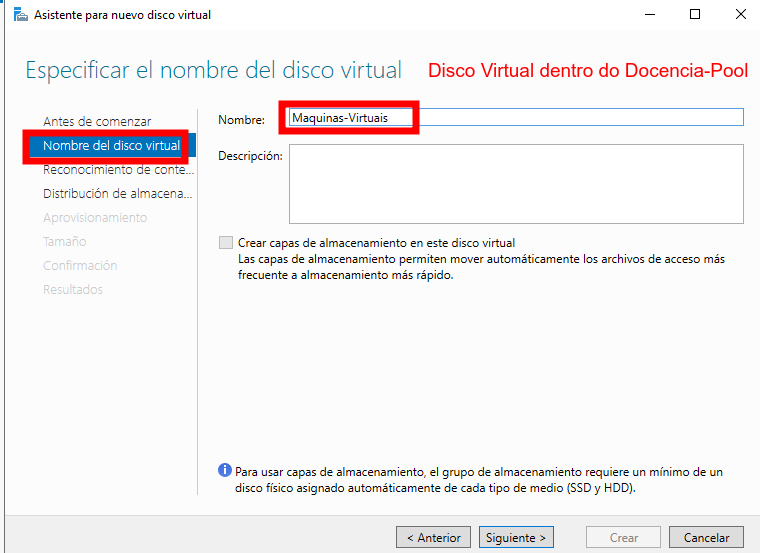
Creamos un Disco Virtual de **distribución simple**, similar a Raid 0.
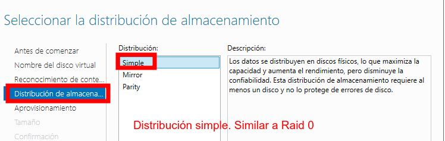

Tipo de aprovisionamiento, fijo.
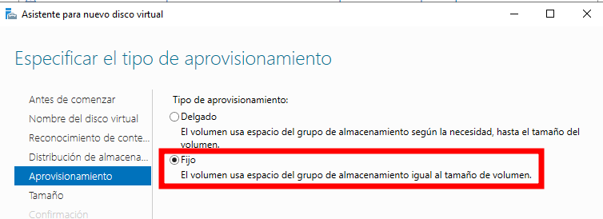

 Se escollemos “aprovisionamento fijo” non poderemos crear un disco virtual de maior tamaño que o dispoñible no pool. Se escollemos “aprovisionamento delgado” non temos ese problema.
 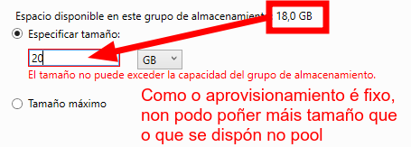

 Escollemos o tamaño total que temos 6GB, e quedaría espazo para máis discos virtuais no mesmo pool.
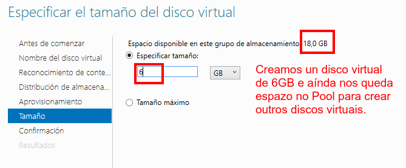

No último paso, créase o **volume**.
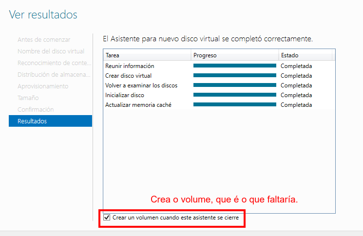

Creamos un volume de todo o espazo.
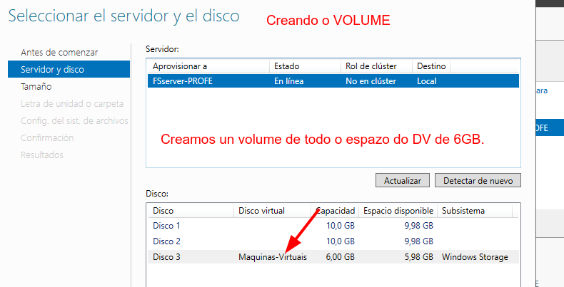

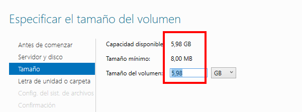

Asignámoslle a letra P.
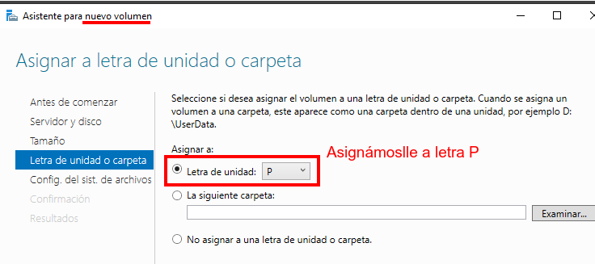

Configuramos o sistema de arquivos, imos aplicarlle **NTFS** neste caso e darlle a etiqueta de volumen **Maquinas-Virtuais**:
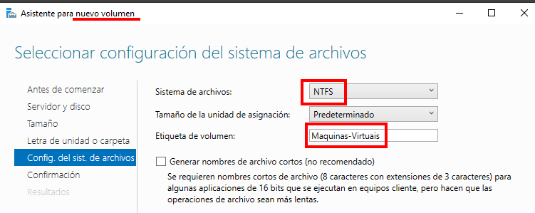

Vemos o resume do **Volume**:
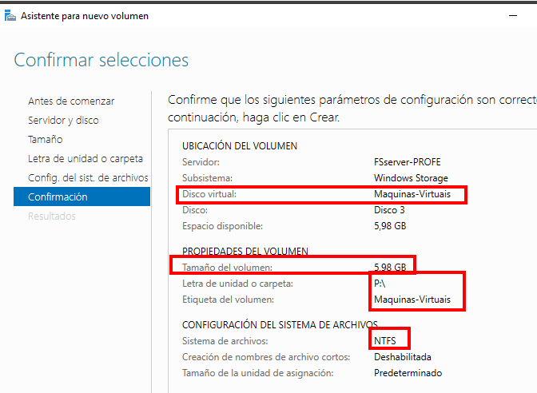

Vemos en **VOLÚMENES**, que aparece o novo volumen.
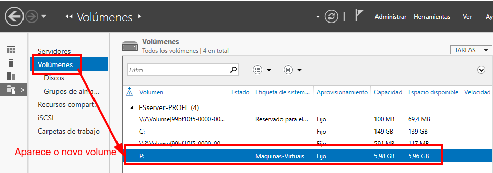

<strong> Paso 4 - Crear un recurso compartido con SMB - Creando un Share</strong>

## Paso 4 - Crear un recurso compartido con SMB - Creando un Share

Crearemos o share, **Maquinas-Virtuais**, dentro do volume Maquinas-Virtuais creado no servidor FSserver-PROFE.

Imos a **Servicios de archivos y almacenamiento**
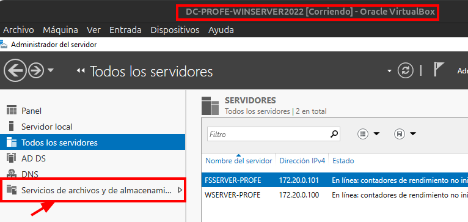

Vemos os recursos compartidos (**shares**) xa creados previamente e a súa ruta no sistema de arquivos. En **DC-PROFE** cando instalas Active Directory créanse NETLOGON e SYSVOL:

- **NETLOGON**: gárdanse **scripts de inicio de sesión** dos usuarios.
- **SYSVOL**: é a forma que ten o controlador de dominio de facer chegar as **GPO** aos membros do domino.

Imos crear un novo recurso: escollemos **Nuevo recurso compartido**
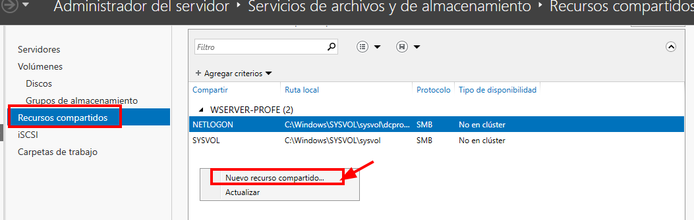

Debemos escoller o **perfil do recurso compartido** entre:

- **SMB-Rápido**: é o método máis rápido para compartir un directorio. Permite escoller o servidor, o nome, a ruta local e os permisos.**Escollemos esta opción**.
- **SMB-Avanzado**: permite o mesmo que o perfil rápido, escoller os propietarios dos arquivos, clasificación dos datos por defecto e cuotas. Necesita o rol adicional de Administrador de  recursos do servidor de arquivos”.
- **SMB-Aplicacións**: configuración especializada para o sistema de virtualización de Microsoft Hiper-V, bases de datos e outras aplicacións de servidores.
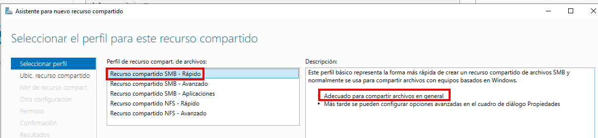

Escollemos o servidor onde vai estar o recurso compartido e o volumen onde se creará:
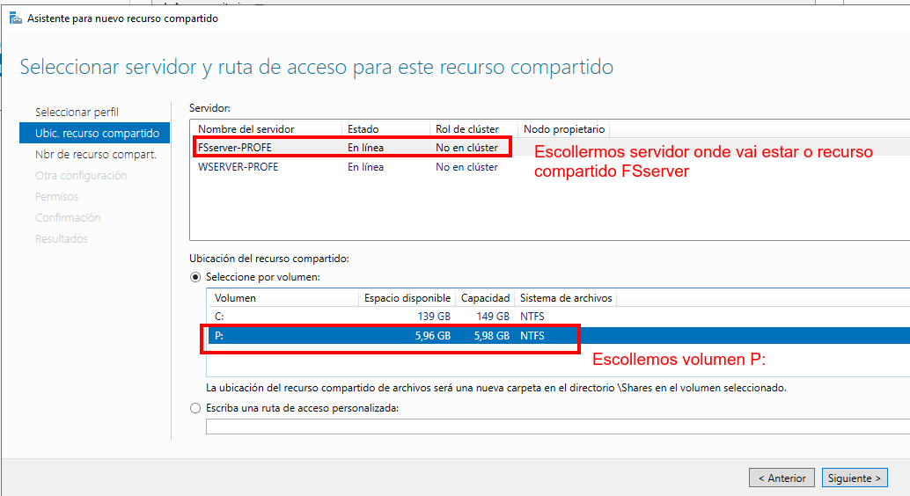

Indicamos o nome do recurso compartido e a ruta local e remota para poder acceder desde outros equipos:
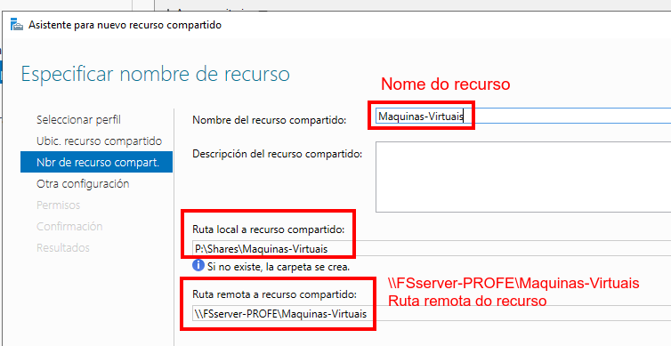

Deixamos todas as opcións sen marcar:
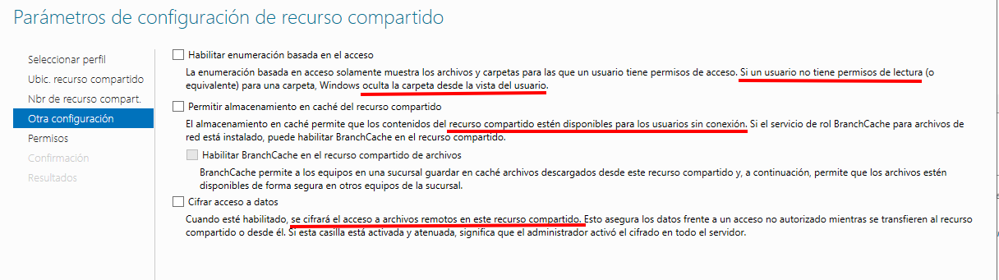

Deixamos todos os permisos por defecto, xa os modificaremos máis adiante.
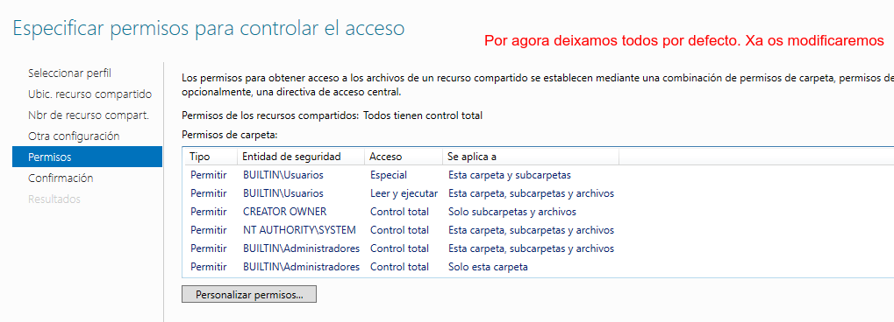

Continuamos e finalizamos, e podemos ver que aparece o recurso compartido:

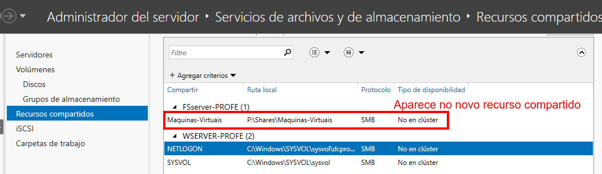

Se imos ao **explorador de arquivos** de calquera dos PCs da rede interna podemos ver que xa está compartida a carpeta:
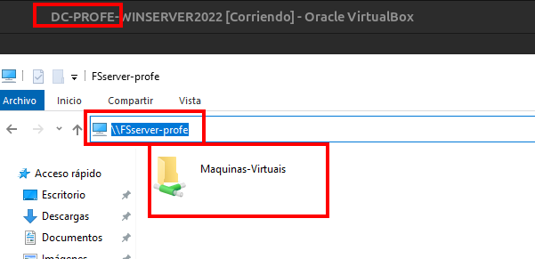