# NFS

Imos crear un Share, chamado **Instruccions** dentro dun recurso compartido tipo **NFS**, creado partindo dun grupo de almacenamento **Publico** que da lugar a un disco virtual **publico** que se establece como **Mirroring**, e que se monta nun volumen chamado **M:**.

## Engadir discos a FSserver-teunome

- Engadismos 2 discos de 20GB
  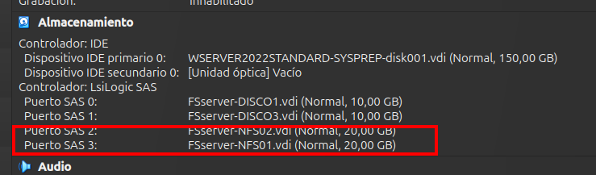

  Inicializamos os discos a MBR. No **Administrador de discos**
  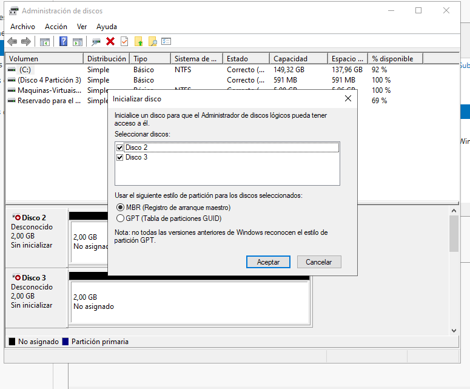

## Paso 1- Instalar o servidor NFS en FSserver-teunome

Engadimos o Rol de **Servidor para NFS**. Dentro de *Servicios de archivos y almacenamiento -> Servidios de iSCSI y archivo*.
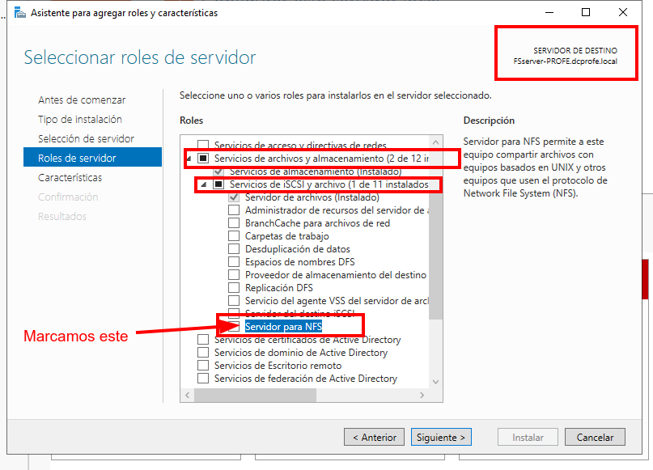

- Agregamos a característica e procedemos a **Instalar**.

## Paso 2 - Crear grupo de almacenamento

Creamos un novo grupo de almacenamento cos dous discos de 20 GB
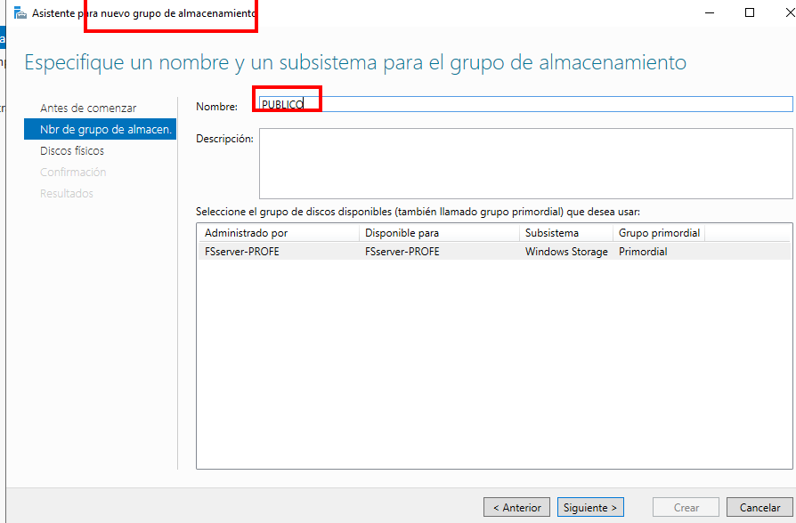
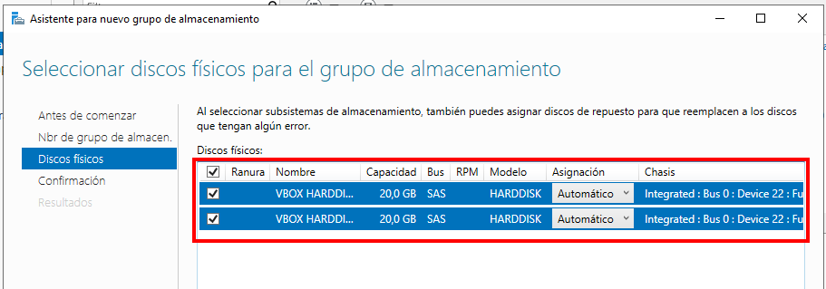
Creado:
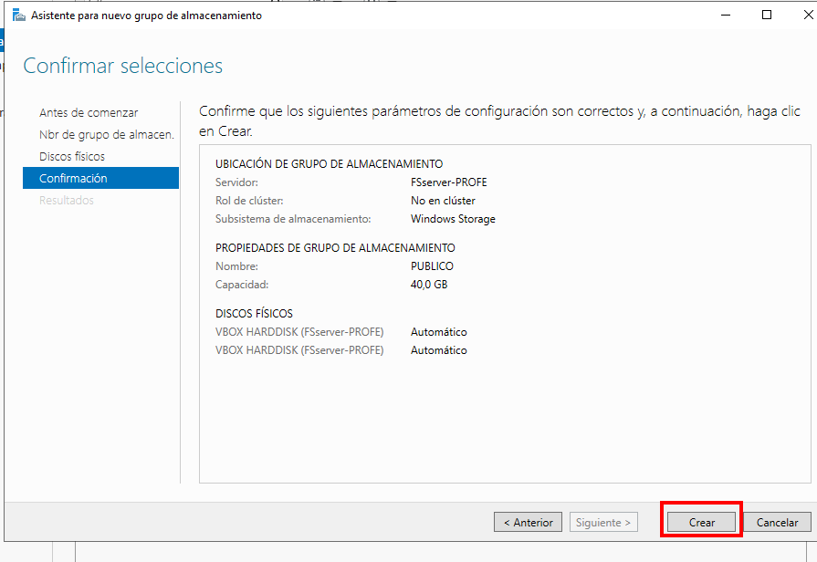

- Creamos o **DISCO VIRTUAL** como **Mirroring** (DVPUBLICO)
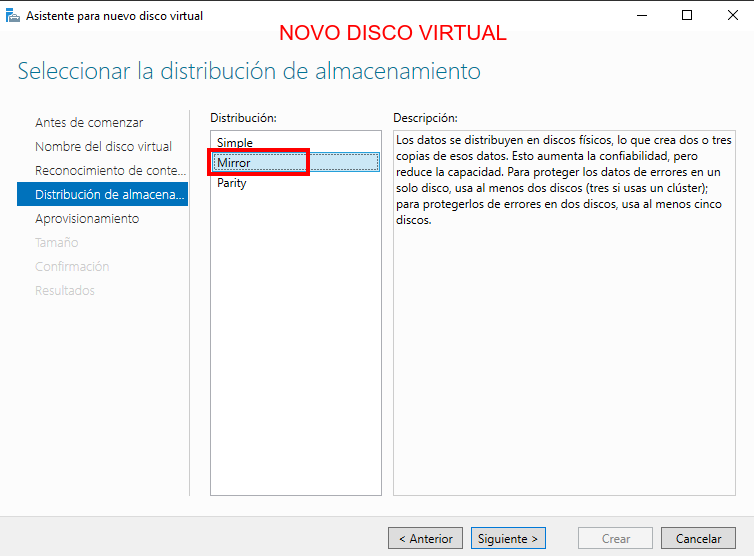

Escollemos, aprovisionamento **delgado**.
Tamaño todo os **20GB**

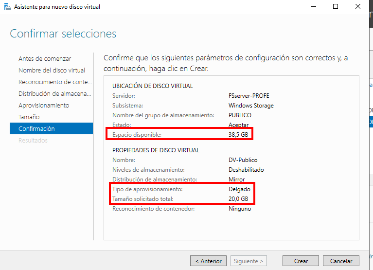

E creamos o novo volumen **M:**.

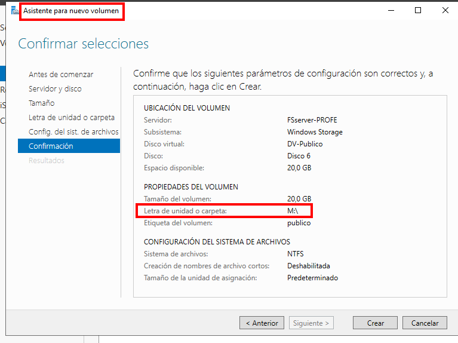

## Paso 3 - Crear o export

Dente a ferramenta de **Administración do servidor->Servidor de archivos**, accedemos a **Recursos Compartidos** como fixemos antes con SMB.

Imos empregar todo o espazo do disco virtual que acabamos de crear.

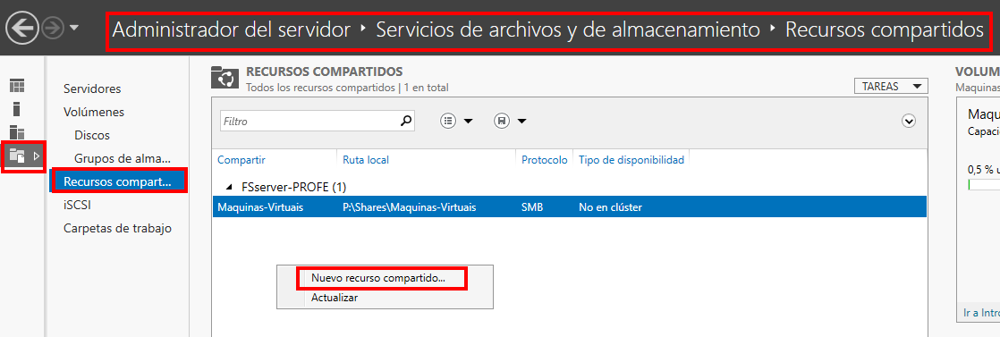

Escollemos o perfil **NFS-Rápido**, e escollemos:

- Sistema
- Servidor
- Volume

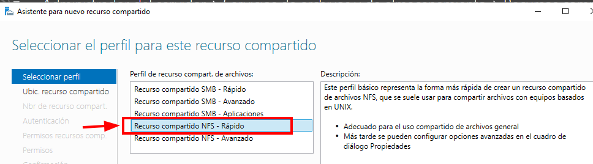

Escollemos o Volumen **M:**
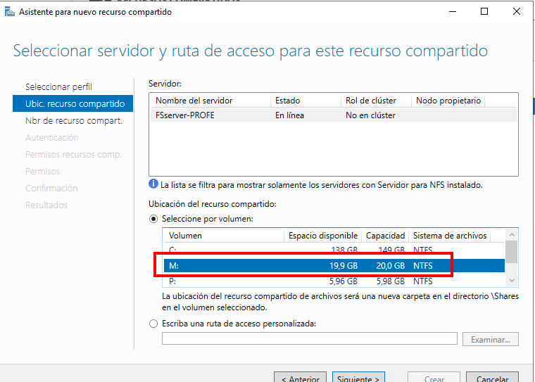

Establecemos nome de recurso **Instrucciones**

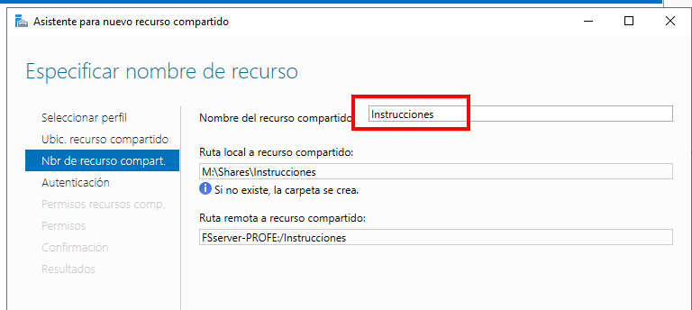

Autenticación Kerberos 5:
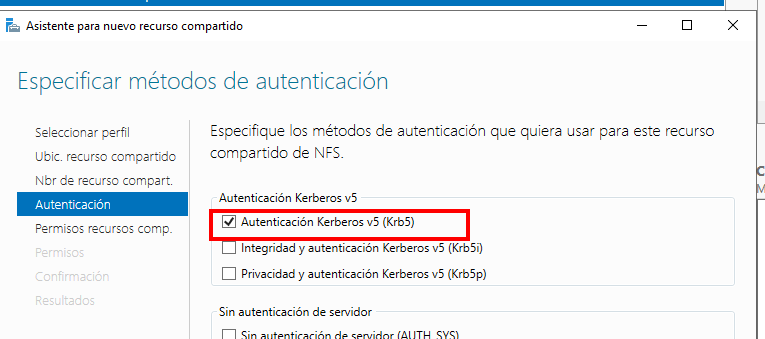

Imos darlle permiso á máquina **WSERVER-PROFE** de **solo lectura**.
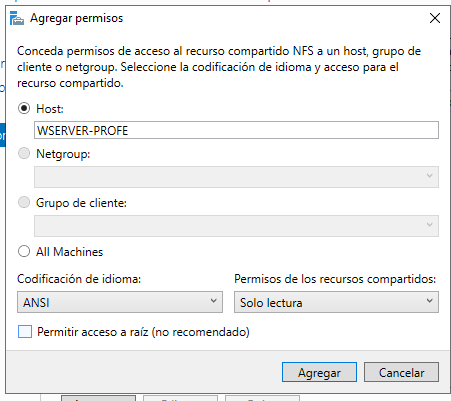
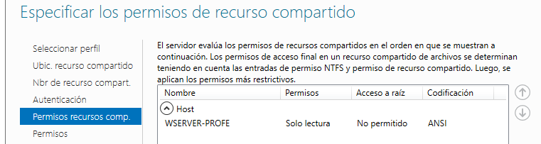

Deixamos os permisos da carpeta por defecto:
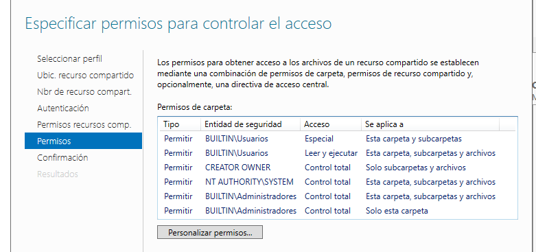

Temos o resumo de recursos compartidos:
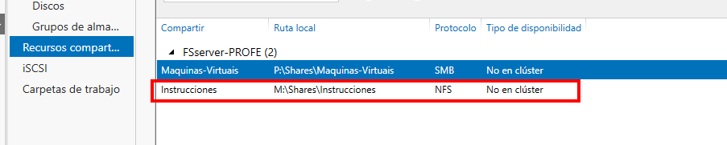

## Paso 4 - Compartir carpeta por NFS

Accedemos desde **FSserver-Profe**, dende o explorador de arquivos, e vemos que aparece unha carpeta onde nos permite o **Uso compartido por NFS**

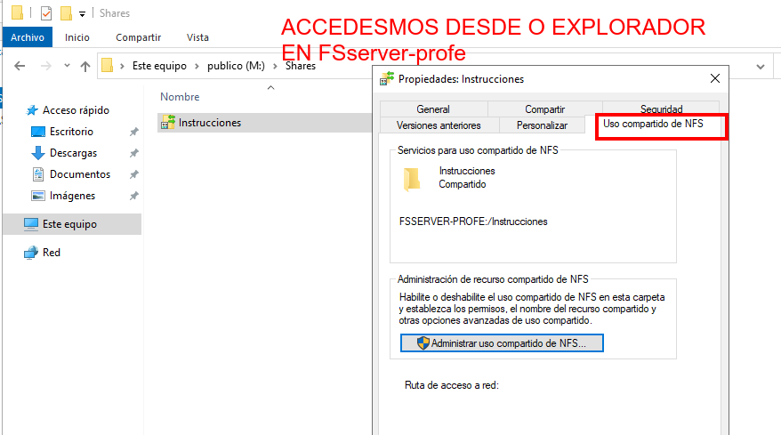

Prememos en **Administrar uso compartido de NFS**
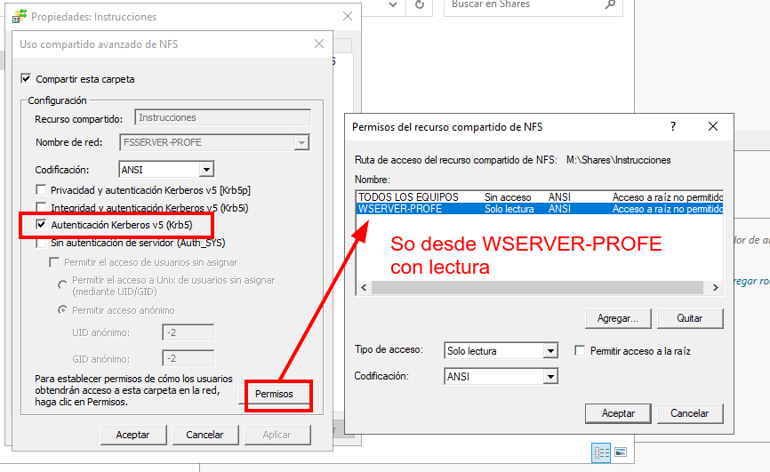

## Paso 5 - Acceder desde o cliente. Instalar cliente NFS

Na máquina cliente hai que instalar o cliente NFS.

Neste caso imos empregar **WSERVER-PROFE** para acceder á carpeta de rede compartida por NFS.

Desde Administrar - > Agregar roles y características. Neste caso **so imos engadir unha característica**, no  servidor **WSERVER-PROFE** a característica **Cliente para NFS**
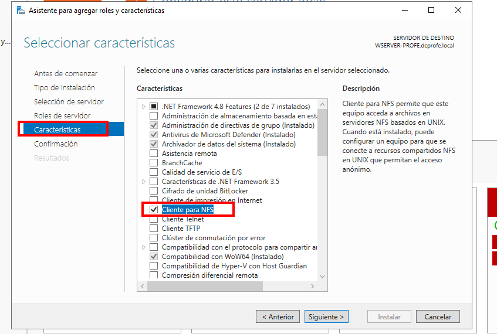

- **Montar o recurso compartido**, na unidade **O:**
`mount FSserver-profe:/instrucciones O:`

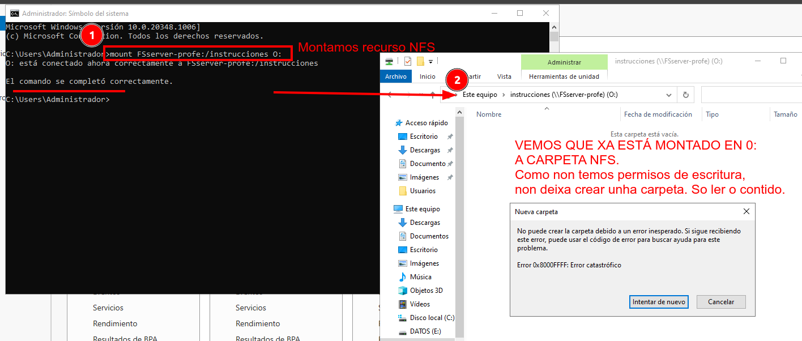

Se quero escribir, debería de cambiar os permisos, podo facelo no recursos compartido, e vemos que nos deixa escribir.
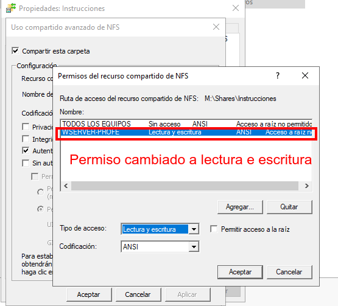
Xa nos deixa escribir desde WSERVER-PROFE.
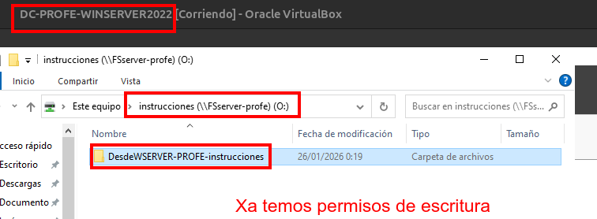

## Proposta

Fai os cambios que consideres para que che deixe acceder como so lectura desde os clientes W11.