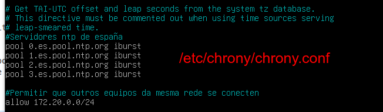
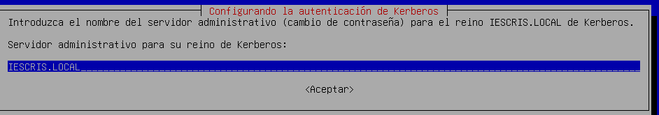
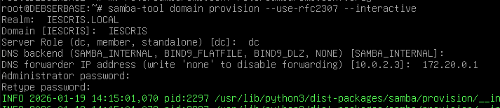
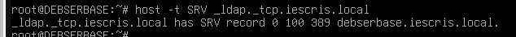

# Controlador de Dominio (DC) en Linux con Samba 4

**Samba4** é a evolución do proxecto Samba que **permite que un servidor Linux funcione como un Controlador de Dominio de Active Directory** (AD DC). Isto significa que pode interactuar con clientes Windows (e tamén Linux ou macOS) de forma nativa, tal e como o faría un servidor Windows Server.

Deste xeito o servidor poderá ter unha autenticación centralizada, aplicar GPO, e permisos a ficheiros con ACL, e tamén configuraremos o **servidor DNS integrado**.

## Preparación - Servidor Debian Server

- **Configurar interfaces de rede en VBox**:
  - Interfaz Interna: rede interna IESCRIS.LOCAL
- **Configurar IPs**: No noso caso imos configurar as IPs:
  - 172.20.0.150/16
  - GW: 172.20.0.1
- Comprobar conectividade co router nat.
  - `ping 172.20.0.1`
  
## Instalacion de software

### A. Instalar NTP- Chrony

```bash
sudo apt update
sudo apt install chrony
```

. Servidores activos en España: [https://www.ntppool.org/zone/es](https://www.ntppool.org/zone/es)

Editamos `sudo nano /etc/chrony/chrony.conf` e engadimos os servidores que recollemos da páxina anterior:

```bash
# Servidores NTP para España

pool 0.es.pool.ntp.org iburst
pool 1.es.pool.ntp.org iburst
pool 2.es.pool.ntp.org iburst
pool 3.es.pool.ntp.org iburst
```

O parámetro **iburst** permite que a primeira sincronización sexa case instantánea ao arrancar o servizo.

Se queremos que outros equipos da mesma rede se conecten a este servidor e sincronicen a hora temos que incluír:

`allow 172.20.0.0/24`

O ficheiro `/etc/chrony/chrony.conf` quedaría así:


Reiniciamos e habilitamos o servizo

```bash
sudo systemctl restart chrony
sudo systemctl enable chrony
```

Aseguramos configurar a hora de España: `timedatectl set-timezone Europe/Madrid`

Ver o estado:

- `timedateclt` hora actual, local e universal
- `chronyc sources -v`: ver os servidores aos que se conectou
- `chronyc tracking`: vese co servidor co que actualizou.
  
### B. Instalar software para controlador de dominio - Samba4

Imos ver os pasos para instalar e configurar samba4 e promover o servidor debian a controlador de dominio, co nome `iescris.local`.

#### Paso 1 - Instalar SW

Hai que instalar o paquete `samba`, as utilidades de Active Directory e o cliente de Kerberos:

```bash
sudo apt update
sudo apt install samba samba-ad-dc krb5-user krb5-config smbclient winbind ldb-tools

```

> **Nota:** Durante a instalación de Kerberos, pedirache o "Realm". Escríbeo en maiúsculas: `IESCRIS.LOCAL`.Pide 3 veces o nome: **1)Default Kerberos version 5 realm**, **2)Kerberos servers for your realm e 3)Administrative server for your Kerberos realm**, nas 2 poñemos IESCRIS.LOCAL
> 

#### Paso 2 - Preparación do sistema

Samba AD DC non pode funcionar se os servizos estándar de Samba (`smbd`, `nmbd`) están activos de forma independente. Debes detelos e "enmascaralos" para que non arranquen por separado:

```bash
## Parar os servizos
sudo systemctl stop smbd nmbd winbind
## Deshabilita os servizos
sudo systemctl disable smbd nmbd winbind
## Bloquea completamente os servizos
sudo systemctl mask smbd nmbd winbind
```

Tamén debes eliminar o ficheiro de configuración por defecto:

```bash
sudo mv /etc/samba/smb.conf /etc/samba/smb.conf.orig
```

O motivo é que  **servizo samba-ad-dc** é un "todo en un": el mesmo xa **inclúe** **o seu propio servidor de ficheiros, o seu propio servidor DNS e o seu propio xestor de identidades**. Se tentas arrancar smbd e samba-ad-dc á vez, o sistema fallará porque ambos tentarán usar o mesmo porto (o 445) e pelexarán polo control.

### Paso 3 - Aprovisionamento do Dominio

Agora executaremos a ferramenta que configura todo o dominio automaticamente. O comando interactivo pedirá os datos:

```bash
sudo samba-tool domain provision --use-rfc2307 --interactive

```

Cando o asistente che pregunte, introduce estes valores:

- **Realm:** `IESCRIS.LOCAL`
- **Domain:** `IESCRIS`
- **Server Role:** `dc`
- **DNS backend:** `SAMBA_INTERNAL` (é o máis sinxelo de xestionar)
- **DNS forwarder IP:** A IP do teu router ou un DNS externo (ex: `8.8.8.8`)
- **Administrator password:** Unha contrasinal forte (mínimo 8 caracteres, maiúsculas e números). Poñemos: **abc123.**



### Paso 4 - Configuración final do servizo e Kerberos

Active Directory xestiona o seu propio ficheiro de Kerberos. Debemos ligalo ao sistema:

```bash
sudo cp /var/lib/samba/private/krb5.conf /etc/krb5.conf

```

Agora, activa o servizo específico do Controlador de Dominio:

```bash
sudo systemctl unmask samba-ad-dc
sudo systemctl enable samba-ad-dc
sudo systemctl start samba-ad-dc

```

### Paso 5 - Configuración do DNS no Servidor

Para que o servidor poida "atopar" o seu propio dominio, edita o ficheiro `/etc/resolv.conf`:

```bash
sudo nano /etc/resolv.conf

```

Substitúe o contido por:

```text
domain iescris.local
search iescris.local
nameserver 127.0.0.1

```

### Paso 6. Verificación

Para comprobar que o teu novo dominio está activo e Kerberos funciona:

1.**Proba de DNS:**

```bash
host -t SRV _ldap._tcp.iescris.local
```

*(Debería devolver a IP do teu servidor).*

2.**Proba de Ticket Kerberos:**

```bash
kinit administrator@IESCRIS.LOCAL
klist
```



### Paso 7 - Creamos un usuario de proba

Creamos un usuario:
`sudo samba-tool user create nomeusuario`

Pediranos a contrasinal dúas veces.

Comprobar que existe o usuario:

`samba-tool user list`

Probar a conectar co usuario desde o mesmo servidor:

`smbclient -L localhost -U nomeusuario`

Exemplo:

```bash
samba-tool user create usuprueba
Password: Abcd1234.
Retype: Abcd1234.
```
