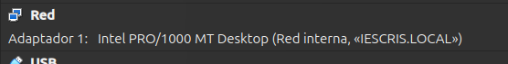
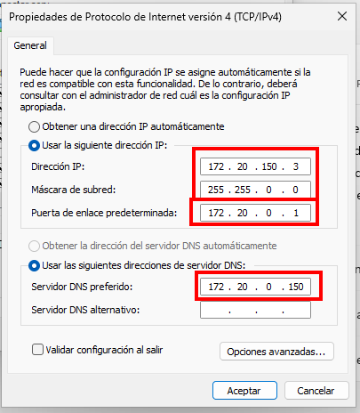
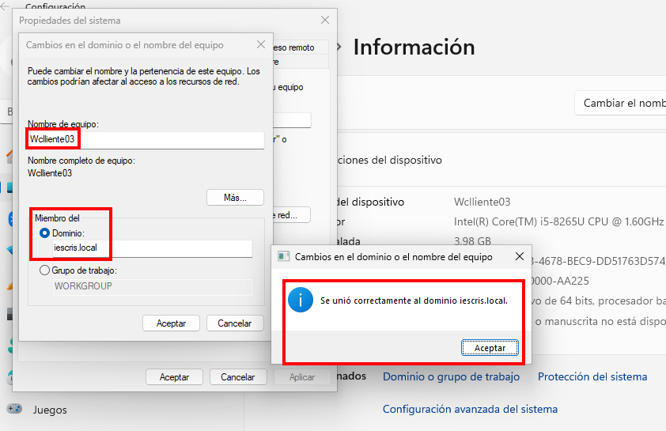
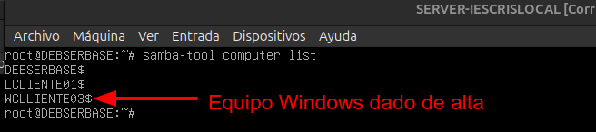
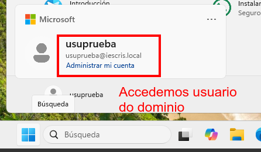

# Unir equipo Windows ao Controlador de Dominio Samba4

## Configuracións a facer

1. Configuramos as tarxetas de VBox
Rede Interna - iescris.local

2. Configuramos a IP/GW/DNS

3. Configuramos nome do equipo
4. Configuramos dominio e unimos ao equipo.

## Verificación

- Imos ao **servidor de dominio**, e vemos que está aquí dado de alta o novo pc de Wcliente03:

- Iniciamos sesión no **pc cliente Wcliente03**:
