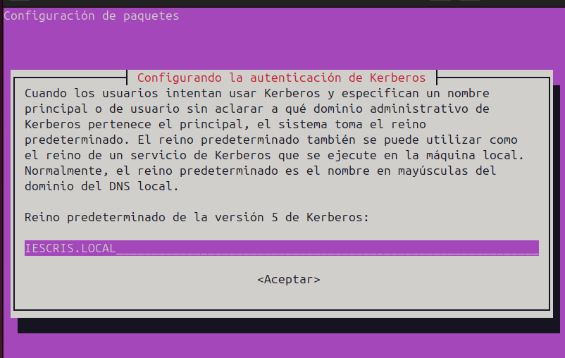
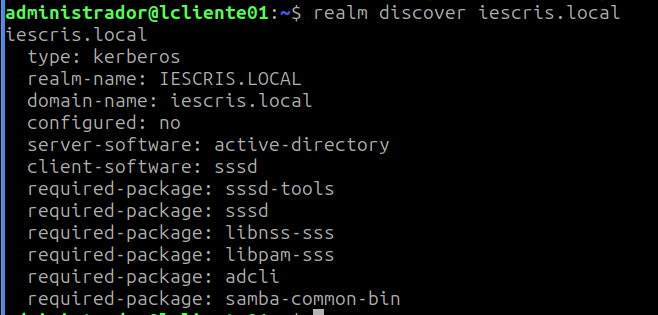
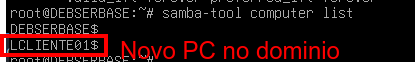
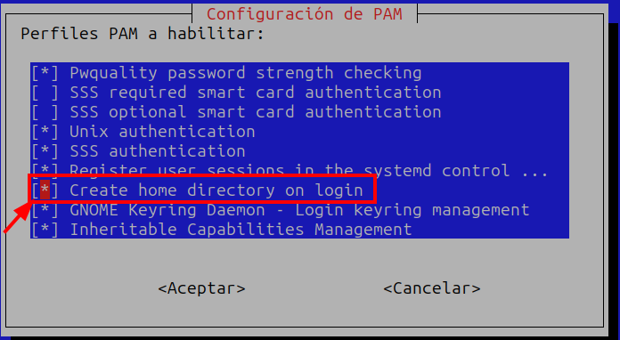
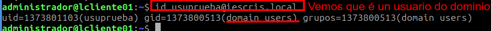
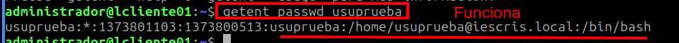
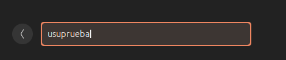
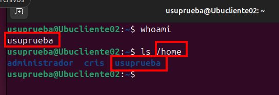

# Integrar equipo Linux no dominio

Imos empregar o paquete **SSSD** o que permitirá que os usuarios do dominio inicien sesión directamente na pantalla de login do sistema (SDDM).

A continuación móstranse os pasos a seguir:

## Paso 0 -  Configuración interfaces rede VBox

1. Interface de rede: Rede Interna (IESCRIS.LOCAL)


## Paso 1 - Preparación: Nome do equipo, IP e DNS


### 1.1. **Configura o nome do equipo:**

```bash
sudo hostnamectl set-hostname lcliente01  # O nome que queiras

```

Cambiamos tamén no `/etc/hosts`
Edita `/etc/hosts`:

```ini
127.0.1.1 lcliente01.iescris.local lcliente01
172.20.0.150 debserbase.dominio.local debserbase
```

Reinicia ou recarga:

```bash
sudo systemctl restart systemd-hostnamed
```

### 1.2. **Configura IP, GW e DNS:**

Configuramos a IP na interface gráfica, cos seguintes datos, e aseguramos que o cliente apunte ao servidor DNS **172.20.0.150**

IP - 172.20.150.1/16
GW: 172.20.0.1
DNS: 172.20.0.150

Comproba que se aplicou: `ip a`

### 1.3. **Configura /etc/resolv.conf**:

`unlink /etc/resolv.conf`

Configurar `/etc/resolv.conf`

```bash
nano /etc/resolv.conf

nameserver 172.20.0.150
search iescris.local
```

Bloqueamos o ficheiro /etc/resolv.conf para que non poida ser modificado.
`chattr +i /etc/resolv.conf`

* Comproba:

```bash
dig dominio.local
dig -t SRV _ldap._tcp.dominio.local
dig -t SRV _kerberos._tcp.dominio.local
```

 > Se isto non funciona, hai que revisar configuracións, non se pode continuar.


## Paso 2 - Sincronizar a hora

Instala e activa `chrony`:

```bash
sudo apt install chrony
sudo systemctl enable --now chrony
```

Comproba:

```bash
timedatectl
```

A diferenza de hora debe ser < 5 minutos.

## Paso 3 - Instalación de paquetes necesarios

Instala o cliente de Active Directory e as ferramentas de unión ao dominio:

```bash
sudo apt update
sudo apt install -y \
samba-common samba-common-bin samba-libs \
sssd sssd-tools sssd-ad \
realmd \
oddjob oddjob-mkhomedir \
packagekit \
krb5-user \
libnss-sss libpam-sss \
adcli
```

> Recorda: Cando pregunte o **Realm**, escribe `IESCRIS.LOCAL` en maiúsculas.



### Paso 4 - Comprobar Kerberos manualmente

```bash
kinit administrator@IESCRIS.LOCAL
klist
```

> **Nota:** Se isto falla, temos un **problema de DNS, hora ou Kerberos**.

### Paso 5-  Descubrir e Unirse ao Dominio

O comando `realm` facilita moito o proceso porque configura case todo por ti.

- **Descubre o dominio:**

```bash
realm discover iescris.local
```

Debe mostrar algo como:

```ini
type: kerberos
realm-name: IESCRIS.LOCAL
server-software: active-directory
client-software: sssd
```

Como se ve na foto:


- **Únete ao dominio:**

```bash
sudo realm join -U administrator iescris.local -v
```

*Pide o contrasinal do administrador que configuraches no servidor Debian.*

E vemos que xa está unido ao dominio. Se imos ao SERVIDOR, e listamos os ordenadores rexistrados, xa aparece o equipo que acabamos de unir.

```bash
samba-tool computer list
```



### Paso 6 - Configurar SSSD (Permitir nomes curtos)

Vemos o contido do ficheiro `/etc/sssd/sssd.conf`.

```bash
$ sudo cat /etc/sssd/sssd.conf
[sudo] contraseña para administrador: 

[sssd]
domains = iescris.local
config_file_version = 2
services = nss, pam

[domain/iescris.local]
default_shell = /bin/bash
cache_credentials = True
krb5_realm = IESCRIS.LOCAL
id_provider = ad
fallback_homedir = /home/%u
ad_domain = iescris.local
use_fully_qualified_names = False
ldap_id_mapping = True
access_provider = ad
auth_provider = ad
chpass_provider = ad

```

Por defecto, Lubuntu pedirache o usuario como `usuario@iescris.local`. Se queres usar só `nomeusuario` para entrar nos equipos, edita o ficheiro de SSSD:

`sudo nano /etc/sssd/sssd.conf`

Busca a liña `use_fully_qualified_names` e cámbiaa a `False`:

```text
use_fully_qualified_names = False

```

**Permisos**:

```bash
sudo chmod 600 /etc/sssd/sssd.conf
sudo systemctl restart sssd
```

**Reinicia o servizo**:

```bash
sudo systemctl restart sssd

```

### Paso 7 - Crear o cartafol persoal automaticamente

Cando un usuario do dominio entre por primeira vez, o sistema debe crear o seu `/home/usuario`.

#### 1. Activamos creación automática do home directory: pam-auth-update

```bash
sudo pam-auth-update

```



Seleccionamos a opción **"Create home directory on login"**.

#### 2. Comprobamos que o servizo oddjobd está activado 

Para entrar en **modo gráfico**, o servido **oddjobd** debe estar activado e funcionando.

```bash
sudo systemctl enable --now oddjobd
systemctl status oddjobd
```

### Paso 8 - Verificación final

No terminal do Lubuntu, proba a buscar un usuario que crearas no servidor:

```bash
id usuprueba@iescris.local

```



- Comprobamos que funciona facendo: `getent passwd usuprueba` se isto da como resultado o usuario do dominio, entón xa funciona. Temos que configurar so a parte de conexión en modo gráfico.
Ou se aínda non cambiaches o sssd para nomes cortos terías que poñer `getent passwd usuprueba@iescris.local`



## CASOS SEGUNDO SO

### Paso 9 - Ubuntu. GDM - Editar /etc/gdm3/custom.conf

Ubuntu usa **GDM moi restritivo**, de forma que non permite entrar na pantalla de login máis que aos usuarios locais, para permitir que admita a outros usuario coma os de dominio debemos.

**Editar**:

```bash
sudo nano /etc/gdm3/custom.conf
```

**Engadir** ou asegurarse de ter:

```ini
[daemon]
IncludeAll=true

[security]
AllowRoot=true
```

**Reinicia**:

```bash
sudo systemctl restart gdm3
```

E xa podes iniciar con **usuprueba**, e a súa contrasinal.


E vemos que creou o cartafol de usuario:

