# Configurar RSAT en Windows 11 para xestionar o dominio Samba de forma gráfica

RSAT son ferramentas que nos permiten configuar gráficamente o dominio Samba4:

- **RSAT: Active Directory Domain Services and Lightweight Directory Services Tools**: Fundamental para usuarios e equipos.
- **RSAT: Group Policy Management Tools**: Para crear políticas de seguridade.
- **RSAT: DNS Server Tools**: Para xestionar os rexistros DNS do dominio.

Para elo hai que **entrar no cliente Windows** cun **usuario do dominio** que pertenza ao grupo **Domain Admins**. Podemos empregar **Administrator**.

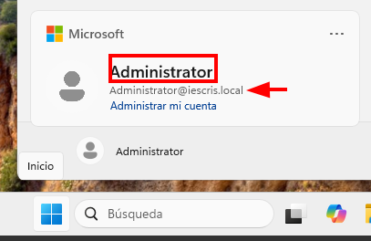

1. Imos a **Sistema->Características Opcionales**
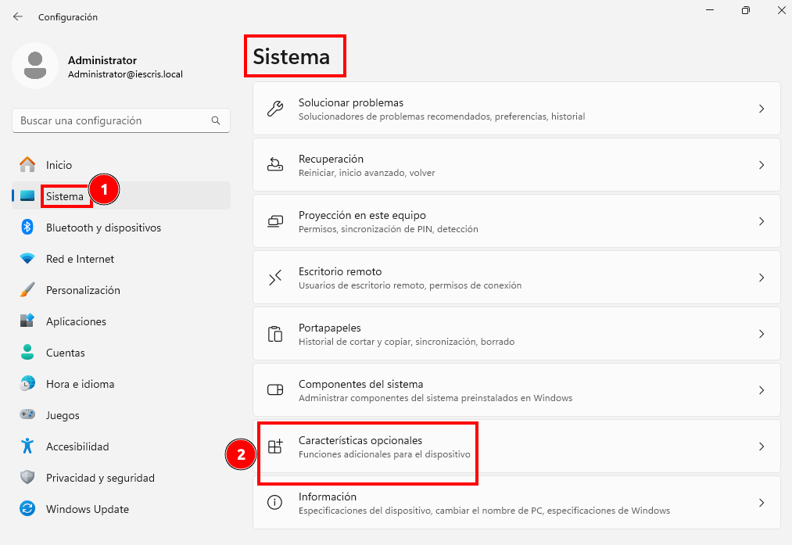
2. Pinchamos en Añadir una característica opcional: 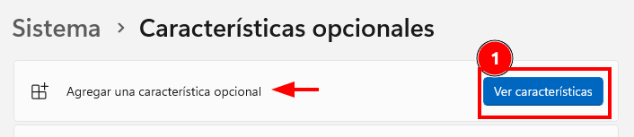
3. Buscamos por RSAT e **instalamos**:
   1.**RSAT: Herramientas de Active Directory Domain Services y Lightweight Directory Services**. 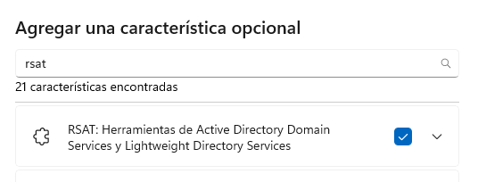
   2. **RSAT: Herramientas de gestión de directivas de grupo**.
   3. **RSAT: Herramientas de gestión de servidor DNS** 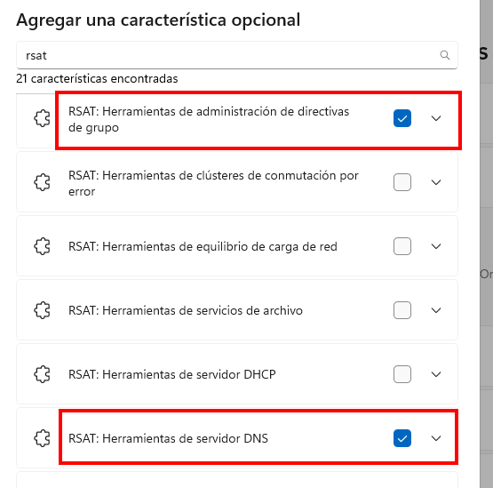
4. **Comprobamos** que foi instalado: tarda un pouquiño en  descargar todo o sw, pero finalmente podemos ver as características agregadas: 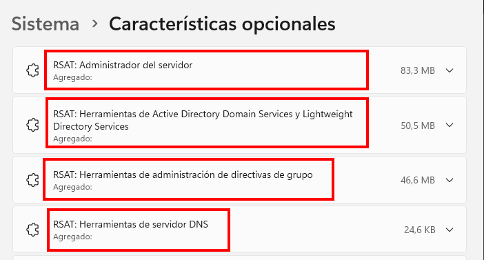

## Iniciamos Usuarios y equipos de Active directory

Buscando *"Usuarios y equipos de Active Directory"*.
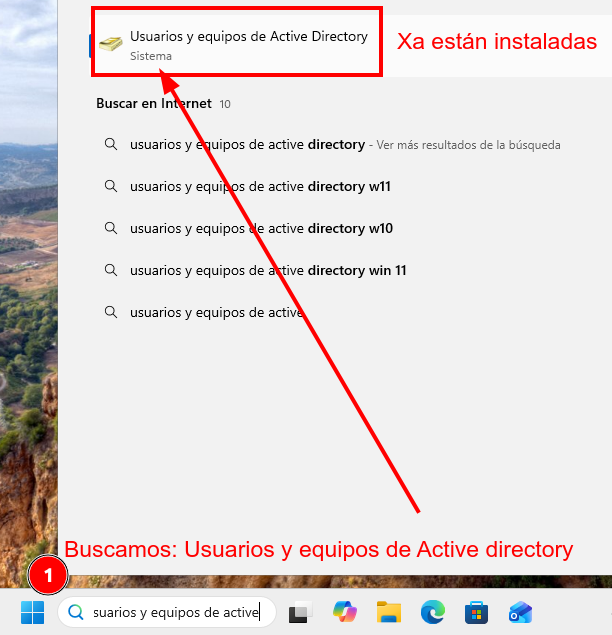
Vemos que directamente accedemos ao dominio de forma gráfica:
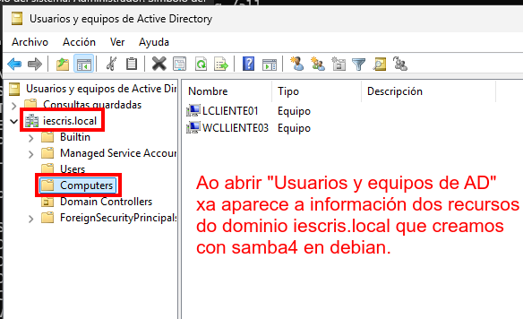

## Iniciamos a consola gráfica de DNS

Buscamos **DNS** e pregúntanos o PC que ten o servidor DNS, indicámosllo:
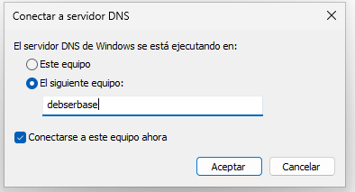

Ao darlle aceptar, directamente abre a consola de administración gráfica do DNS de **iescris.local**.

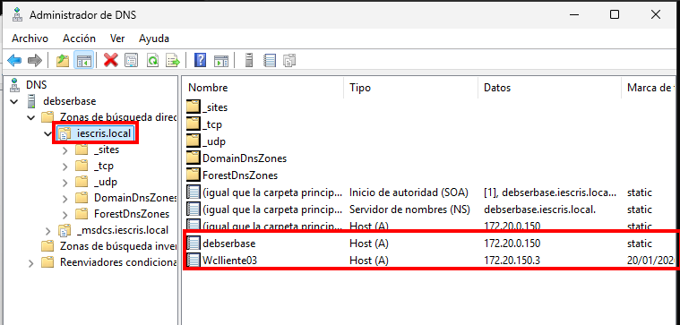

## Iniciamos administración de directivas de grupo

Buscamos *"Administración de directivas de grupo"*, e iniciamos a consola:
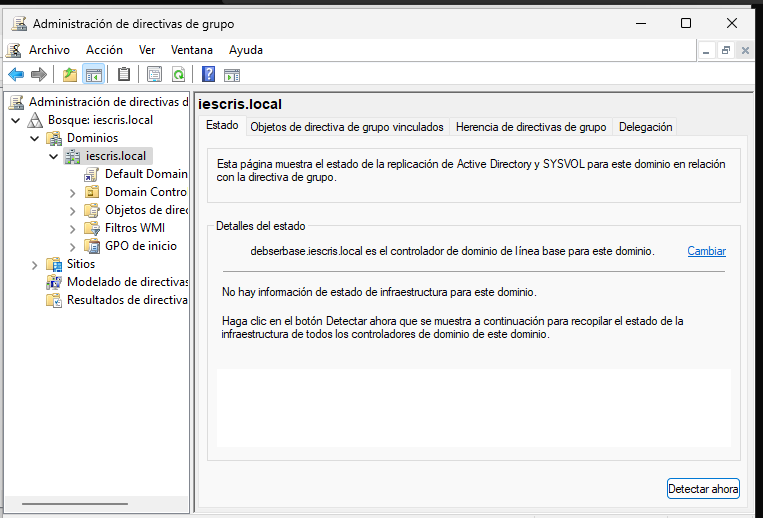

Agora xa podemos facer desde Windows:

- **Crear Usuarios e Unidades Organizativas** (OU): Máis rápido que usar samba-tool.
- **Xestionar o DNS**: Podes crear novos nomes de host (A records) ou zonas de busca inversa dende unha interface visual.
- **Directivas de Grupo** (GPO): Podes configurar, por exemplo, que o fondo de pantalla sexa o mesmo en todos os equipos da rede ou restrinxir o acceso ao panel de control.
